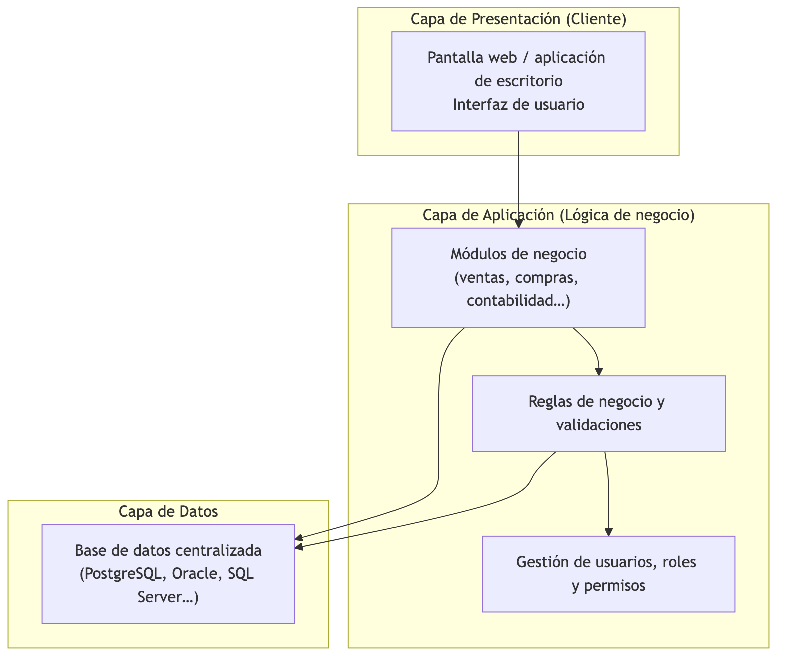
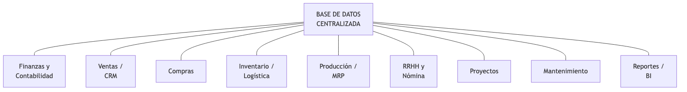
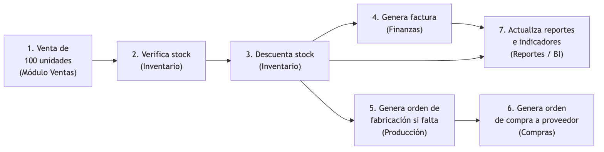
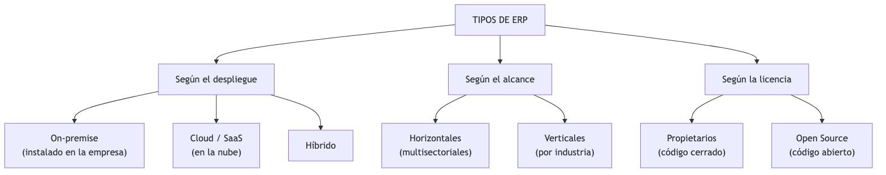
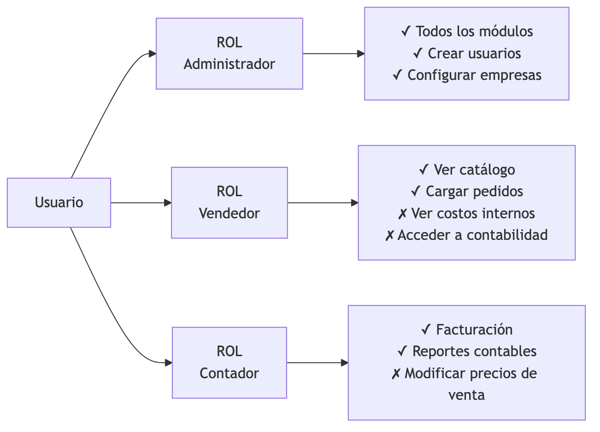

<!-- _class: title -->

# Sistemas ERP
## Planificación de Recursos Empresariales
### Unidad 1 · Introducción
#### Ing. Gaston Genaro Quelali Calcina

---

## Agenda

1. **¿Qué es un ERP?** — definición, historia, objetivos, características
2. **Componentes** — arquitectura y módulos
3. **1.1 Usos y aplicaciones**
4. **1.2 Tipos de ERP** — despliegue, alcance, licencia, comparativa
5. **1.3 Inserción de usuarios y empresas** — conceptos y práctica en Odoo

---

## ¿Qué es un ERP?

> **ERP** = *Enterprise Resource Planning*
> **Planificación de Recursos Empresariales**

Sistema de gestión **integrado** que administra los procesos de la empresa con una **única base de datos** y **módulos** compartidos.

| Letra | Palabra | Idea |
|---|---|---|
| **E** | Enterprise | Empresa |
| **R** | Resource | Recursos |
| **P** | Planning | Planificación |

**Sin ERP:** cada área lleva "su" información por separado. **Con ERP:** una sola fuente de verdad.

---

## Evolución histórica

<!-- fuente: assets/mermaid/01_evolucion_erp.mmd -->

<small>*Fuente editable: `assets/mermaid/01_evolucion_erp.mmd`*</small>

---

## Objetivos fundamentales

- **Integrar** todos los procesos y áreas en un solo sistema
- **Unificar** la información (una sola fuente de verdad)
- **Automatizar** tareas repetitivas y reducir errores
- **Dar visión global** en tiempo real de la organización
- **Estandarizar** los procedimientos
- **Soportar decisiones** con datos confiables

---

## Características esenciales

| Característica | Descripción |
|---|---|
| **Modularidad** | Módulos según el área funcional |
| **BD centralizada** | Todos usan la misma base de datos |
| **Integración** | Un proceso dispara los siguientes |
| **Parametrización** | Se configura, no se reprograma |
| **Multiusuario** | Muchos usuarios simultáneos con permisos |
| **Multientidad** | Varias empresas en un sistema |
| **Escalable** | Crece junto a la empresa |

---

## Arquitectura en 3 capas

<!-- fuente: assets/mermaid/02_arquitectura_erp.mmd -->

> ⚠️ La capa de datos es una **base de datos relacional** → tema de las Unidades 2 a 6.

---

## Módulos típicos de un ERP

<!-- fuente: assets/mermaid/13_modulos_horizontal.mmd -->

<small>*Fuente editable: `assets/mermaid/13_modulos_horizontal.mmd`*</small>

---

## Flujo de datos integrado — Una venta

<!-- fuente: assets/mermaid/04_flujo_venta.mmd -->

**Un solo registro alimenta todos los módulos.** Sin re-tipear nada.

---

## Beneficios y desafíos

**✅ Beneficios**
- Información única y en tiempo real
- Menos errores y duplicación
- Automatización de procesos
- Reducción de costos
- Trazabilidad y auditoría
- Reportes para decidir

**⚠️ Desafíos**
- Costo de licencias e implementación
- Implementación larga y compleja
- Resistencia al cambio
- Reingeniería de procesos
- Dependencia del proveedor

---

## 1.1 Usos por área funcional

| Área | Uso típico |
|---|---|
| Dirección | Tableros de control, KPI, presupuestos |
| Ventas / Marketing | CRM, pedidos, cotizaciones, comisiones |
| Compras | Órdenes de compra, evaluación de proveedores |
| Producción | Fabricación, listas de materiales, calidad |
| Logística | Stock, trazabilidad, traslados |
| Finanzas | Contabilidad, facturación, cobranzas, impuestos |
| RRHH | Legajos, asistencia, sueldos |
| Administración | Empresas, usuarios, roles, permisos |

---

## 1.1 Aplicaciones por sector

<!-- fuente: assets/mermaid/06_sectores_erp.mmd -->

---

## 1.2 Tipos de ERP

<!-- fuente: assets/mermaid/05_tipos_erp.mmd -->

---

## 1.2 Despliegue: on-premise vs cloud

| Criterio | On-premise | Cloud / SaaS |
|---|---|---|
| Instalación | Servidores propios | Servidores del proveedor |
| Pago | Licencia inicial alta | Suscripción mensual |
| Acceso | Red interna | Cualquier lugar, internet |
| Actualizaciones | Manuales | Automáticas |
| Costo inicial | **Alto** | **Bajo** |
| Control de datos | Total | Del proveedor |

**Tendencia actual:** migración hacia la nube.

---

## 1.2 Comparativa de productos

| | SAP S/4HANA | Oracle Cloud | Dynamics 365 | Odoo | ERPNext |
|---|---|---|---|---|---|
| Tipo | Propietario | Propietario | Propietario | Open source | Open source |
| Empresa | Grande | Grande | Grande/Media | PYME/Grande | PYME |
| Costo | Muy alto | Alto | Alto | Gratis (community) | Gratis (self-hosted) |
| Dificultad | Alta | Alta | Media | Baja | Baja |

> **En la materia usaremos Odoo** por ser gratuito, fácil y completo para práctica.

---

## 1.2 Criterios de selección

<!-- fuente: assets/mermaid/11_seleccion_erp.mmd -->

---

## 1.3 Conceptos clave

| Concepto | Definición |
|---|---|
| **Empresa (tenant)** | Organización administrada dentro del ERP |
| **Usuario** | Persona con login y contraseña |
| **Rol / Grupo de acceso** | Conjunto de permisos asignados |
| **Permiso** | Derecho: ver, crear, modificar, eliminar |
| **Autenticación** | ¿Quién sos? (identidad) |
| **Autorización** | ¿Qué podés hacer? (permisos) |

> **Clave:** autenticación ≠ autorización.

---

## 1.3 Estructura multientidad

<!-- fuente: assets/mermaid/07_multientidad.mmd -->

- Varias empresas, una sola instalación
- Datos **aislados** entre empresas
- Un usuario puede tener roles distintos en cada empresa

---

## 1.3 Seguridad por roles (RBAC)

<!-- fuente: assets/mermaid/08_rbac.mmd -->

**RBAC:** el usuario recibe **roles**, no permisos sueltos → mínimo privilegio, fácil auditoría.

---

## 1.3 Práctica con Odoo

1. **Crear empresa:** Ajustes → Compañías → Crear
2. **Crear usuario:** Ajustes → Usuarios → Crear (nombre, correo, contraseña)
3. **Asignar permisos:** por módulo elijo nivel de acceso
   - Sin acceso / Solo lectura / Operaciones propias / Todas / Administrador
4. **Verificar:** iniciar sesión como el usuario nuevo y comprobar qué ve y qué no

| Usuario | Ventas | Inventario | Contabilidad | Ajustes |
|---|---|---|---|---|
| Ana (vendedora) | Operaciones | Lectura | Sin acceso | Sin acceso |
| Juan (contador) | Lectura | Lectura | Operaciones | Sin acceso |

---

## Repaso rápido

1. ¿Qué significa ERP?
2. ¿MRP → MRP II → ERP → ERP II → Cloud? Contá la evolución
3. ¿Autenticación vs autorización?
4. ¿Qué es un tenant?
5. ¿Qué es RBAC?
6. ¿Cómo creo un usuario en Odoo?

**Práctica:** crear 3 usuarios (vendedor, contador, comprador) en Odoo y verificar sus accesos.

---

<!-- _class: title -->
# ¡Gracias!
### Dudas y consultas
