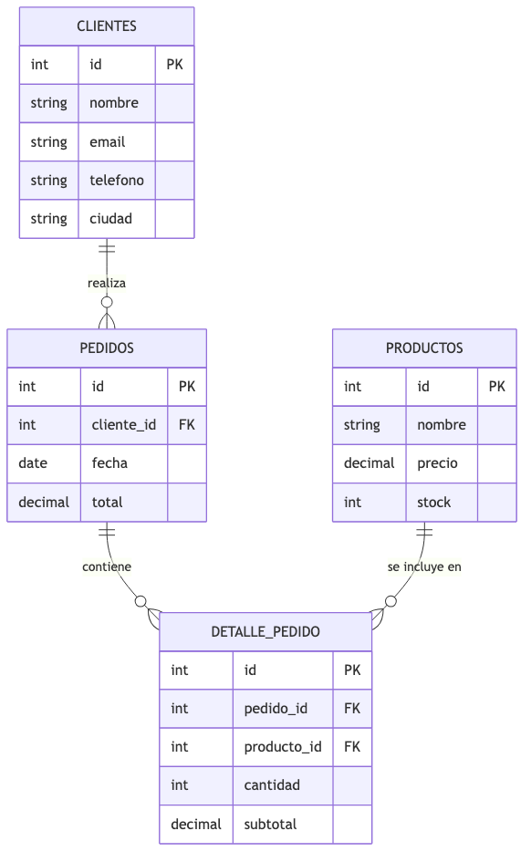
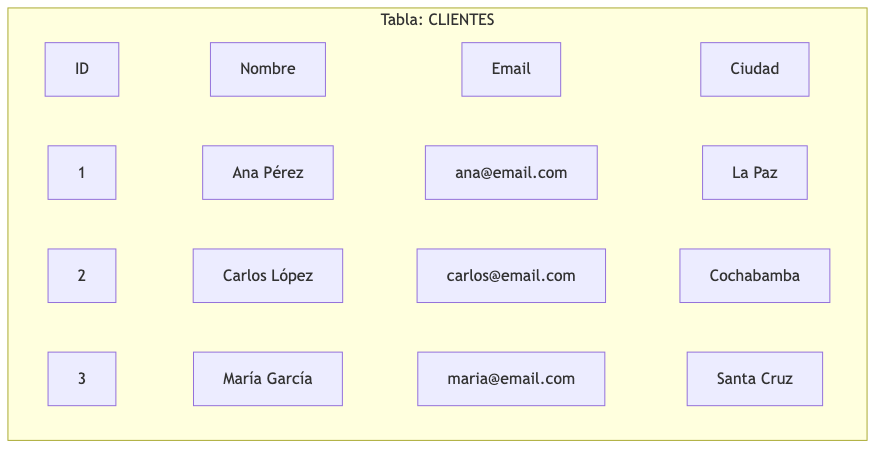
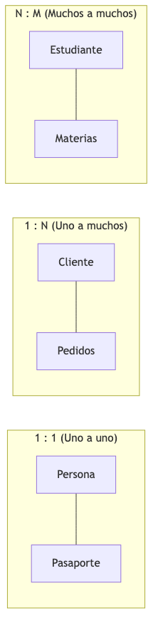
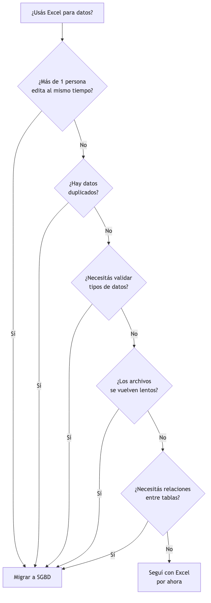
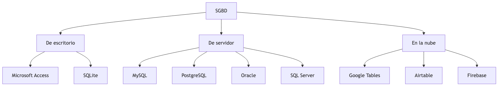

<!-- _class: title -->

# Bases de Datos Relacionales
## Introducción y Práctica
### Tema 1
#### Ing. Gaston Genaro Quelali Calcina

---

## Agenda

1. **¿Qué es una base de datos?** — definición y conceptos fundamentales
2. **Tablas, registros y claves** — la estructura de una BD relacional
3. **Relaciones** — uno a uno, uno a muchos, muchos a muchos
4. **Hojas de cálculo como BD** — Excel/Sheets y sus limitaciones
5. **De Excel a SGBD** — cuándo migrar y por qué

---

## ¿Qué es una base de datos?

> **Definición:** conjunto organizado y estructurado de datos que se almacena para ser accesible, gestionado y actualizado de forma eficiente.

| Idea clave | Significado |
|---|---|
| **Organización** | Datos en tablas con filas y columnas |
| **Accesibilidad** | Múltiples usuarios acceden simultáneamente |
| **Consistencia** | Se evitan duplicaciones y contradicciones |
| **Seguridad** | Se controla quién ve, crea, modifica o elimina |
| **Persistencia** | Los datos se guardan permanentemente |

---

## Conceptos fundamentales

| Concepto | Definición | Ejemplo |
|---|---|---|
| **Tabla** | Estructura de datos en filas y columnas | Tabla "Clientes" |
| **Campo** | Cada columna; un atributo | Nombre, Email |
| **Registro** | Cada fila; una entidad | Un cliente específico |
| **Clave primaria (PK)** | Identifica único cada registro | ID del cliente |
| **Clave foránea (FK)** | Referencia a otra tabla | ID cliente en pedidos |
| **Relación** | Vínculo entre tablas | Cliente → Pedidos |

---

## Modelo relacional (ejemplo)

<!-- fuente: assets/mermaid/01_modelo_relacional.mmd -->

> 4 tablas: **Clientes**, **Pedidos**, **Productos**, **Detalle_Pedido**
> Relaciones: 1 Cliente → N Pedidos → N Detalles ← 1 Producto

---

## Estructura de una tabla

<!-- fuente: assets/mermaid/02_estructura_tabla.mmd -->

| ID | Nombre | Email | Ciudad |
|---|---|---|---|
| 1 | Ana Pérez | ana@email.com | La Paz |
| 2 | Carlos López | carlos@email.com | Cochabamba |
| 3 | María García | maria@email.com | Santa Cruz |

**3 registros**, **4 campos**, **1 clave primaria** (ID)

---

## Tipos de relaciones

<!-- fuente: assets/mermaid/03_tipos_relaciones.mmd -->

| Relación | Descripción | Ejemplo |
|---|---|---|
| **1:1** | Un registro ↔ un registro | Persona ↔ Pasaporte |
| **1:N** | Un registro ↔ varios registros | Cliente ↔ Pedidos |
| **N:M** | Varios ↔ varios (requiere tabla intermedia) | Estudiante ↔ Materias |

> **El 90% de las relaciones en una BD real son 1:N**

---

## Hojas de cálculo como BD

### Capacidades avanzadas
- Tablas estructuradas
- Filtros y ordenamiento
- Fórmulas de búsqueda (`XLOOKUP`, `FILTER`)
- Validación de datos

### Limitaciones
- Sin tipos de datos estrictos
- Sin integridad referencial
- Sin control de concurrencia
- Límite de filas
- Sin seguridad por usuario
- Sin consultas SQL

---

## Hoja de cálculo vs SGBD

| Criterio | Excel/Sheets | SGBD |
|---|---|---|
| Estructura | Archivo suelto | Múltiples tablas |
| Tipos de datos | Informales | Estrictos |
| Relaciones | Simuladas con fórmulas | Reales (FK) |
| Usuarios | 1-2 simultáneos | Múltiples |
| Seguridad | Por archivo | Por usuario/rol |
| Consultas | Fórmulas | SQL |
| Rendimiento | Lento con mucha data | Optimizado |
| Escalabilidad | No escala | Escala con la empresa |

---

## ¿Cuándo migrar de Excel a SGBD?

<!-- fuente: assets/mermaid/04_migrar_excel.mmd -->

**Señales de que es momento:**
- Más de 1 persona edita los datos
- Hay datos duplicados en múltiples hojas
- Necesitás validar tipos de datos
- Los archivos se vuelven lentos
- Necesitás relaciones reales entre tablas

---

## ¿Qué es un SGBD?

> **SGBD** = Sistema de Gestión de Bases de Datos
> Software que permite crear, administrar y manipular bases de datos.

| Función | Qué hace |
|---|---|
| **Definir** | Crear estructura de tablas y campos |
| **Manipular** | Insertar, modificar, eliminar datos |
| **Controlar** | Seguridad, integridad, concurrencia |
| **Almacenar** | Guardar datos de forma persistente |

---

## Clasificación de SGBD

<!-- fuente: assets/mermaid/05_clasificacion_sgbd.mmd -->

| Tipo | Ejemplos | Cuándo usar |
|---|---|---|
| **Escritorio** | Access, SQLite | Proyectos pequeños, aprendizaje |
| **Servidor** | MySQL, PostgreSQL | Empresas, aplicaciones web |
| **Nube** | Google Tables, Airtable | Equipos remotos, prototipos |

---

## Comparativa de herramientas

| | Access | MySQL | Google Tables | Airtable |
|---|---|---|---|---|
| Tipo | Escritorio | Servidor | Cloud | Cloud |
| Costo | Licencia MS 365 | Gratuito | Freemium | Freemium |
| Ideal para | PYMEs, educación | Desarrollo web | Equipos pequeños | Prototipos |
| SQL | No (propio) | Sí (estándar) | Parcial | No |
| Multiusuario | Limitado | Completo | Completo | Completo |

> **En esta materia usaremos Microsoft Access**

---

## SQL: el lenguaje de las BD

| Operación | Comando | Ejemplo |
|---|---|---|
| Crear tabla | `CREATE TABLE` | `CREATE TABLE Clientes (ID INT, Nombre TEXT);` |
| Insertar | `INSERT INTO` | `INSERT INTO Clientes VALUES (1, 'Ana');` |
| Consultar | `SELECT` | `SELECT * FROM Clientes WHERE Ciudad = 'La Paz';` |
| Modificar | `UPDATE` | `UPDATE Clientes SET Tel = '777' WHERE ID = 1;` |
| Eliminar | `DELETE` | `DELETE FROM Clientes WHERE ID = 1;` |

> SQL se verá en detalle en el Tema 4

---

## Repaso rápido

1. ¿Qué es una base de datos?
2. Diferencia entre tabla, campo y registro
3. ¿Qué es una clave primaria? ¿Y una foránea?
4. Los 3 tipos de relaciones entre tablas
5. 4 limitaciones de Excel como BD
6. ¿Qué es un SGBD? Sus 4 funciones
7. ¿Cuándo migrar de Excel a SGBD?

---

<!-- _class: title -->
# ¡Gracias!
### Dudas y consultas
