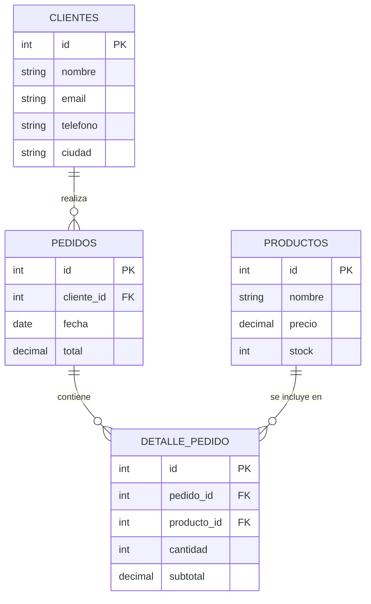
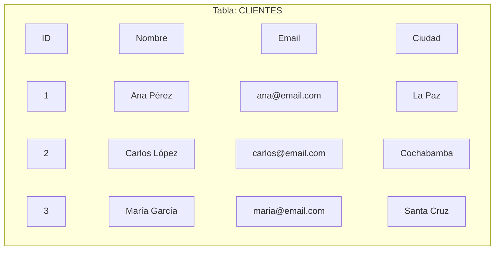
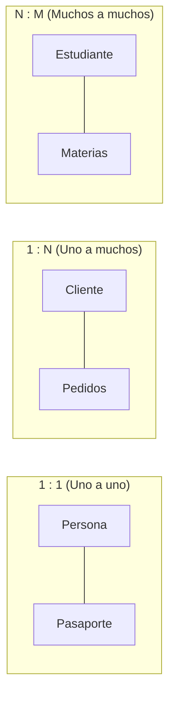
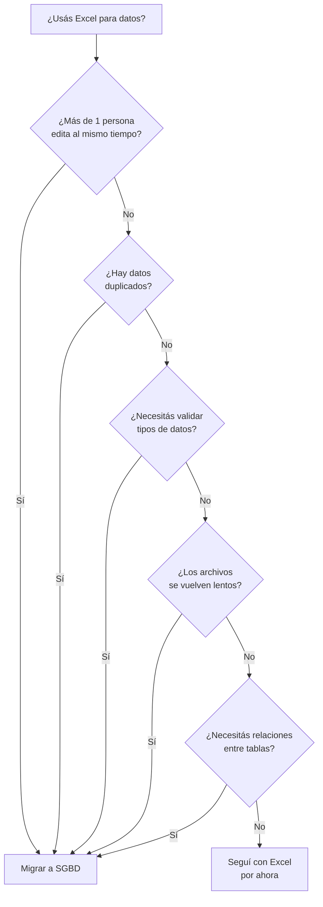
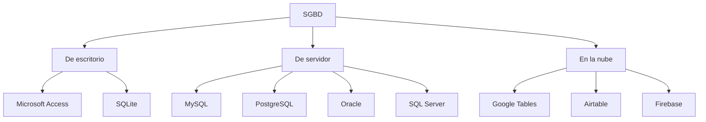

# TEMA 1 — INTRODUCCIÓN Y PRÁCTICA CON BASES DE DATOS RELACIONALES

**Autor:** Ing. Gaston Genaro Quelali Calcina

---

**Contenido:**
- [1. ¿Qué es una base de datos?](#1-qué-es-una-base-de-datos)
- [1.1 Conceptos fundamentales](#11-conceptos-fundamentales)
- [1.2 Hojas de cálculo como base de datos](#12-hojas-de-cálculo-como-base-de-datos)
- [1.3 De hojas de cálculo a SGBD](#13-de-hojas-de-cálculo-a-sgbd)

---

## 1. ¿Qué es una base de datos?

### 1.1 Definición

Una **base de datos** (BD) es un conjunto organizado y estructurado de datos que se almacena de forma que pueda ser fácilmente accesible, gestionada y actualizada.

> **Definición funcional:** una base de datos es una **colección de información organizada en tablas** que permite almacenar, recuperar, modificar y eliminar datos de manera eficiente y consistente.

| Término | Inglés | Significado |
|---|---|---|
| **Base de datos** | Database | Conjunto de datos organizados |
| **Sistema de gestión** | Management System | Software para administrar la BD |
| **SGBD** | DBMS | Database Management System |

**Ideas clave:**

1. **Organización:** los datos se estructuran en tablas con filas y columnas, no en archivos sueltos.
2. **Accesibilidad:** múltiples usuarios pueden consultar y modificar los datos simultáneamente.
3. **Consistencia:** se evitan duplicaciones y contradicciones en la información.
4. **Seguridad:** se controla quién puede ver, crear, modificar o eliminar datos.
5. **Persistencia:** los datos se guardan de forma permanente en el disco.

> **Metáfora:** una base de datos es como una **biblioteca digital**: los libros (datos) están organizados por estanterías (tablas), con un catálogo (índice) que permite encontrar cualquier libro rápidamente. Sin el sistema de biblioteca, los libros estarían apilados en el piso y nadie encontraría lo que busca.

---

### 1.2 Conceptos fundamentales

Antes de profundizar, es fundamental definir los conceptos básicos que forman parte de cualquier base de datos relacional:

| Concepto | Definición | Ejemplo |
|---|---|---|
| **Tabla (table)** | Estructura que organiza los datos en filas y columnas | Una tabla "Clientes" |
| **Campo (field)** | Cada columna de la tabla; representa un atributo | Nombre, Email, Teléfono |
| **Registro (row/record)** | Cada fila de la tabla; representa una entidad | Un cliente específico |
| **Clave primaria (PK)** | Campo o conjunto de campos que identifica de forma única cada registro | ID del cliente |
| **Clave foránea (FK)** | Campo que referencia la clave primaria de otra tabla | ID del cliente en una tabla de pedidos |
| **Relación (relationship)** | Vínculo entre dos tablas basado en claves | Un cliente puede tener muchos pedidos |
| **Consulta (query)** | Pregunta o instrucción sobre los datos | "¿Cuántos clientes hay de La Paz?" |
| **Índice (index)** | Estructura que acelera las búsquedas | Índice sobre el campo "Apellido" |



*Figura: Ejemplo de modelo de datos relacional con 4 tablas y sus relaciones*

### 1.2.1 Tablas: la estructura fundamental

Una **tabla** es la unidad básica de almacenamiento en una base de datos relacional. Piensa en ella como una hoja de cálculo, pero con reglas estrictas:



*Figura: Estructura de una tabla con 3 registros y 4 campos*

**Características de una tabla relacional:**

| Característica | Descripción |
|---|---|
| **Cada columna tiene un tipo de dato** | Texto, número, fecha, etc. No se mezclan tipos |
| **Cada fila es única** | La clave primaria garantiza que no haya duplicados |
| **El orden no importa** | Las filas y columnas pueden mostrarse en cualquier orden |
| **Cada celda contiene un solo valor** | No se guardan listas ni arrays en una celda |
| **Los nombres de columna son únicos** | Dentro de una tabla, no puede haber dos campos con el mismo nombre |

> **Diferencia clave con una hoja de cálculo:** en Excel puedes escribir "Ana" en una celda de fecha, o poner una lista de correos en una celda. En una base de datos, eso es **imposible**: cada campo tiene un tipo de dato estricto que valida lo que se ingresa.

### 1.2.2 Registros: los datos concretos

Un **registro** (o fila) representa una entidad individual: un cliente, un producto, un pedido. Cada registro contiene valores para **todos** los campos de la tabla.

| ID | Nombre | Email | Ciudad |
|---|---|---|---|
| 1 | Ana Pérez | ana@email.com | La Paz |
| 2 | Carlos López | carlos@email.com | Cochabamba |
| 3 | María García | maria@email.com | Santa Cruz |

En esta tabla hay **3 registros** y **4 campos**. Cada registro es un cliente diferente.

### 1.2.3 Claves: la identificación única

#### Clave primaria (PK)

La **clave primaria** es el campo (o combinación de campos) que identifica de forma **única** cada registro de una tabla. Sin ella, no podríamos distinguir un registro de otro.

**Reglas de la clave primaria:**
1. **Unicidad:** no puede haber dos registros con el mismo valor de PK.
2. **No nula:** siempre debe tener un valor (nunca está vacía).
3. **Inmutabilidad:** una vez asignada, no debería cambiarse.

**Tipos de claves primarias:**

| Tipo | Descripción | Ejemplo | Cuándo usarla |
|---|---|---|---|
| **Autonumérico** | El sistema genera un número único automáticamente | 1, 2, 3, 4... | La mayoría de las tablas |
| **Natural** | Un campo existente que ya es único | RUC, DNI, email | Cuando el dato es inherentemente único |
| **Compuesta** | Combinación de dos o más campos | (pedido_id, producto_id) | En tablas de relación (muchos a muchos) |

> **Recomendación práctica:** para la mayoría de los casos, usa un **autonumérico** como clave primaria. Es simple, siempre funciona y evita problemas si cambian los datos del negocio.

#### Clave foránea (FK)

Una **clave foránea** es un campo en una tabla que **referencia** la clave primaria de otra tabla. Es el mecanismo que crea **relaciones** entre tablas.

Ejemplo: la tabla `PEDIDOS` tiene un campo `cliente_id` que es clave foránea hacia la tabla `CLIENTES`. Esto significa: "este pedido pertenece a este cliente".

| Pedido_ID | Cliente_ID | Fecha | Total |
|---|---|---|---|
| 1 | 1 | 2026-03-15 | 250.00 |
| 2 | 2 | 2026-03-16 | 180.00 |
| 3 | 1 | 2026-03-17 | 95.00 |

Aquí, el Cliente_ID = 1 en los pedidos 1 y 3 significa que **Ana Pérez** hizo dos pedidos.

---

### 1.3 Tipos de relaciones

Las relaciones entre tablas se clasifican según cuántos registros de cada tabla se vinculan:



*Figura: Los tres tipos de relaciones en un modelo relacional*

| Relación | Descripción | Ejemplo | ¿Cómo se implementa? |
|---|---|---|---|
| **Uno a uno (1:1)** | Un registro de A se vincula con un solo registro de B, y viceversa | Persona ↔ Pasaporte | FK en una de las dos tablas |
| **Uno a muchos (1:N)** | Un registro de A se vincula con varios de B, pero cada B solo con un A | Cliente ↔ Pedidos | FK en la tabla "muchos" |
| **Muchos a muchos (N:M)** | Un registro de A se vincula con varios de B, y viceversa | Estudiante ↔ Materias | Tabla intermedia (pivot) |

> **El 90% de las relaciones en una BD real son de tipo 1:N.** Es la relación más común y la que verás en casi todos los casos prácticos.

---

## 1.2 Hojas de cálculo como base de datos

### 1.2.1 ¿Por qué empezamos con hojas de cálculo?

Muchas empresas y profesionales usan Excel o Google Sheets como su "primera base de datos". Es comprensible: es una herramienta familiar, accesible y poderosa para许多 tareas. Pero tiene limitaciones importantes cuando los datos crecen.

### 1.2.2 Capacidades avanzadas de hojas de cálculo

Las hojas de cálculo modernas tienen características que se parecen a una base de datos:

| Característica | Excel | Google Sheets |
|---|---|---|
| **Tablas estructuradas** | Insertar → Tabla | Datos → Crear tabla |
| **Filtros y ordenamiento** | Filtros automáticos | Filtros y vistas filtradas |
| **Formulas de búsqueda** | `BUSCARV`, `XLOOKUP` | `FILTER`, `QUERY` |
| **Validación de datos** | Validación de entrada | Validación de datos |
| **Relaciones entre hojas** | `XLOOKUP`, Power Query | `FILTER`, `QUERY`, `VLOOKUP` |
| **Formularios** | Formularios de Microsoft Forms | Google Forms vinculado |

### 1.2.3 Ejemplo práctico: Excel como mini-BD

Imaginemos que gestionamos una ferretería pequeña y usamos Excel:

**Hoja "Clientes":**

| ID | Nombre | Email | Ciudad |
|---|---|---|---|
| 1 | Ana Pérez | ana@email.com | La Paz |
| 2 | Carlos López | carlos@email.com | Cochabamba |
| 3 | María García | maria@email.com | Santa Cruz |

**Hoja "Productos":**

| ID | Nombre | Precio | Stock |
|---|---|---|---|
| 1 | Martillo | 45.00 | 20 |
| 2 | Tornillos (caja) | 12.50 | 100 |
| 3 | Pintura blanca (galón) | 85.00 | 15 |

**Hoja "Pedidos":**

| ID Pedido | ID Cliente | ID Producto | Cantidad | Fecha |
|---|---|---|---|---|
| 1 | 1 | 1 | 2 | 2026-03-15 |
| 2 | 2 | 3 | 1 | 2026-03-16 |
| 3 | 1 | 2 | 5 | 2026-03-17 |

Para saber **qué cliente hizo qué pedido**, usamos `BUSCARV` o `XLOOKUP` para traer el nombre del cliente desde la hoja "Clientes". Esto simula una **relación** entre tablas.

### 1.2.4 Tres reglas para estructurar tablas en hojas de cálculo

Para que una hoja de cálculo se comporte como una tabla de base de datos, debe cumplir tres reglas:

1. **Una pestaña por entidad:** no mezcles datos de distintas entidades en la misma hoja. Cada tabla tiene su propio espacio (Clientes, Productos, Ventas).
2. **Formato de tabla plana:** la fila 1 solo para encabezados, un registro por fila, sin celdas combinadas y una sola clase de dato por columna.
3. **La primera columna es la PK:** la clave primaria va siempre en la primera columna, con valores únicos.

> Esto replica la estructura relacional dentro de un libro de Excel o Google Sheets.

### 1.2.5 Simular una clave foránea con validación de datos

La **validación de datos** impide que el usuario escriba valores que no existen en otra tabla, simulando una clave foránea:

1. Selecciona la columna `ID_Producto` en la hoja "Ventas".
2. Ve a **Datos → Validación de datos**.
3. Elige **Lista desde un rango** y selecciona la columna de la PK en "Productos".
4. Activa *"Mostrar lista desplegable en celda"*.

| Sin validación | Con validación |
|---|---|
| `"Muz"`, `"mouse"`, `"Mouse "` — tres formas de escribir lo mismo, tres valores distintos para el sistema | Solo se puede elegir un valor que ya exista en la tabla Productos |

### 1.2.6 Relacionar tablas con fórmulas de búsqueda

En lugar de duplicar el nombre o el precio del producto en cada venta, se traen desde la tabla origen usando la clave foránea.

**BUSCARX (recomendada)** — flexible y moderna, no requiere contar columnas:

```
=BUSCARX(valor_buscado, col_búsqueda, col_retorno)
```

**Ejemplo en la hoja "Ventas":**

| ID_Venta | ID_Producto | Nombre (fórmula) | Precio (fórmula) |
|---|---|---|---|
| V-101 | PROD-02 | `=BUSCARX(B2, Productos!A:A, Productos!B:B)` | `=BUSCARX(B2, Productos!A:A, Productos!D:D)` |

`B2` contiene el `ID_Producto`; la fórmula busca ese valor en la columna A de "Productos" y devuelve el nombre o el precio.

**BUSCARV (tradicional)** — compatible con versiones antiguas, pero más rígida (requiere que el valor buscado esté en la primera columna del rango):

```
=BUSCARV(valor_buscado, tabla, columna, FALSO)
```

> En Google Sheets se usa `BUSCARV`, `XLOOKUP` o `QUERY` para el mismo propósito.

### 1.2.7 Tablas dinámicas para resumir datos

Una **tabla dinámica** resume miles de filas en segundos, sin escribir una sola fórmula:

1. Selecciona los datos de la hoja "Ventas".
2. **Insertar → Tabla dinámica**.
3. Arrastra `Nombre_Producto` a **Filas** y `Monto` a **Valores**.
4. Resultado: totales por producto al instante.

> En Excel, el **Modelo de Datos** permite crear relaciones internas entre tablas sin abusar de BUSCARV.

### 1.2.8 Limitaciones de las hojas de cálculo

A pesar de ser útiles, las hojas de cálculo tienen limitaciones serias como herramienta de gestión de datos:

| Limitación | Consecuencia | Ejemplo |
|---|---|---|
| **Sin tipos de datos estrictos** | Se pueden ingresar datos incorrectos | Escribir "abc" en un campo de precio |
| **Sin integridad referencial** | Se pueden crear referencias rotas | Un pedido con ID de cliente que no existe |
| **Sin control de concurrente** | Si dos personas editan a la vez, se pisan los cambios | Dos vendedores cargan el mismo pedido |
| **Límite de filas** | Excel: 1,048,576 filas. Sheets: 10 millones | Una empresa grande supera esto rápido |
| **Sin seguridad por usuario** | Cualquiera con el archivo puede ver todo | No se puede ocultar la columna de sueldos |
| **Sin consultas SQL** | Las búsquedas complejas son difíciles | "Clientes que compraron en los últimos 30 días y deben más de 500" |
| **Sin transacciones** | No se puede revertir un grupo de cambios | Si falla la mitad de un pedido, no se puede deshacer todo |
| **Rendimiento** | Con mucha data, los archivos se vuelven lentos | Un archivo con 500K filas tarda minutos en abrir |

> **Dato real:** según estudios, **más del 75% de las PYMEs** en Latinoamérica usan Excel como su principal herramienta de gestión de datos, a pesar de sus limitaciones. Esto genera errores, duplicación y pérdida de información.

---

### 1.5 Comparación: Hoja de cálculo vs SGBD

La siguiente tabla resume las diferencias clave:

| Criterio | Hoja de cálculo (Excel/Sheets) | SGBD (Access/MySQL) |
|---|---|---|
| **Estructura** | Archivo suelto (.xlsx, .csv) | Base de datos con múltiples tablas |
| **Tipos de datos** | Informales (acepta cualquier cosa) | Estrictos (cada campo tiene un tipo) |
| **Relaciones** | Simuladas con fórmulas | Reales (integridad referencial) |
| **Usuarios simultáneos** | Limitado (1-2 editando) | Múltiples (decenas o cientos) |
| **Seguridad** | Por archivo (abrir/no abrir) | Por usuario, rol y permiso |
| **Consultas** | Fórmulas y filtros | SQL (lenguaje estándar) |
| **Rendimiento** | Lento con muchos datos | Optimizado para grandes volúmenes |
| **Consistencia** | Baja (errores manuales) | Alta (reglas de validación) |
| **Escalabilidad** | No escala | Escala con la empresa |
| **Costo** | Bajo o nulo | Variable (gratuito a costoso) |
| **Curva de aprendizaje** | Baja (ya lo conocemos) | Media (requiere capacitación) |

> **Conclusión:** las hojas de cálculo son ideales para **análisis puntual y reportes**, mientras que un SGBD es necesario para **gestionar datos de forma continua y confiable**. No son excluyentes: una empresa puede usar ambas (SGBD para operar, Excel para reportes).

---

### 1.6 Cuándo migrar de Excel a un SGBD

Es momento de dejar Excel y migrar a un SGBD cuando:

1. **Más de una persona** necesita acceder y modificar los datos al mismo tiempo.
2. Los datos están **duplicados** en múltiples hojas o archivos.
3. Necesitas **validar** que los datos sean correctos (que un precio sea un número, que una fecha sea válida).
4. Los archivos se vuelven **lentos** por la cantidad de datos.
5. Necesitas **relaciones** entre tablas (clientes → pedidos → productos).
6. Requerís **seguridad**: que ciertos usuarios solo vean ciertos datos.
7. Necesitás **consultas complejas** que las fórmulas de Excel no pueden resolver.
8. La empresa **crece** y los datos van a seguir aumentando.



*Figura: Árbol de decisión: ¿es momento de migrar de Excel a un SGBD?*

### 1.6.1 Cuándo seguir usando hoja de cálculo

| Situación | Motivo |
|---|---|
| Volumen bajo o moderado (menos de ~500.000 filas) | El archivo aún se maneja bien y no satura |
| Análisis ad-hoc y prototipos | Gráficos rápidos, exploración de datos o modelos temporales |
| Equipos pequeños sin automatización | Trabajo colaborativo básico sin integración técnica compleja |

### 1.6.2 Cuándo pasar a un SGBD

| Situación | Motivo |
|---|---|
| Aplicaciones web, móviles o sistemas contables | Requieren persistencia, escalabilidad y acceso programático |
| Necesitás auditar cambios | Registrar quién modificó cada dato y cuándo es crítico en negocios regulados |
| La pérdida de datos pone en riesgo el negocio | Transacciones financieras, datos de clientes o inventarios críticos |

### 1.6.3 Casos reales: dos decisiones

**Caso A — Artesano local 🛒**
- **Problema:** controlar el inventario personal de productos y pedidos.
- **Decisión:** Excel / Google Sheets ✔ — volumen bajo, un solo usuario, análisis rápido. La complejidad de un SGBD sería innecesaria.

**Caso B — E-commerce 💳**
- **Problema:** procesar transacciones bancarias y compras en tiempo real.
- **Decisión:** SGBD — requiere concurrencia, seguridad y consistencia que una hoja de cálculo no puede garantizar.

> **Pregunta de debate:** imagina que tu aplicación de entregas pasa de 10 a 50.000 pedidos diarios. ¿Qué problemas inmediatos experimentarías si mantuvieras toda la operación en Google Sheets?

---

## 1.3 De hojas de cálculo a SGBD

### 1.3.1 ¿Qué es un SGBD?

Un **SGBD** (Sistema de Gestión de Bases de Datos) es el software que permite **crear, administrar y manipular** bases de datos. Es el "cerebro" que se encarga de almacenar, recuperar y proteger los datos.

> **Definición:** un SGBD es un conjunto de programas que permite a los usuarios **definir** la estructura de los datos, **almacenar** la información, **modificar** los datos cuando sea necesario y **consultar** la base de datos de manera eficiente y segura.

| Sigla | Inglés | Español |
|---|---|---|
| S | Sistema | Sistema |
| G | Gestión | Gestión |
| B | Base(s) | Base(s) |
| D | Datos | Datos |

**Funciones principales de un SGBD:**

| Función | Qué hace | Ejemplo |
|---|---|---|
| **Definir** | Crear la estructura de tablas, campos y tipos de datos | Crear tabla "Clientes" con campo "Nombre" de tipo texto |
| **Manipular** | Insertar, modificar, eliminar y consultar datos | Agregar un nuevo cliente, cambiar su teléfono |
| **Controlar** | Gestionar seguridad, integridad y concurrencia | Solo el admin puede borrar registros |
| **Almacenar** | Guardar los datos de forma persistente y optimizada | Guardar millones de registros eficientemente |

#### Seguridad granular y auditoría

En un SGBD se puede definir **quién ve o edita cada tabla, columna o fila**. En Excel, la protección es por archivo y fácilmente vulnerable.

| Aspecto | Hoja de cálculo | SGBD |
|---|---|---|
| **Seguridad** | Por archivo (abrir/no abrir) | Por usuario, rol, tabla, columna o fila |
| **Auditoría** | No registra quién cambió qué | Trazabilidad: quién, qué y cuándo |
| **Integridad** | Errores manuales | Reglas estrictas y transacciones |

> La auditoría y trazabilidad son críticas en negocios regulados: se debe poder registrar quién modificó cada dato y cuándo.

#### Integridad ACID

Las transacciones ACID garantizan que los datos sean confiables ante cualquier error:

| Letra | Significado | En palabras simples |
|---|---|---|
| **A** | Atómico | Un grupo de cambios ocurre completo o no ocurre |
| **C** | Consistente | La base nunca queda en un estado inválido |
| **I** | Aislado | Las operaciones concurrentes no se pisan entre sí |
| **D** | Duradero | Los cambios confirmados sobreviven a fallas |

> Un error no corrompe toda la base: si falla la mitad de un pedido, todo el pedido se revierte y los datos quedan consistentes.

### 1.3.2 Tipos de SGBD



*Figura: Clasificación de los principales SGBD*

| Tipo | Ejemplos | Características | Cuándo usar |
|---|---|---|---|
| **De escritorio** | Access, SQLite | Se instalan en una PC, manejan un archivo local | Proyectos pequeños, aprendizaje, uso personal |
| **De servidor** | MySQL, PostgreSQL, Oracle | Se instalan en un servidor, múltiples usuarios | Empresas medianas/grandes, aplicaciones web |
| **En la nube** | Google Tables, Airtable | Servicio online, sin instalación | Equipos remotos, colaboración, prototipos rápidos |

### 1.3.3 El modelo relacional

La mayoría de los SGBD modernos usan el **modelo relacional**, propuesto por Edgar F. Codd en 1970. Este modelo organiza los datos en **tablas** (llamadas "relaciones" en teoría) que se vinculan entre sí mediante **claves**.

**Principios del modelo relacional:**

1. **Información explícita:** todos los datos se representan explícitamente en tablas (valores en celdas, no estructuras anidadas).
2. **Garantía de acceso:** cada valor de dato es accesible mediante una combinación de nombre de tabla, nombre de campo y clave primaria.
3. **Valores atómicos:** cada celda contiene un solo valor indivisible (no listas ni tablas anidadas).
4. **Integridad de claves:** cada tabla tiene una clave primaria que identifica cada fila de forma única.
5. **Integridad referencial:** las claves foráneas deben apuntar a registros existentes en la tabla referenciada.

> **Dato histórico:** el modelo relacional lleva más de 50 años y sigue siendo el estándar de la industria. SQL (Structured Query Language), el lenguaje para consultar bases de datos relacionales, fue creado en 1974 y sigue siendo el más usado del mundo.

### 1.3.4 SQL: el lenguaje de las bases de datos

**SQL** (Structured Query Language, *Lenguaje de Consulta Estructurado*) es el lenguaje estándar para interactuar con bases de datos relacionales. Con SQL puedes:

| Operación | Comando SQL | Ejemplo |
|---|---|---|
| **Crear una tabla** | `CREATE TABLE` | `CREATE TABLE Clientes (ID INT, Nombre TEXT);` |
| **Insertar datos** | `INSERT INTO` | `INSERT INTO Clientes VALUES (1, 'Ana');` |
| **Consultar datos** | `SELECT` | `SELECT * FROM Clientes WHERE Ciudad = 'La Paz';` |
| **Modificar datos** | `UPDATE` | `UPDATE Clientes SET Tel = '777' WHERE ID = 1;` |
| **Eliminar datos** | `DELETE` | `DELETE FROM Clientes WHERE ID = 1;` |

SQL se dividen en sublenguajes:

| Sublenguaje | Siglas | Qué hace | Ejemplos |
|---|---|---|---|
| **Lenguaje de definición de datos** | DDL | Crear, modificar y eliminar estructuras | `CREATE`, `ALTER`, `DROP` |
| **Lenguaje de manipulación de datos** | DML | Insertar, actualizar, eliminar registros | `INSERT`, `UPDATE`, `DELETE` |
| **Lenguaje de consulta de datos** | DQL | Consultar datos | `SELECT` |
| **Lenguaje de control de datos** | DCL | Gestionar permisos | `GRANT`, `REVOKE` |

> **Nota para la materia:** SQL se verá en detalle en el Tema 4. Aquí solo es una introducción para que entiendas que el SGBD se controla con un lenguaje de programación específico.

### 1.3.5 Comparación detallada de herramientas SGBD

| Característica | Microsoft Access | MySQL | Google Tables | Airtable |
|---|---|---|---|---|
| **Tipo** | Escritorio | Servidor | Cloud | Cloud |
| **Costo** | Licencia Microsoft 365 | Gratuito (open source) | Gratuito (tier básico) | Freemium |
| **Interfaz** | Visual (GUI completa) | Línea de comandos + Workbench | Web | Web |
| **Ideal para** | PYMEs, aprendizaje | Desarrollo web, empresas | Equipos pequeños | Prototipos, no-code |
| **Capacidad** | Hasta ~2 GB | Sin límite práctico | 10K filas (gratis) | 1K filas (gratis) |
| **Multiusuario** | Limitado | Completo | Completo | Completo |
| **Relaciones** | Completas (visuales) | Completas (SQL) | Simples | Simples |
| **SQL** | No (usa SQL de Access) | Sí (estándar) | Parcial (QUERY) | No |
| **Ventajas** | Todo en uno, visual, rápido de aprender | Potente, escalable, gratuito | Sin instalación, colaborativo | Fácil, bonito, no-code |
| **Desventajas** | Límite de tamaño, solo Windows | Curva de aprendizaje alta | Limitado en planes gratis | Limitado en planes gratis |

> **Para esta materia usaremos Microsoft Access** como herramienta principal, por ser visual, completo y el más utilizado en el ámbito educativo y empresarial boliviano.

---

## Preguntas de repaso

1. ¿Qué es una base de datos y por qué se diferencia de un archivo de texto?
2. ¿Qué es una tabla? Nombra sus componentes principales (campos, registros, claves).
3. ¿Cuál es la diferencia entre clave primaria y clave foránea? Da un ejemplo de cada una.
4. Describe los tres tipos de relaciones entre tablas con un ejemplo de cada una.
5. ¿Por qué las hojas de cálculo no son ideales para gestionar datos empresariales? Enumera 4 limitaciones.
6. ¿Cuándo es momento de migrar de Excel a un SGBD? Describe 3 señales.
7. ¿Qué es un SGBD y cuáles son sus 4 funciones principales?
8. Clasifica los SGBD en tres tipos y da dos ejemplos de cada uno.
9. ¿Qué es SQL y para qué sirve? Nombra 3 comandos básicos.
10. Compara Access y MySQL: ¿cuándo usarías uno u otro?

---

## Glosario

| Término | Significado |
|---|---|
| **Campo** | Cada columna de una tabla; representa un atributo de los datos |
| **Clave foránea (FK)** | Campo que referencia la clave primaria de otra tabla, creando una relación |
| **Clave primaria (PK)** | Campo que identifica de forma única cada registro de una tabla |
| **Consulta (query)** | Pregunta o instrucción sobre los datos de una o varias tablas |
| **DBMS** | Database Management System (Sistema de Gestión de Bases de Datos) |
| **DCL** | Data Control Language — lenguaje de control de datos (permisos) |
| **DDL** | Data Definition Language — lenguaje de definición de datos (estructuras) |
| **DML** | Data Manipulation Language — lenguaje de manipulación de datos |
| **DQL** | Data Query Language — lenguaje de consulta de datos |
| **Índice** | Estructura que acelera las búsquedas en una tabla |
| **Integridad referencial** | Regla que garantiza que las claves foráneas apunten a registros existentes |
| **Modelo relacional** | Modelo de datos que organiza la información en tablas vinculadas por claves |
| **Registro** | Cada fila de una tabla; representa una entidad individual |
| **Relación** | Vínculo entre dos tablas basado en claves primarias y foráneas |
| **SGBD** | Sistema de Gestión de Bases de Datos |
| **SQL** | Structured Query Language — lenguaje estándar para consultar bases de datos |
| **Tabla** | Estructura que organiza los datos en filas (registros) y columnas (campos) |
