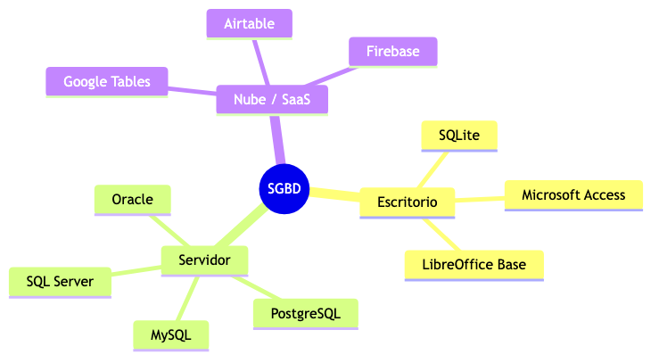
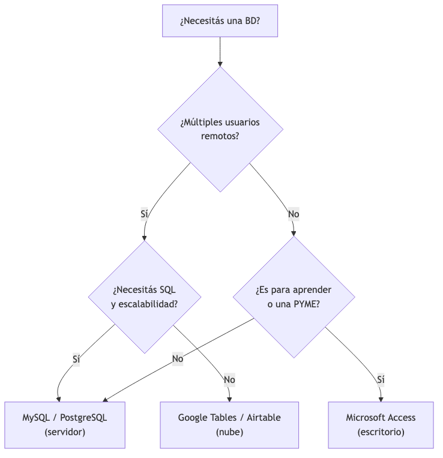
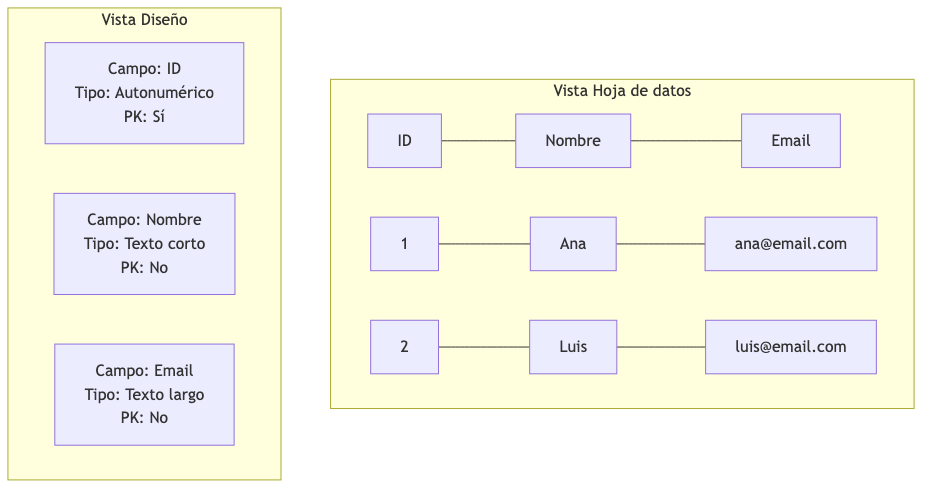
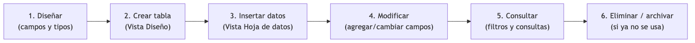
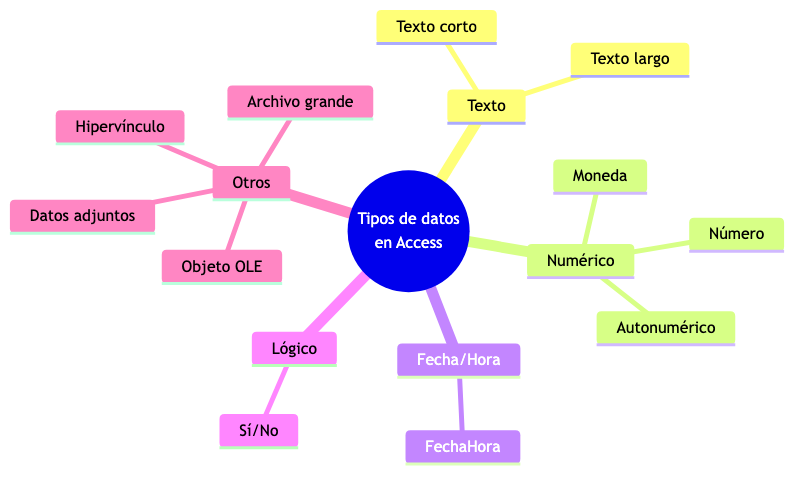
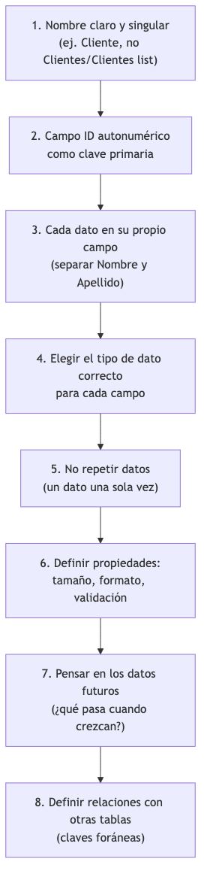
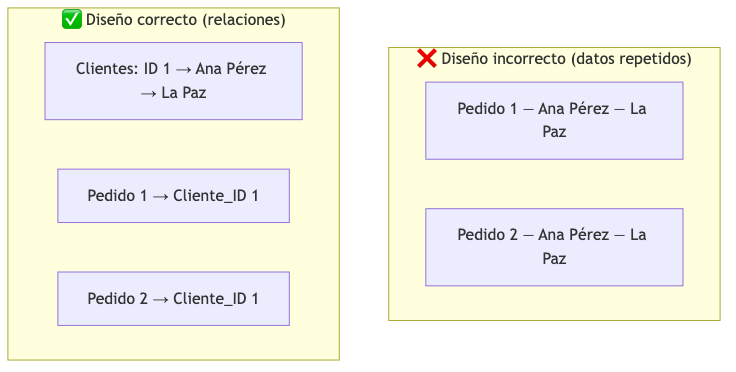

# TEMA 2 — MANEJO BÁSICO DE SISTEMAS DE GESTIÓN DE BASES DE DATOS (SGBD)

**Autor:** Ing. Gaston Genaro Quelali Calcina

---

**Contenido:**
- [2. ¿Qué es un SGBD?](#2-qué-es-un-sgbd)
- [2.1 Herramientas SGBD](#21-herramientas-sgbd)
- [2.2 Crear, modificar y eliminar tablas](#22-crear-modificar-y-eliminar-tablas)
- [2.3 Trabajar con registros](#23-trabajar-con-registros)
- [2.4 Propiedades de campo y tipos de datos](#24-propiedades-de-campo-y-tipos-de-datos)
- [2.5 Buenas prácticas de modelado](#25-buenas-prácticas-de-modelado)

---

## 2. ¿Qué es un SGBD?

### 2.0.1 Definición

Un **SGBD** (Sistema de Gestión de Bases de Datos, del inglés **DBMS** — *Database Management System*) es un **software que permite crear, administrar y manipular bases de datos**, garantizando la integridad, seguridad y disponibilidad de la información.

> **Definición funcional:** el SGBD es el "cerebro" que se encarga de **almacenar los datos de forma organizada**, **recuperarlos rápidamente** cuando se los consulta y **protegerlos** frente a errores y accesos no autorizados.

| Sigla | Inglés | Español |
|---|---|---|
| S | System | Sistema |
| G | Management | Gestión |
| B | Base(s) | Base(s) |
| D | Datos | Datos |

**Funciones principales de un SGBD:**

| Función | Qué hace | Ejemplo |
|---|---|---|
| **Definir** | Crear la estructura: tablas, campos, tipos de datos | Crear la tabla "Clientes" con sus campos |
| **Manipular** | Insertar, modificar, eliminar y consultar datos | Agregar un cliente, cambiar su teléfono |
| **Controlar** | Seguridad, integridad, concurrencia, respaldos | Solo el admin borra registros |
| **Almacenar** | Guardar los datos en el disco de forma eficiente | Guardar 1 millón de registros |

> **Metáfora:** un SGBD es como el **jefe de la bodega** de una empresa: sabe exactamente qué hay en cada estantería (tabla), quién puede entrar a la bodega (seguridad), en qué orden se reponen los productos (consistencia) y lleva el inventario actualizado (consultas). Si cada empleado manejara su propio cuaderno, habría caos.

### 2.0.2 ¿Por qué no alcanza con una hoja de cálculo?

En el Tema 1 vimos las limitaciones de Excel/Sheets. Recordemos las principales:

| Limitación | Consecuencia |
|---|---|
| Sin tipos de datos estrictos | Se ingresan datos incorrectos ("abc" en un precio) |
| Sin integridad referencial | Un pedido puede apuntar a un cliente inexistente |
| Sin control de concurrencia | Dos personas se pisan los cambios |
| Límite de filas | Excel llega a 1 millón de filas y se vuelve lento |
| Sin seguridad por usuario | Cualquiera con el archivo ve todo |
| Sin consultas SQL | Las búsquedas complejas son casi imposibles |

> Un SGBD resuelve todas estas limitaciones **de forma nativa**. Es por eso que las empresas migran sus datos de Excel a sistemas de gestión.

### 2.0.3 Ventajas de usar un SGBD

1. **Integridad de datos:** reglas que garantizan que los datos sean correctos y consistentes.
2. **Seguridad:** permisos por usuario, roles y niveles de acceso.
3. **Concurrencia:** múltiples usuarios trabajando al mismo tiempo sin conflictos.
4. **Respaldo y recuperación:** copias de seguridad automáticas y restauración ante fallos.
5. **Consulta potente:** SQL permite consultas complejas en milisegundos.
6. **Escalabilidad:** puede crecer desde una tabla en una PC hasta millones de registros en servidores.

---

## 2.1 Herramientas SGBD

### 2.1.1 Clasificación general

*Figura: Clasificación de los SGBD según su despliegue*

| Tipo | Qué es | Ejemplos | Ideal para |
|---|---|---|---|
| **Escritorio** | Se instala en una PC; datos en un archivo local | Access, SQLite | Aprendizaje, PYMEs pequeñas, uso personal |
| **Servidor** | Se instala en un servidor central; los clientes se conectan | MySQL, PostgreSQL, Oracle | Empresas, aplicaciones web |
| **Nube / SaaS** | Servicio online por suscripción; sin instalación | Google Tables, Airtable | Equipos remotos, prototipos rápidos |

### 2.1.2 Microsoft Access — herramienta principal

**Microsoft Access** es un SGBD de **escritorio** incluido en Microsoft 365, diseñado para usuarios que no son programadores. Combina la facilidad de uso de una hoja de cálculo con las capacidades de una base de datos real.

**Componentes de la interface de Access:**

| Componente | Función |
|---|---|
| **Tablas** | Almacenan los datos en filas y columnas |
| **Consultas** | Extraen y procesan datos de una o más tablas |
| **Formularios** | Pantallas amigables para ingresar y editar datos |
| **Informes** | Documentos imprimibles con los datos formateados |
| **Macros** | Automatización de tareas repetitivas |
| **Módulos** | Código VBA para funciones avanzadas |

**Ventajas de Access:**
- ✅ Interfaz 100% visual, sin necesidad de programar
- ✅ Integrado con el resto de Office (Excel, Word, Outlook)
- ✅ Relaciones entre tablas visibles y configurables
- ✅ Ideal para aprender conceptos de BD sin complejidad
- ✅ Formularios e informes listos para usar

**Limitaciones:**
- ⚠️ Solo Windows (no hay versión para macOS/Linux)
- ⚠️ Tamaño máximo de archivo: ~2 GB
- ⚠️ Concurrencia limitada (recomendado hasta ~10 usuarios simultáneos)
- ⚠️ No apto para aplicaciones web de gran escala

### 2.1.3 MySQL

**MySQL** es el SGBD de **servidor open source** más popular del mundo. Es la "M" de LAMP (Linux, Apache, MySQL, PHP) y se usa en aplicaciones como Facebook, YouTube y WordPress.

| Característica | Detalle |
|---|---|
| **Tipo** | Servidor relacional |
| **Licencia** | Gratuita (GPL) / comercial (Oracle) |
| **Idioma** | SQL estándar |
| **Interfaces** | Línea de comandos, MySQL Workbench (visual) |
| **Cuándo usarlo** | Aplicaciones web, empresas medianas/grandes |
| **Ventajas** | Gratuito, muy rápido, millones de instalaciones, documentación enorme |
| **Desventajas** | Curva de aprendizaje mayor, requiere servidor |

> **Dato real:** MySQL es usado por el **99% de las empresas** que están en el ranking Fortune 500, aunque muchas lo usan indirectamente a través de aplicaciones como WordPress.

### 2.1.4 Google Tables y Airtable

**Google Tables** y **Airtable** son SGBD **en la nube**, pensados para equipos que necesitan colaborar sin instalar nada.

| Característica | Google Tables | Airtable |
|---|---|---|
| **Tipo** | Nube (SaaS) | Nube (SaaS) |
| **Interfaz** | Similar a Sheets, con vistas tipo tabla/kanban | Tablas + vistas grid, kanban, calendario |
| **Plan gratuito** | 10K filas | 1K filas |
| **Relaciones** | Simples | Simples |
| **Ideal para** | Equipos que ya usan Google Workspace | Prototipos, gestión de proyectos no-code |
| **Ventajas** | Colaboración en tiempo real, gratuito | Muy visual, plantillas, fácil de usar |
| **Desventajas** | Límite de filas, funcionalidad limitada | Límite de filas, features avanzadas pagas |

> **¿Cuándo usarlas?** Son ideales para **prototipos rápidos**, gestionar proyectos o datos de equipos pequeños. Cuando el proyecto crece, los datos se migran a Access o MySQL.

### 2.1.5 Comparativa de herramientas SGBD

| Criterio | **Access** | **MySQL** | **Google Tables** | **Airtable** |
|---|---|---|---|---|
| Tipo | Escritorio | Servidor | Nube | Nube |
| Costo | Licencia MS 365 | Gratuito | Freemium | Freemium |
| Instalación | Sí (Windows) | Servidor | No | No |
| Interfaz | Visual | Comandos + GUI | Web | Web |
| SQL | Parcial | Completo | Parcial | No |
| Multiusuario | Limitado | Completo | Completo | Completo |
| Capacidad | ~2 GB | Ilimitada | 10K filas (gratis) | 1K filas (gratis) |
| Relaciones | Completas y visuales | SQL | Simples | Simples |
| Formularios | Sí | No | Parcial | Vistas |
| Mejor para | Aprendizaje y PYMEs | Desarrollo web | Equipos Google | Prototipos |

> **Para esta materia usaremos Access**, por ser visual, completo y el estándar educativo. Los conceptos que aprendas en Access se aplican a cualquier SGBD relacional.

### 2.1.6 ¿Qué herramienta elegir?

*Figura: ¿Qué herramienta SGBD elegir?*

---

## 2.2 Crear, modificar y eliminar tablas

### 2.2.1 ¿Qué es una tabla en Access?

Una **tabla** es la estructura básica de almacenamiento: datos organizados en **filas** (registros) y **columnas** (campos). En Access, cada tabla tiene:

- **Vista Hoja de datos:** donde se ven y editan los datos (como Excel).
- **Vista Diseño:** donde se definen los campos, tipos de datos y propiedades.

*Figura: Las dos vistas de una tabla en Access*

### 2.2.2 Crear una tabla en Vista Diseño

**Paso 1 — Crear la tabla:**
1. Ir a la pestaña **Crear**.
2. Hacer clic en **Diseño de tabla**.
3. Se abre una ventana en blanco con dos columnas: **Nombre del campo** y **Tipo de datos**.

**Paso 2 — Definir los campos:**

| Nombre del campo | Tipo de datos | Propiedades |
|---|---|---|
| ID | Autonumérico | Clave principal |
| Nombre | Texto corto | Tamaño del campo: 50 |
| Email | Texto corto | Requerido: Sí |
| Telefono | Texto corto | Tamaño: 15 |
| Ciudad | Texto corto | Valor predeterminado: "La Paz" |

**Paso 3 — Establecer la clave primaria:**
1. Seleccionar el campo que será clave (ID).
2. Clic en **Clave principal** (la llave dorada) en la pestaña Diseño.
3. Aparece un icono de llave junto al campo.

**Paso 4 — Guardar:**
1. Clic en el icono de **Guardar** (disquete).
2. Nombrar la tabla: "Clientes".
3. Clic en **Aceptar**.

### 2.2.3 Agregar campos a una tabla existente

1. Abrir la tabla en **Vista Diseño**.
2. En la primera fila vacía, escribir el **nombre del nuevo campo**.
3. Elegir el **tipo de datos** en la lista desplegable.
4. Configurar las **propiedades** del campo (tamaño, formato, etc.).
5. **Guardar** los cambios.

> 💡 **Consejo:** el nombre del campo no debe contener espacios ni caracteres especiales. En vez de "Nombre Completo", usar "NombreCompleto" o "Nombre_Completo".

### 2.2.4 Modificar campos

| Operación | Cómo se hace |
|---|---|
| **Cambiar nombre** | En Vista Diseño, editar el texto del nombre |
| **Cambiar tipo de dato** | En Vista Diseño, seleccionar otro tipo del menú desplegable |
| **Cambiar propiedades** | En la sección inferior, ajustar tamaño, formato, validación |
| **Mover campo** | Arrastrarlo a la posición deseada |
| **Reordenar campos** | Usar la flecha de movimiento en el margen izquierdo |

> ⚠️ **Precaución:** cambiar el tipo de dato de un campo que ya tiene datos puede **borrar o alterar** la información existente (ej. cambiar de "Número" a "Texto" convierte los números en texto).

### 2.2.5 Eliminar campos y tablas

**Eliminar un campo:**
1. Abrir la tabla en **Vista Diseño**.
2. Seleccionar la fila del campo (clic en el selector de fila).
3. Clic derecho → **Eliminar filas**.
4. Confirmar la acción.

**Eliminar una tabla completa:**
1. En el panel de **Navegación**, seleccionar la tabla.
2. Clic derecho → **Eliminar** (o presionar **Supr**).
3. **Confirmar** la eliminación.

> ⚠️ **Advertencia importante:** eliminar una tabla **borra permanentemente** todos sus datos. Antes de eliminar, hacer una copia de seguridad. Además, si otras tablas dependen de ella (relaciones), Access advertirá y bloqueará la eliminación o romperá las relaciones.

### 2.2.6 Ciclo de vida de una tabla

*Figura: Ciclo de vida de una tabla*

---

## 2.3 Trabajar con registros

### 2.3.1 Insertar registros

La forma más directa es la **Vista Hoja de datos**:

1. Abrir la tabla (doble clic en su nombre).
2. Ir a la primera fila vacía (la de abajo de todo, con el asterisco *).
3. Escribir los valores en cada columna.
4. Al pasar a la siguiente fila, el registro se guarda automáticamente.

| ID (Auto) | Nombre | Email | Telefono | Ciudad |
|---|---|---|---|---|
| 1 | Ana Pérez | ana@email.com | 70012345 | La Paz |
| 2 | Carlos López | carlos@email.com | 70123456 | Cochabamba |
| 3 | María García | maria@email.com | 70234567 | Santa Cruz |

**Otra forma:** usar un **formulario** (se ve en temas siguientes), que ofrece una pantalla amigable para cargar datos.

### 2.3.2 Modificar registros

1. Abrir la tabla en **Vista Hoja de datos**.
2. Hacer clic en la celda que se quiere modificar.
3. Editar el contenido.
4. Al salir de la celda, los cambios se guardan automáticamente.

> 💡 **Consejo:** si un campo tiene una **regla de validación**, Access rechazará el valor si no cumple (ej. stock >= 0).

### 2.3.3 Eliminar registros

1. Seleccionar el registro (clic en el selector de fila, el rombo a la izquierda).
2. Clic derecho → **Eliminar registro** (o presionar **Supr**).
3. **Confirmar** en el cuadro de diálogo.

**Eliminar varios registros a la vez:**
1. Hacer clic en la primera fila a eliminar.
2. Mantener **Shift** (mayúscula) y hacer clic en la última fila.
3. Clic derecho → **Eliminar registro**.

> ⚠️ **No se puede deshacer** la eliminación de registros en Access. Siempre confirmar antes de eliminar, y en entornos productivos usar un campo "Activo" (Sí/No) en lugar de borrar físicamente.

### 2.3.4 Buscar y filtrar registros

**Búsqueda simple (Ctrl + B):**
1. Abrir la tabla.
2. Presionar **Ctrl + B** (o clic en "Buscar").
3. Escribir el texto a buscar.
4. Elegir en qué campo buscar y las opciones de coincidencia.

**Filtrar por selección:**
1. Hacer clic en una celda que contenga el valor de referencia (ej. "La Paz").
2. Clic derecho → **Selección igual a "La Paz"**.
3. La tabla muestra solo los registros que coinciden.

**Filtro avanzado:**
1. En la pestaña **Inicio** → **Filtro avanzado**.
2. Configurar condiciones por campo.
3. Aplicar el filtro.

| Operación | Acción |
|---|---|
| Buscar texto | Ctrl + B (Buscar) |
| Filtrar por selección | Clic derecho → Selección igual a... |
| Quitar filtro | Clic en "Alternar filtro" |
| Ordenar A-Z | Clic en el encabezado de columna → Ordenar ascendente |
| Ordenar Z-A | Clic en el encabezado → Ordenar descendente |

---

## 2.4 Propiedades de campo y tipos de datos

### 2.4.1 El nombre del campo

Reglas y buenas prácticas:

| Regla | Ejemplo correcto | Ejemplo incorrecto |
|---|---|---|
| Sin espacios | NombreCompleto | Nombre Completo |
| Sin caracteres especiales | Precio_unitario | Precio$/u |
| No empezar con número | Codigo_1 | 1_Codigo |
| Descriptivo y claro | FechaNacimiento | F1 |
| Coherente entre tablas | ClienteID (mismo nombre en todas) | ClienteID / IDCliente / ID_Cliente |

### 2.4.2 Tipos de datos en Access

*Figura: Tipos de datos en Access*

| Tipo de datos | Qué almacena | Tamaño | Ejemplo |
|---|---|---|---|
| **Texto corto** | Texto o combinación de texto y números | Hasta 255 caracteres | Nombres, teléfonos, códigos |
| **Texto largo** | Párrafos de texto | Hasta 65,535 caracteres | Descripciones, comentarios |
| **Número** | Valores numéricos para cálculos | 1, 2, 4 u 8 bytes | Cantidades, edades |
| **Moneda** | Valores monetarios | 8 bytes | Precios, sueldos |
| **Autonumérico** | Número generado automáticamente, único | 4 u 8 bytes | IDs, códigos |
| **Fecha/Hora** | Fechas y horas | 8 bytes | Fecha de pedido |
| **Sí/No** | Valor lógico (verdadero/falso) | 1 bit | Activo, Pagado, EnStock |
| **Hipervínculo** | URLs y rutas | Hasta 2 GB | Sitio web |
| **Datos adjuntos** | Archivos incrustados | Hasta 2 GB | Fotografías, documentos |
| **Objeto OLE** | Objetos de otras aplicaciones | Hasta 2 GB | Gráficos de Excel |
| **Archivo grande** | Binarios grandes | Hasta 2 GB | Videos, PDFs |

**Cómo elegir el tipo de dato correcto:**

| Situación | Tipo correcto | Tipo incorrecto |
|---|---|---|
| Nombre de una persona | Texto corto | Número |
| Precio de un producto | Moneda | Texto |
| Número de teléfono "70012345" | Texto corto | Número (se perdería el 0 inicial) |
| Cantidad en stock | Número | Texto |
| Fecha de nacimiento | Fecha/Hora | Texto |
| ¿Está pagado? | Sí/No | Texto |
| Identificador de cliente | Autonumérico | Texto libre |

> 💡 **Regla de oro:** si un número **no se usa en cálculos**, debe ser **Texto** (teléfonos, códigos postales, RUC, DNI).

### 2.4.3 Propiedades de campo

Cada tipo de dato tiene propiedades que controlan cómo se almacena y muestra el valor:

| Propiedad | Qué controla | Ejemplo |
|---|---|---|
| **Tamaño del campo** | Máximo de caracteres (texto) o precisión (número) | Texto de 50 caracteres |
| **Formato** | Cómo se muestra el dato | Formato moneda "$#,##0.00" |
| **Máscara de entrada** | Plantilla para ingresar el dato | "(999) 000-0000" para teléfono |
| **Valor predeterminado** | Valor que se rellena automáticamente | "La Paz" en campo Ciudad |
| **Regla de validación** | Condición que debe cumplir el dato | `>=0` en stock |
| **Texto de validación** | Mensaje de error si no cumple | "El stock no puede ser negativo" |
| **Requerido** | Si el campo debe completarse siempre | Sí para Nombre |
| **Permitir longitud cero** | Si se acepta "" (cadena vacía) | No |
| **Indexado** | Crea índice para búsquedas rápidas | Sí (duplicados permitidos) |
| **Título** | Etiqueta alternativa de la columna | "Nombre completo" |

### 2.4.4 Ejemplo práctico de propiedades

**Tabla "Productos":**

| Campo | Tipo | Propiedades |
|---|---|---|
| ID | Autonumérico | Clave principal |
| Nombre | Texto corto | Tamaño: 100 · Requerido: Sí |
| Precio | Moneda | Formato: Moneda · Regla: `>=0` · Texto: "El precio no puede ser negativo" |
| Stock | Número | Entero largo · Regla: `>=0` · Texto: "Stock no negativo" |
| FechaVencimiento | Fecha/Hora | Formato: Fecha corta |
| Activo | Sí/No | Valor predeterminado: Sí |

### 2.4.5 La clave primaria

La **clave primaria** (PK) es el campo que identifica **de forma única** cada registro.

**Reglas de la clave primaria:**
1. **Única:** no puede haber dos registros con el mismo valor.
2. **No nula:** siempre debe tener un valor.
3. **Estable:** no debería cambiar con el tiempo.

**Opciones en Access:**

| Opción | Descripción | Ejemplo |
|---|---|---|
| **Autonumérico** | Access genera 1, 2, 3... automáticamente | El más común y recomendado |
| **Campo único natural** | Un campo que ya es único por naturaleza | DNI, RUC |
| **Clave compuesta** | Combinación de 2+ campos | (Pedido_ID + Producto_ID) |

> 💡 **Recomendación:** usar siempre **Autonumérico** como clave primaria. Es simple, infalible y no depende de datos del negocio.

---

## 2.5 Buenas prácticas de modelado

### 2.5.1 Lista de verificación para diseñar una tabla

*Figura: Checklist de buenas prácticas de modelado*

### 2.5.2 Buenas prácticas detalladas

| Práctica | Qué hacer | Qué evitar |
|---|---|---|
| **Nombre de tablas** | Singular, descriptivo: "Cliente" | "Tabla1", "Lista de clientes" |
| **Nombre de campos** | Descriptivo, sin espacios: "FechaNacimiento" | "a", "campo1", "Fecha Nacimiento" |
| **Clave primaria** | Autonumérico en todas las tablas | Dejar tablas sin clave primaria |
| **Tipos de datos** | El más adecuado a la naturaleza del dato | Usar "Texto" para todo |
| **Propiedades** | Definir tamaño, validación, requerido | Dejar todo por defecto |
| **Redundancia** | Un dato se almacena UNA sola vez | Repetir el nombre del cliente en cada pedido |
| **Datos calculados** | Calcularlos en consultas/formularios | Guardar resultados calculados (ej. total = precio × cantidad) |
| **Registros eliminados** | Usar campo "Activo" (Sí/No) | Borrar físicamente datos históricos |

### 2.5.3 Introducción a la normalización

La **normalización** es el proceso de organizar los datos para eliminar redundancia y problemas de inconsistencia. Para este nivel, basta con las reglas básicas:

**Primera regla (1FN) — datos atómicos:**
- Cada celda contiene un solo valor.
- ❌ Celda con "Ana, Carlos, María"
- ✅ Tres registros separados

**Segunda regla (2FN) — sin datos repetidos entre tablas:**
- Un dato se almacena una sola vez y se referencia con claves.
- ❌ Pedido con "Ana Pérez" repetido en cada fila
- ✅ Pedido con "Cliente_ID" que apunta a la tabla Clientes

*Figura: Normalización básica: eliminar datos repetidos*

### 2.5.4 Errores comunes en el modelado

| Error | Ejemplo | Consecuencia |
|---|---|---|
| Tablas sin clave primaria | Tabla de pedidos sin ID | No se puede distinguir ni relacionar registros |
| Un solo campo para todo | "Datos = Ana, La Paz, 70012345" | Imposible filtrar o consultar |
| Datos repetidos | Nombre del cliente en cada pedido | Si cambia el nombre, hay que cambiarlo en todos lados |
| Mezclar tipos | Campo "Precio" con "50", "barato", "no" | No se puede calcular ni validar |
| Guardar calculados | Total = precio × cantidad | Si cambia el precio, el total queda desactualizado |
| Borrar sin respaldo | Eliminar registros viejos | Se pierde el historial y la trazabilidad |

### 2.5.5 El siguiente paso: relaciones

Las buenas prácticas de modelado culminan en el **Tema 3**: las **relaciones entre tablas**. Un buen modelo:

- Define claves primarias claras (esta unidad).
- Conecta las tablas con claves foráneas (Tema 3).
- Permite consultas que combinan datos (Tema 3 y 4).

> **Conexión con la materia:** lo que diseñás como tabla acá, se convertirá en las consultas del Tema 3, el SQL del Tema 4 y los informes del Tema 5. Un buen diseño inicial evita dolores de cabeza en los próximos temas.

---

## 2.6 Práctica guiada: Access paso a paso

### Paso 1: Crear la base de datos

1. Abrir **Microsoft Access**.
2. Elegir **Base de datos en blanco**.
3. Nombrar: `Gestion_Libreria.accdb`.
4. Guardar en la carpeta del alumno.

### Paso 2: Crear la tabla "Libros"

1. **Crear → Diseño de tabla**.
2. Definir los campos:

| Campo | Tipo de dato | Propiedades |
|---|---|---|
| ID | Autonumérico | Clave principal |
| Titulo | Texto corto | Tamaño: 200 · Requerido: Sí |
| Autor | Texto corto | Tamaño: 100 · Requerido: Sí |
| Genero | Texto corto | Tamaño: 50 |
| Precio | Moneda | Regla: `>=0` |
| Stock | Número | Entero largo · Regla: `>=0` |
| Disponible | Sí/No | Valor predeterminado: Sí |

3. Guardar como **"Libros"**.

### Paso 3: Insertar registros en "Libros"

| ID | Titulo | Autor | Genero | Precio | Stock | Disponible |
|---|---|---|---|---|---|---|
| 1 | Cien años de soledad | Gabriel García Márquez | Novela | 89.00 | 10 | Sí |
| 2 | El principito | Antoine de Saint-Exupéry | Infantil | 55.00 | 15 | Sí |
| 3 | Historia de Bolivia | varios | Historia | 120.00 | 5 | Sí |

### Paso 4: Modificar y eliminar

1. Cambiar el precio del libro 2 a **60.00**.
2. Agregar el campo **"Editorial"** (Texto corto, tamaño 100).
3. Cargar la editorial de cada libro.
4. Eliminar el registro del libro 3 (prueba).

### Paso 5: Aplicar propiedades

1. Agregar **máscara de entrada** al campo "Autor": ninguno (por ahora).
2. En "Stock", verificar la **regla de validación** `>=0`.
3. Probar ingresar un stock negativo → debe aparecer el mensaje de error.

### Paso 6: Verificación

| Verificación | Resultado esperado |
|---|---|
| La tabla "Libros" existe con 7 campos | Sí |
| Los 3 libros se cargaron correctamente | Sí |
| El campo Editorial se agregó | Sí |
| El libro 3 ya no aparece | Sí |
| Ingresar stock negativo | Error de validación |

> **Actividad de cierre:** crear una segunda tabla **"Prestamos"** con campos ID (autonumérico), LibroID (número), FechaPrestamo (fecha/hora) y FechaDevolucion (fecha/hora). Insertar 3 registros. *La relación entre Libros y Prestamos se verá en el Tema 3.*

---

## Preguntas de repaso

1. ¿Qué es un SGBD y cuáles son sus 4 funciones principales?
2. Nombra y describe los 3 tipos de SGBD según su despliegue.
3. ¿Cuáles son las ventajas y limitaciones de Microsoft Access?
4. ¿En qué se diferencia MySQL de Access? ¿Cuándo usarías cada uno?
5. ¿Qué es la vista Diseño y para qué sirve? ¿Y la vista Hoja de datos?
6. Describe los pasos para crear una tabla en Access con su clave primaria.
7. ¿Qué tipos de datos existen en Access? Da 2 ejemplos de uso de cada uno.
8. ¿Cuándo debe un número ser tipo "Texto" en lugar de "Número"?
9. Nombra 5 propiedades de campo y qué controla cada una.
10. ¿Qué es la clave primaria y por qué es obligatoria? ¿Qué opciones ofrece Access?
11. Enuncia 4 buenas prácticas de modelado.
12. ¿Qué es la normalización? Da un ejemplo de datos repetidos mal modelados.

---

## Glosario

| Término | Significado |
|---|---|
| **Autonumérico** | Tipo de dato que genera un número único automáticamente |
| **Base de datos** | Conjunto organizado de datos estructurados en tablas |
| **Campo** | Cada columna de una tabla; un atributo de los datos |
| **Clave primaria (PK)** | Campo que identifica de forma única cada registro |
| **Concurrencia** | Capacidad de varios usuarios operando simultáneamente |
| **DBMS** | Database Management System (SGBD en inglés) |
| **Formulario** | Pantalla de Access para ingresar/editar datos de forma amigable |
| **Integridad referencial** | Regla que garantiza la consistencia de las relaciones entre tablas |
| **Máscara de entrada** | Plantilla que guía el formato de ingreso de un dato |
| **Normalización** | Proceso de organizar datos para eliminar redundancia |
| **Registro** | Cada fila de una tabla; una entidad individual |
| **Regla de validación** | Condición que debe cumplir un valor al ingresarse |
| **SGBD** | Sistema de Gestión de Bases de Datos |
| **Tabla** | Estructura de datos en filas (registros) y columnas (campos) |
| **Vista Diseño** | Vista de Access para definir campos, tipos y propiedades |
| **Vista Hoja de datos** | Vista de Access para ver y editar los registros como en Excel |
