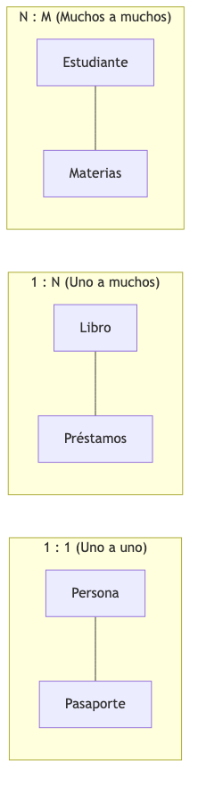
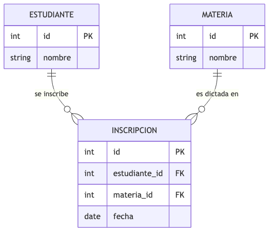
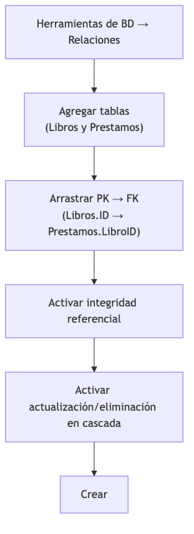
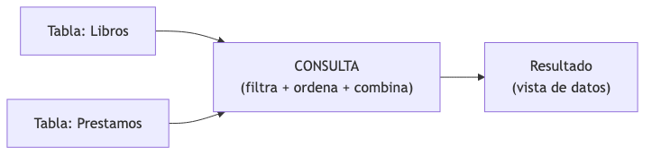
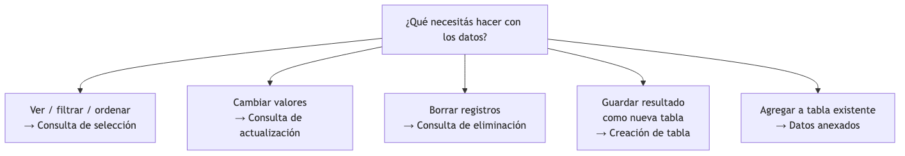

<!-- _class: title -->

# Relaciones, Consultas y Análisis Avanzado
## Tema 3
#### Ing. Gaston Genaro Quelali Calcina

---

## Agenda

1. **Relaciones entre tablas** — 1:1, 1:N, N:M
2. **Edición y gestión de relaciones** — integridad referencial
3. **Consultas de selección** — filtros, varias tablas
4. **Consultas avanzadas** — parámetros, totales, cruzadas
5. **Consultas de acción** — actualización, eliminación, creación, anexos

---

## ¿Qué es una relación?

> Vínculo lógico entre dos tablas que permite combinar sus datos.
> Se crea conectando la **PK** de una tabla con la **FK** de otra.

**Ejemplo (Tema 2):**
- Tabla **Libros** (PK: `ID`)
- Tabla **Prestamos** (FK: `LibroID`)
- Relación: "un libro puede tener muchos préstamos"

---

## Los tres tipos de relaciones

<!-- fuente: assets/mermaid/01_tipos_relaciones.mmd -->


| Relación | Ejemplo | Implementación |
|---|---|---|
| **1:1** | Persona ↔ Pasaporte | PK de una es FK de la otra |
| **1:N** | Libro ↔ Préstamos | FK en la tabla "muchos" |
| **N:M** | Estudiante ↔ Materias | Tabla intermedia |

> La FK va siempre en el lado "muchos"

---

## Muchos a muchos: tabla intermedia

<!-- fuente: assets/mermaid/02_tabla_intermedia.mmd -->


**INSCRIPCION** = tabla puente con 2 FKs:
- Estudiante_ID → ESTUDIANTE
- Materia_ID → MATERIA

Cada fila: "el estudiante X está inscripto en la materia Y"

---

## Crear una relación en Access

<!-- fuente: assets/mermaid/03_crear_relacion.mmd -->


1. **Herramientas de BD → Relaciones**
2. Agregar tablas
3. Arrastrar PK → FK
4. Activar **integridad referencial**
5. Activar **cascadas** (actualización sí, eliminación con cuidado)
6. Crear

---

## Integridad referencial

Reglas que garantizan relaciones válidas:

| Regla | Consecuencia |
|---|---|
| No hay hijo sin padre | Un préstamo necesita un libro existente |
| No se borra un padre con hijos | No se borra un libro con préstamos |
| No se cambia PK con hijos | Salvo actualización en cascada |

**Error típico de Access:**
> "No puede agregar o modificar un registro porque se necesita un registro relacionado en la tabla 'Libros'"

---

## Tipos de combinación (joins)

| Tipo | Incluye |
|---|---|
| **1. Coincidentes** | Solo pares FK = PK |
| **2. Todos de A + coincidentes** | Todos de Libros, con préstamos si existen |
| **3. Todos de B + coincidentes** | Todos de Préstamos, con libros si existen |

---

## ¿Qué es una consulta?

<!-- fuente: assets/mermaid/04_que_es_consulta.mmd -->


> Instrucción que **extrae y procesa datos** sin copiarlos. Es una "vista" calculada en tiempo real.

**Ventajas:**
- No duplica datos · siempre actualizada
- Combina tablas · filtra · ordena · agrupa · calcula
- Base de informes y formularios

---

## Vista Diseño vs Vista SQL

| Vista | Qué muestra |
|---|---|
| **Diseño** | Cuadrícula visual (campos, tablas, criterios) |
| **SQL** | Texto del comando generado |

**Ejemplo SQL:**
```sql
SELECT Titulo, Autor, Stock
FROM Libros
WHERE Disponible = True
ORDER BY Titulo;
```

> Siempre mirar el SQL que genera Access → prepara el Tema 4

---

## Criterios de filtro

| Criterio | Ejemplo |
|---|---|
| Texto exacto | `= "Novela"` |
| Diferente de | `<> "Novela"` |
| Mayor que | `> 100` |
| Entre | `Between 50 And 100` |
| Contiene | `Like "*soledad*"` |
| Empieza con | `Like "C*"` |
| Lista | `In ("Novela","Historia")` |
| Nulo | `Is Null` |

---

## Consulta con varias tablas

```sql
SELECT Libros.Titulo, Prestamos.FechaPrestamo
FROM Libros INNER JOIN Prestamos
  ON Libros.ID = Prestamos.LibroID;
```

> La relación definida antes se usa automáticamente en las consultas.

---

## Consulta de parámetros

Pide el criterio al usuario en el momento de ejecutar:

```
[Ingrese el género a buscar]
```

```sql
SELECT Titulo, Autor, Genero
FROM Libros
WHERE Genero = [Ingrese el género a buscar];
```

> **Una consulta, muchos valores posibles.**

---

## Consultas de totales (Σ)

| Función | Calcula | Ejemplo |
|---|---|---|
| Sum | Suma | Precio total del stock |
| Avg | Promedio | Precio promedio |
| Count | Cantidad | Cuántos libros |
| Min / Max | Mínimo / máximo | Más barato / caro |

```sql
SELECT Genero, Avg(Precio) AS PromedioPrecio, Count(ID) AS Cantidad
FROM Libros
GROUP BY Genero;
```

---

## Referencias cruzadas

Presenta datos en formato **bidimensional** (como tabla dinámica):

```
            Enero   Febrero   Marzo
Cien años     2        1        0
El principito 1        3        2
```

> Filas = un campo · Columnas = otro campo · Celda = valor agregado

---

## Consultas de acción

| Tipo | Qué hace | Riesgo |
|---|---|---|
| **Actualización** | Modifica valores | Puede afectar muchos registros |
| **Eliminación** | Borra registros | Irreversible |
| **Creación de tabla** | Guarda resultado en nueva tabla | Duplica (consciente) |
| **Datos anexados** | Agrega a tabla existente | Puede duplicar |

> ⚠️ **No se pueden deshacer. Siempre respaldar antes.**

---

## Consulta de actualización

```sql
UPDATE Libros SET Precio = [Precio]*1.1 WHERE Genero = "Historia";
```

1. Diseño → tipo **Actualizar**
2. Campo Precio → Actualizar a: `[Precio]*1.1`
3. Genero → Criterios: `"Historia"`
4. Ejecutar y confirmar

---

## Consulta de eliminación

```sql
DELETE FROM Libros WHERE Stock = 0;
```

1. Diseño → tipo **Eliminar**
2. Criterio en Stock: `0`
3. Ejecutar y confirmar

> Con integridad referencial, no se borrará un libro con préstamos.

---

## Creación de tabla y datos anexados

**Creación:**
```sql
SELECT * INTO HistorialPrestamos
FROM Prestamos
WHERE FechaPrestamo Between #01/01/2026# And #31/12/2026#;
```

**Anexado:**
```sql
INSERT INTO PedidosReponer (Titulo, Stock)
SELECT Titulo, Stock FROM Libros WHERE Stock < 5;
```

> ⚠️ La tabla copiada es una "foto" del momento, no se actualiza sola.

---

## ¿Qué consulta elegir?

<!-- fuente: assets/mermaid/05_tipo_consulta.mmd -->


| Necesidad | Consulta |
|---|---|
| Ver / filtrar / ordenar | Selección |
| Cambiar valores | Actualización |
| Borrar registros | Eliminación |
| Guardar resultado | Creación de tabla |
| Agregar a tabla | Datos anexados |

---

## Repaso rápido

1. ¿Cuáles son los 3 tipos de relaciones?
2. ¿Cómo se resuelve un N:M?
3. ¿Qué es la integridad referencial?
4. ¿Qué es una consulta de parámetros?
5. ¿Qué calcula Sum, Avg, Count?
6. ¿Qué es una referencias cruzadas?
7. Nombra las 4 consultas de acción y sus riesgos
8. Escribe el SQL de una actualización

---

<!-- _class: title -->
# ¡Gracias!
### Dudas y consultas
