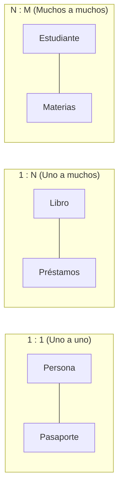
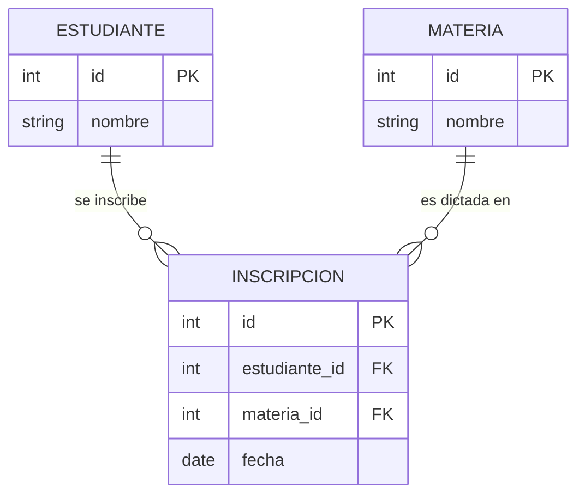
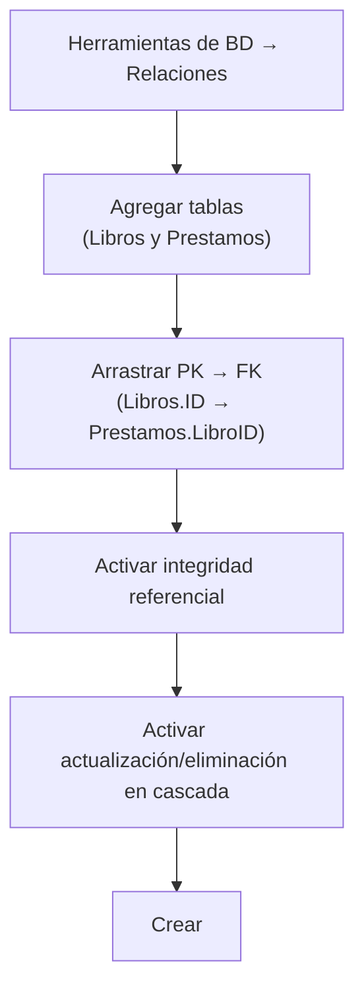
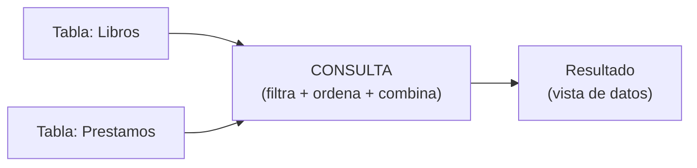
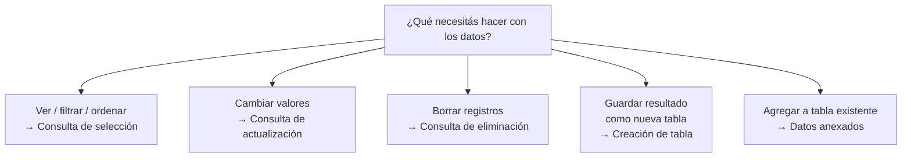

# TEMA 3 — RELACIONES, CONSULTAS Y ANÁLISIS AVANZADO

**Autor:** Ing. Gaston Genaro Quelali Calcina

---

**Contenido:**
- [3. Relaciones entre tablas](#3-relaciones-entre-tablas)
- [3.1 Edición y gestión de relaciones](#31-edición-y-gestión-de-relaciones)
- [3.2 Consultas en Access](#32-consultas-en-access)
- [3.3 Consultas avanzadas](#33-consultas-avanzadas)
- [3.4 Consultas de acción](#34-consultas-de-acción)

---

## 3. Relaciones entre tablas

### 3.0.1 ¿Qué es una relación?

Una **relación** es un **vínculo lógico entre dos tablas** que permite combinar sus datos. Se crea conectando la **clave primaria (PK)** de una tabla con la **clave foránea (FK)** de otra.

> **Definición funcional:** la relación responde a la pregunta *"¿cómo se conectan los datos de esta tabla con los de esta otra?"*. Sin relaciones, las tablas son cajas aisladas; con relaciones, forman un modelo integrado.

**Ejemplo típico (viene del Tema 2):**

- Tabla **Libros** (PK: `ID`).
- Tabla **Prestamos** (FK: `LibroID` apunta a `Libros.ID`).
- Relación: "un libro puede tener muchos préstamos".

### 3.0.2 Los tres tipos de relaciones



*Figura: Los tres tipos de relaciones*

| Relación | Descripción | Ejemplo | ¿Cómo se implementa? |
|---|---|---|---|
| **1:1 (uno a uno)** | Un registro de A se relaciona con un solo registro de B y viceversa | Persona ↔ Pasaporte | La PK de una tabla es también FK de la otra |
| **1:N (uno a muchos)** | Un registro de A se relaciona con varios de B; cada B solo con un A | Libro ↔ Préstamos | La FK va en la tabla del lado "muchos" |
| **N:M (muchos a muchos)** | Un registro de A se relaciona con varios de B y viceversa | Estudiante ↔ Materias | **Tabla intermedia** con 2 FKs |

> **Regla práctica:** la clave foránea siempre se coloca en la tabla del **lado "muchos"**. En un 1:N de Libro→Préstamos, la FK `LibroID` va en Préstamos.

### 3.0.3 Muchos a muchos: la tabla intermedia

La relación N:M **no puede representarse directamente** en el modelo relacional. Se resuelve con una **tabla intermedia** (también llamada "puente", "pivot" o "de unión") que contiene dos claves foráneas.



*Figura: Relación N:M resuelta con la tabla intermedia INSCRIPCION*

| Tabla | Función |
|---|---|
| ESTUDIANTE | Almacena un estudiante por registro |
| MATERIA | Almacena una materia por registro |
| **INSCRIPCION** | Tabla intermedia: cada fila = "el estudiante X está inscripto en la materia Y" |

> **Ejemplo en Access:** para modelar "un cliente puede comprar varios productos y un producto puede ser comprado por varios clientes", creamos la tabla **Detalle_Pedido** (intermedia) que vincula Pedidos y Productos.

---

## 3.1 Edición y gestión de relaciones

### 3.1.1 La ventana Relaciones

En Access, las relaciones se administran en la ventana **Herramientas de base de datos → Relaciones**.



*Figura: Pasos para crear una relación en Access*

### 3.1.2 Pasos para crear una relación

1. Cerrar todas las tablas abiertas.
2. Ir a **Herramientas de base de datos → Relaciones**.
3. Clic en **Mostrar tabla** y agregar las tablas a vincular (ej. "Libros" y "Prestamos").
4. **Arrastrar** el campo `ID` (de Libros) sobre el campo `LibroID` (de Prestamos).
5. En el cuadro **Editar relaciones**:

| Opción | Descripción |
|---|---|
| **Tipo de relación** | Se muestra automáticamente (1:N) |
| **Exigir integridad referencial** | Evita huérfanos (un préstamo sin libro) |
| **Actualizar en cascada los campos relacionados** | Si cambia el ID del libro, se actualiza en todos sus préstamos |
| **Eliminar en cascada los registros relacionados** | Si se borra el libro, se borran sus préstamos |

6. Marcar **Exigir integridad referencial** (recomendado).
7. Clic en **Crear**.

> 💡 **Consejo:** activar "Actualizar en cascada" sí; activar "Eliminar en cascada" solo si estás seguro de que quieres que al borrar el padre se borren los hijos.

### 3.1.3 Integridad referencial

La **integridad referencial** es la regla que garantiza que una relación siempre sea válida:

| Regla | Consecuencia |
|---|---|
| No se puede insertar un registro hijo sin su padre | Un préstamo debe tener un libro existente |
| No se puede eliminar un padre con hijos | No se borra un libro que tiene préstamos |
| No se puede cambiar la PK de un padre con hijos | Salvo que esté activada la actualización en cascada |

**Resultados al violar la integridad referencial:**
- Access muestra el error: *"No puede agregar o modificar un registro porque se necesita un registro relacionado en la tabla 'Libros'"*.
- Si el campo de enlace no es una PK/FK válida, Access no permite crear la relación.

### 3.1.4 Editar y eliminar relaciones

| Operación | Cómo se hace |
|---|---|
| **Editar** | Doble clic sobre la línea de la relación → ajustar opciones |
| **Eliminar** | Clic derecho sobre la línea → **Eliminar** → confirmar |
| **Ver relaciones** | Ventana Relaciones → líneas entre tablas |

### 3.1.5 Tipos de combinación (joins)

Access permite definir cómo se combinan los datos al consultar:

| Tipo de combinación | Qué incluye |
|---|---|
| **1: Solo registros coincidentes (INNER JOIN)** | Solo los pares donde el FK coincide con la PK |
| **2: Todos de la tabla A + coincidentes de B** | Todos los registros de la primera tabla, con datos de la segunda si existen |
| **3: Todos de la tabla B + coincidentes de A** | Todos los de la segunda, con datos de la primera si existen |

> **Ejemplo:** con Libros (10) y Prestamos (5):
> - Combinación 1 → solo los 5 libros que tienen préstamos.
> - Combinación 2 → los 10 libros, y los que tienen préstamos muestran sus datos.

---

## 3.2 Consultas en Access

### 3.2.1 ¿Qué es una consulta?

Una **consulta** (query) es una instrucción que **extrae y procesa datos** de una o más tablas, según criterios definidos. La consulta **no copia los datos**: muestra una "vista" calculada de ellos en el momento de ejecutarse.



*Figura: Una consulta combina datos de varias tablas y genera un resultado*

**Ventajas de las consultas:**
- ✅ No duplican datos (siempre trabajan sobre el original).
- ✅ Se actualizan automáticamente cuando cambian los datos.
- ✅ Permiten combinar varias tablas.
- ✅ Pueden filtrar, ordenar, agrupar y calcular.
- ✅ Son la base de informes y formularios.

### 3.2.2 Vista SQL vs Vista Diseño

Access muestra las consultas de dos formas:

| Vista | Qué muestra | Uso |
|---|---|---|
| **Vista Diseño** | Cuadrícula visual (campos, tablas, criterios) | Crear consultas sin escribir código |
| **Vista SQL** | Texto del comando SQL | Ver/editar el SQL generado |

> **Importante:** aunque Access genera el SQL automáticamente, es fundamental que veas el SQL para entender qué está pasando. El Tema 4 profundiza en SQL.

### 3.2.3 Crear una consulta de selección

1. Ir a **Crear → Diseño de consultas**.
2. Agregar las tablas necesarias (ej. Libros y Prestamos).
3. En la cuadrícula inferior, elegir los **campos** a mostrar.
4. Definir **criterios** (filtros) si se necesitan.
5. Guardar con nombre descriptivo (ej. "LibrosDisponibles").
6. Ejecutar: clic en **Ejecutar** (el signo ! rojo) o vista Hoja de datos.

### 3.2.4 Consulta de selección simple

**Ejemplo:** mostrar título, autor y stock de los libros disponibles.

| Campo | Titulo | Autor | Stock | Disponible |
|---|---|---|---|---|
| Tabla | Libros | Libros | Libros | Libros |
| Orden | Ascendente | | | |
| Criterios | | | | Sí |

**SQL generado:**
```sql
SELECT Titulo, Autor, Stock
FROM Libros
WHERE Disponible = True
ORDER BY Titulo;
```

### 3.2.5 Consultas con criterios (filtros)

| Criterio | Qué filtra | Ejemplo |
|---|---|---|
| Texto exacto | `= "Novela"` | Solo género Novela |
| Diferente de | `<> "Novela"` | Todos menos Novela |
| Mayor que | `> 100` | Precios mayores a 100 |
| Entre | `Between 50 And 100` | Precios entre 50 y 100 |
| Contiene | `Like "*soledad*"` | Títulos que contengan "soledad" |
| Empieza con | `Like "C*"` | Títulos que empiecen con C |
| Lista de valores | `In ("Novela","Historia")` | Géneros Novela o Historia |
| Nulo | `Is Null` | Campos vacíos |
| No nulo | `Is Not Null` | Campos completados |

> 💡 **Comodines en Access:** `*` = cualquier cantidad de caracteres, `?` = un solo carácter. (En SQL estándar es `%` y `_`, se ve en el Tema 4).

---

## 3.3 Consultas avanzadas

### 3.3.1 Consultas con varias tablas

Cuando hay una relación, una consulta puede combinar datos de ambas:

**Ejemplo:** mostrar qué libro se prestó, a quién y cuándo.

| Campo | Titulo | FechaPrestamo |
|---|---|---|
| Tabla | Libros | Prestamos |
| Criterios | | |

**SQL generado:**
```sql
SELECT Libros.Titulo, Prestamos.FechaPrestamo
FROM Libros INNER JOIN Prestamos ON Libros.ID = Prestamos.LibroID;
```

### 3.3.2 Consultas de parámetros

Una **consulta de parámetros** pide el valor del criterio en el momento de ejecutarse. Es útil para reutilizar la misma consulta con distintos valores.

**Ejemplo:** consulta que pide un género y muestra los libros de ese género.

1. En la fila **Criterios** del campo Genero, escribir entre corchetes:
   ```
   [Ingrese el género a buscar]
   ```
2. Al ejecutar, Access muestra un cuadro pidiendo el valor.
3. El usuario escribe, por ejemplo: `Novela`.

**SQL generado:**
```sql
SELECT Titulo, Autor, Genero
FROM Libros
WHERE Genero = [Ingrese el género a buscar];
```

> **Ventaja:** con una sola consulta, cada usuario elige qué género consultar.

### 3.3.3 Consultas de resumen (Totales)

Una **consulta de totales** agrupa registros y calcula valores resumidos (sumas, promedios, conteos).

**Tipos de agrupación/agregación:**

| Función | Qué calcula | Ejemplo |
|---|---|---|
| **Total (Sum)** | Suma de los valores | Precio total del stock |
| **Promedio (Avg)** | Media aritmética | Precio promedio |
| **Contar (Count)** | Cantidad de registros | Cuántos libros hay |
| **Mínimo (Min)** | Valor mínimo | Libro más barato |
| **Máximo (Max)** | Valor máximo | Libro más caro |
| **Desviación estándar** | Variabilidad | Dispersión de precios |

**Cómo crear una consulta de totales:**
1. Crear una consulta de selección.
2. En la pestaña **Diseño**, activar **Totales** (el símbolo Σ).
3. Aparece la fila **Total** en la cuadrícula.
4. Para cada campo elegir: `Group By`, `Sum`, `Avg`, `Count`, `Min`, `Max`, etc.

**Ejemplo:** cantidad de libros por género y precio promedio.

| Campo | Genero | Precio | ID |
|---|---|---|---|
| Tabla | Libros | Libros | Libros |
| Total | Group By | Avg | Count |

**SQL generado:**
```sql
SELECT Genero, Avg(Precio) AS PromedioPrecio, Count(ID) AS Cantidad
FROM Libros
GROUP BY Genero;
```

**Resultado:**

| Genero | PromedioPrecio | Cantidad |
|---|---|---|
| Historia | 120.00 | 1 |
| Infantil | 55.00 | 1 |
| Novela | 89.00 | 1 |

### 3.3.4 Consultas de referencias cruzadas

Una **consulta de referencias cruzadas** presenta los datos como una **tabla bidimensional** (filas = un campo, columnas = otro campo, celda = valor agregado). Es como una tabla dinámica de Excel.

**Ejemplo:** cantidad de préstamos por libro y por mes.

```
            Enero   Febrero   Marzo
Cien años     2        1        0
El principito 1        3        2
```

**Cómo crearla:**
1. **Crear → Diseño de consultas → Consulta de referencias cruzadas** (asistente).
2. Elegir la tabla/campos para **Encabezados de fila** (ej. Titulo).
3. Elegir el campo para **Encabezados de columna** (ej. Mes).
4. Elegir el campo y función de **valor** (ej. Count de ID de préstamo).

> **Cuándo usarla:** cuando se quiere comparar dos dimensiones de los datos (libro × mes, producto × sucursal, vendedor × trimestre).

### 3.3.5 Consultas con cálculos

Se pueden agregar **campos calculados** en una consulta:

| Cálculo | Expresión | Ejemplo |
|---|---|---|
| Multiplicación | `[Precio] * [Stock]` | Valor total del stock |
| Concatenación | `[Nombre] & " " & [Apellido]` | Nombre completo |
| Fecha actual | `Date()` | Días de atraso |
| Conteo de días | `[FechaDevolucion] - [FechaPrestamo]` | Días del préstamo |

**Ejemplo:** valor total del stock por libro.

| Campo | ValorStock: [Precio]*[Stock] |
|---|---|
| Tabla | (expresión) |
| Total | Sum |

**SQL generado:**
```sql
SELECT Titulo, [Precio]*[Stock] AS ValorStock
FROM Libros;
```

---

## 3.4 Consultas de acción

### 3.4.1 ¿Qué son las consultas de acción?

A diferencia de las consultas de selección (que solo **leen** datos), las **consultas de acción** **modifican** los datos:

| Tipo | Qué hace | Riesgo |
|---|---|---|
| **Actualización** | Modifica valores en registros existentes | Puede afectar muchos registros |
| **Eliminación** | Borra registros | Irreversible |
| **Creación de tabla** | Crea una nueva tabla con los resultados | Duplica datos (consciente) |
| **Datos anexados** | Agrega registros a una tabla existente | Puede duplicar registros |

> ⚠️ **Advertencia:** las consultas de acción **modifican datos reales y no se pueden deshacer**. Siempre hacer una copia de seguridad antes de ejecutarlas. Access muestra un mensaje de confirmación con la cantidad de registros afectados.

### 3.4.2 Consulta de actualización

**Qué hace:** modifica valores de registros que cumplen un criterio.

**Ejemplo:** aumentar 10% el precio de todos los libros de género "Historia".

1. **Crear → Diseño de consultas**.
2. Agregar la tabla Libros.
3. En la pestaña Diseño → **Actualizar** (tipo de consulta).
4. En el campo Precio, en la fila **Actualizar a**: `[Precio]*1.1`.
5. En el campo Genero, en la fila **Criterios**: `"Historia"`.
6. Ejecutar y confirmar.

**SQL generado:**
```sql
UPDATE Libros SET Precio = [Precio]*1.1 WHERE Genero = "Historia";
```

### 3.4.3 Consulta de eliminación

**Qué hace:** borra los registros que cumplen un criterio.

**Ejemplo:** eliminar todos los libros sin stock.

1. **Crear → Diseño de consultas**.
2. Agregar Libros.
3. Tipo de consulta → **Eliminar**.
4. En Stock, criterios: `0`.
5. Ejecutar y confirmar.

**SQL generado:**
```sql
DELETE FROM Libros WHERE Stock = 0;
```

> ⚠️ **Precaución:** con integridad referencial activada y sin "eliminar en cascada", Access bloqueará la eliminación si hay préstamos relacionados.

### 3.4.4 Consulta de creación de tabla

**Qué hace:** crea una **nueva tabla** a partir del resultado de la consulta. Útil para archivar, exportar o hacer copias de seguridad.

**Ejemplo:** crear la tabla "HistorialPrestamos" con los préstamos de 2026.

1. Crear una consulta de selección que filtre préstamos del año 2026.
2. Tipo de consulta → **Creación de tabla**.
3. Nombrar la nueva tabla: "HistorialPrestamos".
4. Ejecutar.

**SQL generado:**
```sql
SELECT * INTO HistorialPrestamos
FROM Prestamos
WHERE FechaPrestamo Between #01/01/2026# And #31/12/2026#;
```

> ⚠️ **Nota:** la nueva tabla es una **fotografía** de los datos en ese momento. Si los datos originales cambian, la tabla copiada NO se actualiza.

### 3.4.5 Consulta de datos anexados (append)

**Qué hace:** agrega registros del resultado de la consulta a una **tabla existente**.

**Ejemplo:** agregar los libros sin stock a la tabla "PedidosReponer".

1. Crear una consulta de selección que filtre libros con stock bajo (ej. `< 5`).
2. Tipo de consulta → **Datos anexados**.
3. Elegir la tabla destino: "PedidosReponer".
4. Ejecutar.

**SQL generado:**
```sql
INSERT INTO PedidosReponer (Titulo, Stock)
SELECT Titulo, Stock FROM Libros WHERE Stock < 5;
```

### 3.4.6 Resumen de consultas de acción



*Figura: Cómo elegir el tipo de consulta según la necesidad*

---

## Preguntas de repaso

1. ¿Qué es una relación entre tablas y por qué es necesaria?
2. Describe los tres tipos de relaciones con un ejemplo de cada uno.
3. ¿Cómo se resuelve una relación muchos a muchos en el modelo relacional?
4. Explica los pasos para crear una relación en Access.
5. ¿Qué es la integridad referencial? ¿Qué errores previene?
6. ¿Cuáles son los tres tipos de combinación y qué incluye cada uno?
7. ¿Qué es una consulta y qué ventajas tiene frente a trabajar directamente con las tablas?
8. ¿Qué es una consulta de parámetros y cuándo conviene usarla?
9. Explica qué calcula cada función de agregación (Sum, Avg, Count, Min, Max) con un ejemplo.
10. ¿Qué es una consulta de referencias cruzadas? Da un ejemplo de uso.
11. ¿Cuáles son los 4 tipos de consultas de acción y qué riesgo implica cada una?
12. Escribe el SQL de una consulta de actualización que aumente 5% el precio de los libros.

---

## Glosario

| Término | Significado |
|---|---|
| **Actualización en cascada** | Al cambiar la PK del padre, se actualizan automáticamente las FK de los hijos |
| **Consulta** | Instrucción que extrae y procesa datos de una o más tablas |
| **Consulta de acción** | Consulta que modifica datos (actualiza, elimina, crea, anexa) |
| **Consulta de parámetros** | Consulta que solicita el criterio al usuario al ejecutarse |
| **Consulta de selección** | Consulta que solo lee y muestra datos |
| **Consulta de totales** | Consulta que agrupa y calcula resúmenes (Sum, Avg, Count...) |
| **Referencias cruzadas** | Consulta que presenta datos en formato bidimensional |
| **Eliminación en cascada** | Al borrar el padre, se borran automáticamente los hijos |
| **FK (clave foránea)** | Campo que referencia la PK de otra tabla |
| **Integridad referencial** | Regla que garantiza la validez de las relaciones |
| **Join (combinación)** | Operación que une datos de dos tablas por sus claves |
| **PK (clave primaria)** | Campo que identifica de forma única cada registro |
| **Relación** | Vínculo entre dos tablas basado en claves |
| **Tabla intermedia** | Tabla puente para resolver relaciones N:M |
