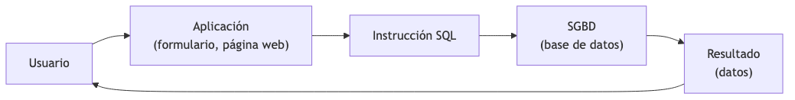
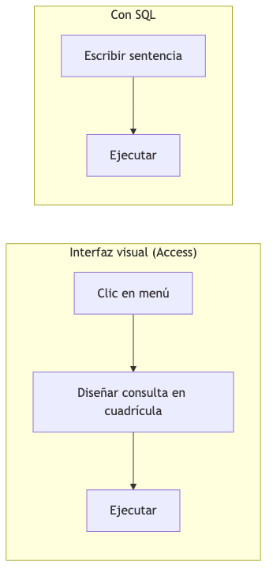
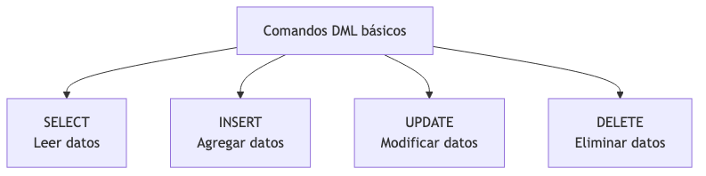
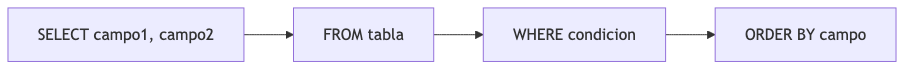
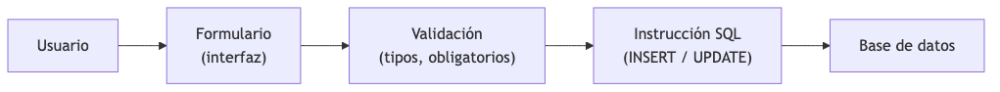
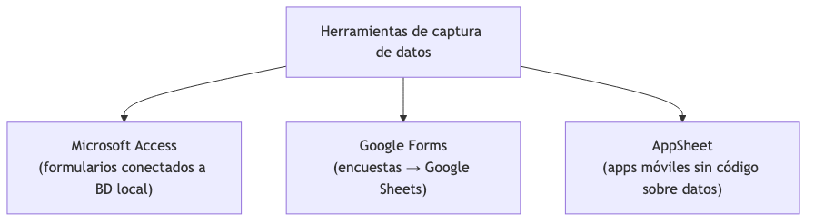

# TEMA 4 — INTRODUCCIÓN AL LENGUAJE SQL Y AUTOMATIZACIÓN

**Autor:** Ing. Gaston Genaro Quelali Calcina

---

**Contenido:**
- [4. ¿Qué es SQL?](#4-qué-es-sql)
- [4.1 Importancia en la gestión empresarial](#41-importancia-en-la-gestión-empresarial)
- [4.2 Estructura básica: SELECT, INSERT, UPDATE, DELETE](#42-estructura-básica-select-insert-update-delete)
- [4.3 Consultas básicas de extracción y manipulación](#43-consultas-básicas-de-extracción-y-manipulación)
- [4.4 Diseño de formularios para captura de información](#44-diseño-de-formularios-para-captura-de-información)

---

## 4. ¿Qué es SQL?

### 4.0.1 Definición

**SQL** (*Structured Query Language* — Lenguaje de Consulta Estructurado) es el **lenguaje estándar** para comunicarse con bases de datos relacionales. Permite crear, consultar, modificar y eliminar datos mediante instrucciones textuales.

> **Definición funcional:** si las tablas son "los cajones donde guardamos los datos", SQL es "el idioma que hablamos para pedirle al SGBD que los guarde, los muestre, los cambie o los borre".

**¿Por qué es tan importante?**
- Es el estándar de la industria: casi todos los SGBD lo entienden (Access, MySQL, SQL Server, PostgreSQL).
- Es la base de casi toda aplicación moderna: páginas web, apps, sistemas empresariales.
- Es una habilidad muy demandada: analistas, administradores de datos y desarrolladores lo usan a diario.

### 4.0.2 SQL como puente entre la aplicación y la base de datos



*Figura: SQL como puente entre la aplicación y la base de datos*


**Ejemplo del mundo real:**

- Un cajero registra una venta → la aplicación ejecuta `INSERT INTO Ventas (...) VALUES (...)`.
- Un gerente consulta las ventas del mes → la aplicación ejecuta `SELECT * FROM Ventas WHERE Fecha BETWEEN ...`.
- Un cliente cambia su dirección → la aplicación ejecuta `UPDATE Clientes SET Direccion = ... WHERE ID = ...`.

> 💡 **Dato clave:** cuando trabajamos con Access en vista Diseño, el SGBD **traduce** lo que hacemos a SQL automáticamente. Aprender SQL te da el control total.

### 4.0.3 Clasificación del lenguaje SQL

SQL se divide en grupos según lo que hace:

| Grupo | Qué hace | Comandos principales |
|---|---|---|
| **DDL** (Data Definition Language) | Define la estructura | `CREATE`, `ALTER`, `DROP` |
| **DML** (Data Manipulation Language) | Manipula los datos | `SELECT`, `INSERT`, `UPDATE`, `DELETE` |
| **DCL** (Data Control Language) | Controla permisos y seguridad | `GRANT`, `REVOKE` |

> **En este tema** nos centramos en el **DML**, que es el más usado en el trabajo diario con datos.

---

## 4.1 Importancia en la gestión empresarial

### 4.1.1 ¿Por qué las empresas necesitan SQL?

| Necesidad empresarial | Cómo la resuelve SQL |
|---|---|
| Consultar datos al instante | `SELECT` sobre millones de registros en segundos |
| Mantener datos actualizados | `INSERT`, `UPDATE`, `DELETE` masivos y controlados |
| Generar reportes | Consultas que alimentan informes y dashboards |
| Detectar problemas | Filtros, agrupaciones y comparaciones |
| Tomar decisiones | Datos exactos y confiables a pedido |

### 4.1.2 SQL frente a los clics de la interfaz



*Figura: Interfaz visual frente a SQL*


| Aspecto | Interfaz visual | SQL |
|---|---|---|
| Velocidad | Lenta para consultas complejas | Rápida, directa |
| Reproducibilidad | Hay que repetir clics | Se guarda y reutiliza |
| Documentación | No queda registro | La sentencia es documentación |
| Precisión | Limitada por el menú | Total: cualquier consulta posible |

> **Conclusión:** la interfaz es amigable para empezar; SQL es lo que te da poder real sobre los datos.

### 4.1.3 Casos reales de uso

- **Comercio:** "¿Cuáles son los 10 productos más vendidos este mes?"
- **Recursos humanos:** "¿Cuántos empleados por departamento y cuál es el promedio salarial?"
- **Finanzas:** "¿Qué facturas están vencidas y por cuánto?"
- **Marketing:** "¿Cuántos clientes nuevos se registraron cada semana?"

> Todas estas preguntas se responden con un `SELECT` bien construido.

---

## 4.2 Estructura básica: SELECT, INSERT, UPDATE, DELETE

### 4.2.1 Los cuatro comandos fundamentales



*Figura: Los cuatro comandos DML básicos*


### 4.2.2 SELECT — leer datos

Es el comando más usado. Extrae datos de una o más tablas.

```sql
SELECT campo1, campo2
FROM tabla
WHERE condicion
ORDER BY campo;
```

**Partes principales:**

| Cláusula | Qué hace |
|---|---|
| `SELECT` | Elige los campos a mostrar |
| `FROM` | Indica de qué tabla se leen |
| `WHERE` | Filtra qué registros se muestran |
| `ORDER BY` | Ordena el resultado |
| `GROUP BY` | Agrupa para resúmenes (se ve en el Tema 3) |

**Ejemplo:**
```sql
SELECT Titulo, Autor, Precio
FROM Libros
WHERE Precio > 50
ORDER BY Precio DESC;
```

### 4.2.3 INSERT — agregar datos

Añade un nuevo registro a una tabla.

```sql
INSERT INTO Libros (Titulo, Autor, Genero, Precio, Stock)
VALUES ('Cien años de soledad', 'Gabriel García Márquez', 'Novela', 120.00, 15);
```

| Parte | Significado |
|---|---|
| `INSERT INTO Libros` | Tabla donde se inserta |
| `(Titulo, Autor, ...)` | Campos que se completan |
| `VALUES (...)` | Valores en el mismo orden |

> ⚠️ El orden de los `VALUES` debe coincidir con el orden de los campos listados.

### 4.2.4 UPDATE — modificar datos

Cambia valores de los registros que cumplen la condición.

```sql
UPDATE Libros
SET Precio = Precio * 1.1
WHERE Genero = 'Historia';
```

> ⚠️ **Advertencia:** si se omite el `WHERE`, la sentencia modifica **todos** los registros de la tabla. Siempre verificar la condición antes de ejecutar.

### 4.2.5 DELETE — eliminar datos

Borra los registros que cumplen la condición.

```sql
DELETE FROM Libros
WHERE Stock = 0;
```

> ⚠️ **Advertencia:** si se omite el `WHERE`, la sentencia borra **toda** la tabla. Esta operación **no se puede deshacer** sin una copia de seguridad.

### 4.2.6 Comparativa de los cuatro comandos

| Comando | Acción | ¿Afecta estructura? | ¿Riesgo sin WHERE? |
|---|---|---|---|
| `SELECT` | Leer | No | No |
| `INSERT` | Agregar | No | N/A |
| `UPDATE` | Modificar | No | Modifica todo |
| `DELETE` | Borrar | No | Borra todo |

---

## 4.3 Consultas básicas de extracción y manipulación

### 4.3.1 Anatomía de una sentencia SELECT



*Figura: Anatomía de una sentencia SELECT*


> 💡 El orden **lógico** de las cláusulas es fijo: `SELECT` → `FROM` → `WHERE` → `GROUP BY` → `HAVING` → `ORDER BY`. Cambiar el orden produce error.

### 4.3.2 Seleccionar todos los campos

```sql
SELECT * FROM Libros;
```
El asterisco `*` significa "todos los campos".

### 4.3.3 Alias de columnas

Con `AS` se renombra una columna en el resultado:

```sql
SELECT Titulo, Precio * Stock AS ValorStock
FROM Libros;
```

| Titulo | ValorStock |
|---|---|
| Cien años de soledad | 1800.00 |
| El principito | 550.00 |

### 4.3.4 Filtros con WHERE

| Operador | Ejemplo | Resultado |
|---|---|---|
| `=` | `WHERE Genero = 'Novela'` | Exactos |
| `<>` | `WHERE Genero <> 'Novela'` | Todos menos |
| `>` / `<` | `WHERE Precio > 50` | Mayores / menores |
| `BETWEEN` | `WHERE Precio BETWEEN 50 AND 100` | Rango |
| `LIKE` | `WHERE Titulo LIKE 'C*'` | Patrón |
| `IN` | `WHERE Genero IN ('Novela','Historia')` | Lista |
| `AND` / `OR` | `WHERE Stock > 0 AND Precio < 100` | Combinar condiciones |

### 4.3.5 Ordenar resultados

```sql
SELECT Titulo, Precio FROM Libros ORDER BY Precio DESC;
```

| Orden | Cláusula |
|---|---|
| Ascendente (por defecto) | `ORDER BY campo ASC` |
| Descendente | `ORDER BY campo DESC` |
| Varios campos | `ORDER BY Genero, Titulo` |

### 4.3.6 Consultas de manipulación en la práctica

**Insertar varios registros a la vez** (Access):

```sql
INSERT INTO Libros (Titulo, Autor, Genero, Precio, Stock)
SELECT 'El principito', 'Antoine de Saint-Exupéry', 'Infantil', 55.00, 10
UNION ALL
SELECT 'Breve historia del tiempo', 'Stephen Hawking', 'Ciencia', 150.00, 5;
```

**Actualizar según condición compuesta:**

```sql
UPDATE Libros
SET Stock = 0
WHERE Precio > 200 AND Genero = 'Técnico';
```

**Eliminar registros relacionados (en cascada manual):**

```sql
DELETE FROM Prestamos WHERE LibroID = 7;
DELETE FROM Libros WHERE ID = 7;
```

> 💡 Cuando hay integridad referencial sin "eliminar en cascada", primero se eliminan los registros hijos (Prestamos) y luego el padre (Libros).

---

## 4.4 Diseño de formularios para captura de información

### 4.4.1 ¿Qué es un formulario?

Un **formulario** es una **interfaz gráfica** que permite **ingresar, modificar o consultar datos** de forma amigable, sin exponer las tablas directamente. Es la "puerta de entrada" de los datos a la base.

**Ventajas frente a escribir en las tablas:**
- ✅ Interfaz amigable y guiada.
- ✅ Evita errores (valida tipos y formatos).
- ✅ Protege los datos (solo se ven campos permitidos).
- ✅ Acelera la carga de información.

### 4.4.2 Flujo de captura de datos



*Figura: Flujo de captura de datos mediante formularios*


### 4.4.3 Formularios en Access

En Access, los formularios se crean en **Crear → Formulario** y se personalizan en vista **Diseño**.

**Partes de un formulario en Access:**

| Elemento | Función |
|---|---|
| **Encabezado** | Título, instrucciones, logotipo |
| **Cuerpo (detalle)** | Campos, cuadros de texto, listas |
| **Pie** | Botones (Guardar, Cancelar, Nuevo), totales |
| **Campos calculados** | Valores que se calculan al ingresar |

**Tipo de formularios en Access:**

| Tipo | Uso |
|---|---|
| **Formulario simple** | Una tabla, un registro a la vez |
| **Formulario dividido** | Hoja de datos arriba, detalle abajo |
| **Formulario con subformulario** | Un padre (cliente) con hijos (sus pedidos) |
| **Formulario de exploración** | Navegación entre varios formularios |

> **Ejemplo práctico:** un formulario "Nuevo Préstamo" muestra los datos del libro (leído de Libros), pide el nombre del socio y la fecha, y al guardar ejecuta un `INSERT INTO Prestamos (...) VALUES (...)`.

### 4.4.4 Otros capturadores de datos



*Figura: Herramientas de captura de datos*


| Herramienta | Dónde se usan los datos | Ideal para |
|---|---|---|
| **Access** | BD local con tablas relacionadas | Procesos internos formales |
| **Google Forms** | Google Sheets (puede conectarse a BD) | Encuestas, registro rápido |
| **AppSheet** | Datos en Sheets/Cloud, app móvil | Trabajo de campo, sin código |

**Ejemplo Google Forms → Sheets:**
1. Se crea el formulario con preguntas (nombre, libro, fecha).
2. Las respuestas llegan a una hoja de cálculo automáticamente.
3. La hoja puede importarse o conectarse a una base de datos.

**Ejemplo AppSheet:**
- Se vincula una Google Sheet como fuente de datos.
- Se define qué campos son editables.
- Se genera una app móvil que escribe en la hoja (y por extensión en la BD).

### 4.4.5 Buenas prácticas para formularios

| Práctica | Por qué |
|---|---|
| Marcar campos obligatorios | Evita registros incompletos |
| Usar listas desplegables | Reduce errores de escritura |
| Validar formatos (fechas, correos) | Datos consistentes |
| Agrupar campos por secciones | Mejor experiencia |
| Probar la carga de datos | Verificar que INSERT/UPDATE funcionan |
| Asociar con consultas | Formulario conectado a datos filtrados |

---

## Preguntas de repaso

1. ¿Qué es SQL y por qué es el estándar en bases de datos relacionales?
2. ¿Qué grupos componen el lenguaje SQL y cuál se enfoca en los datos?
3. ¿Qué diferencia hay entre consultar con la interfaz visual y con SQL?
4. Escribe un `SELECT` que muestre título y precio de los libros ordenados de mayor a menor.
5. Escribe un `INSERT` que agregue un libro a la tabla Libros.
6. Escribe un `UPDATE` que aumente 10% el precio de los libros de "Técnico".
7. Escribe un `DELETE` que borre los libros sin stock.
8. ¿Qué riesgo tiene ejecutar un `UPDATE` o `DELETE` sin `WHERE`?
9. ¿Qué es un formulario y qué ventajas tiene frente a cargar datos en las tablas?
10. ¿Cuáles son las partes de un formulario en Access?
11. Compara Access, Google Forms y AppSheet como herramientas de captura.
12. Menciona 3 buenas prácticas en el diseño de formularios.

---

## Glosario

| Término | Significado |
|---|---|
| **Alias** | Nombre alternativo para una columna o tabla en una consulta |
| **AppSheet** | Plataforma para crear apps móviles sin código sobre datos |
| **DDL** | Grupo de comandos que definen la estructura (CREATE, ALTER, DROP) |
| **DELETE** | Comando SQL que elimina registros |
| **DML** | Grupo de comandos que manipulan los datos (SELECT, INSERT, UPDATE, DELETE) |
| **Formulario** | Interfaz gráfica para ingresar y modificar datos |
| **INSERT** | Comando SQL que agrega registros |
| **SELECT** | Comando SQL que lee y muestra datos |
| **SQL** | Lenguaje estándar para comunicarse con bases de datos relacionales |
| **UPDATE** | Comando SQL que modifica valores de registros |
| **WHERE** | Cláusula que filtra qué registros afecta una consulta |
