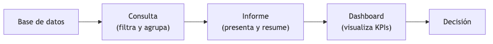
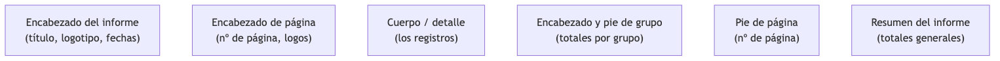
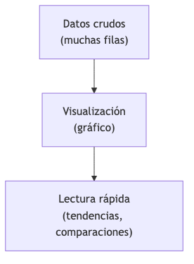
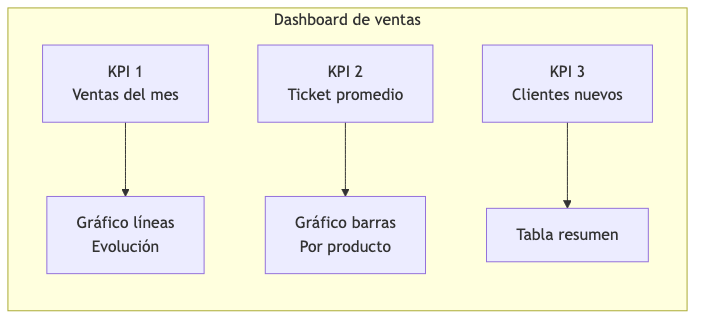
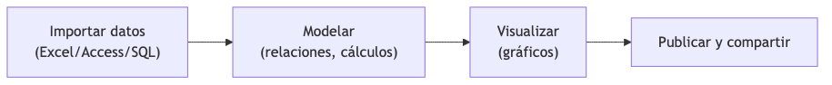
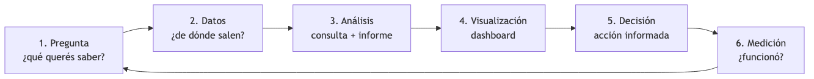

<!-- _class: title -->

# Informes, Visualización y Toma de Decisiones
## Tema 5
#### Ing. Gaston Genaro Quelali Calcina

---

## Agenda

1. **Informes** — qué son, partes, tipos, creación en Access
2. **Visualización de datos** — gráficos y herramientas
3. **Dashboards** — KPIs, Power BI y Looker Studio
4. **De los datos a las decisiones** — ciclo completo

---

## ¿Qué es un informe?

> Presentación **organizada** de datos con formato, agrupaciones, totales y gráficos.
> La consulta es "la pregunta"; el informe es "la respuesta presentada".

**Sirve para:**
- Documentar ventas, inventarios, cobranzas
- Resumir resultados para gerencia
- Emitir documentos formales
- Soportar decisiones con datos

---

## Del dato a la decisión

<!-- fuente: assets/mermaid/01_dato_a_decision.mmd -->

| Etapa | Herramienta |
|---|---|
| Base de datos | Access, MySQL |
| Consulta | SQL |
| Informe | Access, Excel |
| Dashboard | Power BI, Looker |
| Decisión | La persona |

---

## Partes de un informe en Access

<!-- fuente: assets/mermaid/02_partes_informe.mmd -->

- **Encabezado de informe:** título, logotipo, fechas
- **Encabezado/pie de página:** nº de página
- **Cuerpo:** los registros
- **Grupos:** totales parciales
- **Resumen:** totales generales

---

## Tipos de informes en Access

| Tipo | Para qué |
|---|---|
| Simple | Listado de registros |
| Con agrupaciones | Totales por grupo |
| Con subinformes | Maestro-detalle |
| Con gráficos | Visualización |
| Etiquetas postales | Impresión |

---

## Crear un informe en Access

1. Seleccionar tabla o consulta
2. **Crear → Asistente para informes**
3. Elegir campos
4. Definir agrupaciones (ej. por Género)
5. Orden y estilo
6. Ajustar en **vista Diseño**

---

## Personalización en vista Diseño

- Título y logotipo
- Tamaño de campos
- Formato de números (moneda, %)
- Totales: `=Sum([Precio])`
- Gráficos
- Orden de impresión

---

## ¿Qué es la visualización de datos?

<!-- fuente: assets/mermaid/03_que_es_visualizacion.mmd -->

> Representación **gráfica** de la información para comprenderla de un vistazo.

**Gráfico según objetivo:**

| Objetivo | Gráfico |
|---|---|
| Comparar categorías | Barras |
| Evolución temporal | Líneas |
| Proporciones | Torta/dona |
| Relación de variables | Dispersión |

---

## Herramientas de visualización

| Herramienta | Ideal para |
|---|---|
| **Access** | Informes formales |
| **Excel** | Análisis rápido |
| **Power BI** | Dashboards corporativos |
| **Looker Studio** | Dashboards en la nube |

> Elegir primero el **objetivo** y después el gráfico.

---

## ¿Qué es un dashboard?

> Tablero que reúne **KPIs y visualizaciones** para monitorear la gestión de un vistazo.

**Es el "tablero del auto" de la empresa:**
- Velocímetro → ventas
- Combustible → stock
- Temperatura → cobranza

---

## Anatomía de un dashboard

<!-- fuente: assets/mermaid/04_anatomia_dashboard.mmd -->

1. **KPIs:** números clave
2. **Gráficos:** evolución, comparaciones
3. **Filtros:** fecha, sucursal
4. **Resúmenes/tablas:** detalle

---

## ¿Qué es un KPI?

> **KPI** = Indicador Clave de Desempeño. Mide el logro de un objetivo.

| Área | KPI |
|---|---|
| Ventas | Ventas del mes, ticket promedio |
| Stock | Rotación de inventario |
| Cobranza | Días de cobro, morosidad |
| Clientes | Clientes nuevos |

> Debe ser **medible, relevante y accionable**.

---

## Power BI

**Microsoft Power BI** — líder en dashboards empresariales.

| Característica | Detalle |
|---|---|
| Fuentes | Excel, Access, SQL, web |
| Modelo | Tablas relacionadas |
| Visuales | Amplia galería |
| Publicación | Web y móvil |
| Costo | Gratis (Desktop) + planes |

---

## Flujo en Power BI

<!-- fuente: assets/mermaid/05_flujo_powerbi.mmd -->

1. **Importar** datos
2. **Modelar** relaciones y cálculos
3. **Visualizar** gráficos
4. **Publicar** y compartir

---

## Google Looker Studio

**Looker Studio** (antes Data Studio) — alternativa gratuita en la nube.

| Característica | Detalle |
|---|---|
| Fuentes | Google Sheets, BigQuery, CSV |
| Compartición | Vínculos en vivo |
| Integración | Ecosistema Google |
| Costo | Gratuito |
| Colaboración | Como Google Docs |

---

## Power BI vs Looker Studio

| Criterio | Power BI | Looker Studio |
|---|---|---|
| Costo | Gratis + planes | Gratuito |
| Dónde corre | Desktop + nube | Solo nube |
| Fuentes | Muy amplias | Google + varias |
| Compartir | Requiere licencia | Vínculo simple |
| Dificultad | Media-alta | Baja |

---

## El ciclo de la decisión con datos

<!-- fuente: assets/mermaid/06_ciclo_decision.mmd -->

1. **Pregunta** — ¿qué querés saber?
2. **Datos** — ¿de dónde salen?
3. **Análisis** — consulta + informe
4. **Visualización** — dashboard
5. **Decisión** — acción informada
6. **Medición** — ¿funcionó?

---

## Ejemplo: librería

1. **Pregunta:** ¿qué géneros venden más en marzo?
2. **Análisis:** `SELECT Genero, Sum(Total) FROM Ventas WHERE Mes=3 GROUP BY Genero`
3. **Dashboard:** barras por género
4. **Decisión:** reforzar el líder, promocionar el menor
5. **Medición:** comparar el mes siguiente

---

## Errores comunes al visualizar

- Torta con muchas categorías → ilegible
- Escala manipulada → engaña
- Demasiados KPIs → se pierde el foco
- Datos desactualizados → malas decisiones
- Sin título → sin contexto

> Un buen dashboard **responde preguntas**, no solo muestra números.

---

## Repaso rápido

1. ¿Informe vs consulta?
2. Partes de un informe
3. ¿Qué gráfico para evolución temporal?
4. ¿Qué es un dashboard?
5. ¿Qué es un KPI? Da ejemplos
6. ¿Power BI vs Looker Studio?
7. El ciclo de decisión con datos
8. 3 errores comunes de visualización

---

<!-- _class: title -->
# ¡Gracias!
### Dudas y consultas
