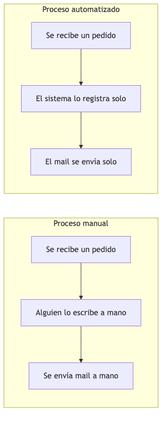
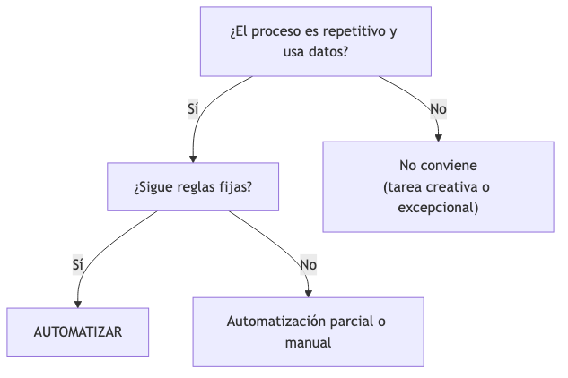
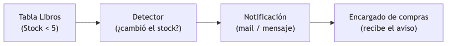
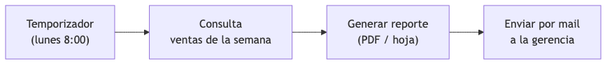
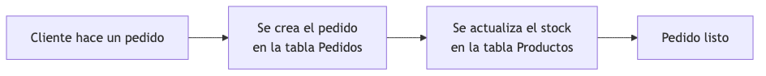
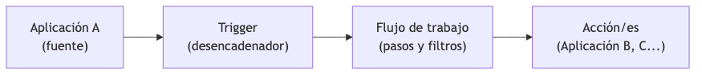
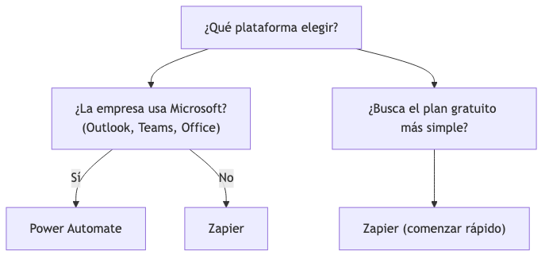
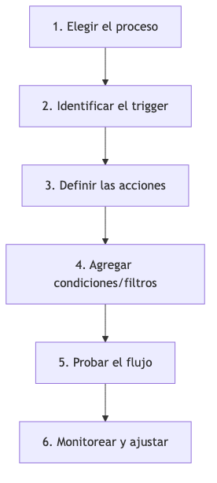

<!-- _class: title -->

# Automatización Empresarial y Conectores Digitales
## Tema 6
#### Ing. Gaston Genaro Quelali Calcina

---

## Agenda

1. **¿Qué es la automatización de procesos?**
2. **Casos prácticos** — notificaciones, reportes, actualización
3. **Conectores y flujos de trabajo** — Zapier, Power Automate
4. **Diseño de flujos de trabajo digital**

---

## ¿Qué es la automatización?

> Reemplazar **tareas manuales y repetitivas** por **flujos automáticos** que se ejecutan sin intervención humana.

**Ejemplo:** si "cuando pasa X, hay que hacer Y" → se puede automatizar.

---

## Proceso manual vs automatizado

<!-- fuente: assets/mermaid/01_manual_vs_auto.mmd -->

| Aspecto | Manual | Automatizado |
|---|---|---|
| Tiempo | Minutos/horas | Segundos |
| Errores | Posibles | Mínimos |
| Costo | Horas de personal | Una vez configurado |
| Escalabilidad | Limitada | Ilimitada |

---

## ¿Qué procesos automatizar?

<!-- fuente: assets/mermaid/02_conviene_automatizar.mmd -->

Criterios:
- 🔁 **Repetitivo**
- 📏 **Reglado** (reglas claras)
- 📊 **Basado en datos**
- ⚠️ **Alto riesgo de error humano**

> No tiene sentido automatizar tareas que requieren criterio o creatividad.

---

## Beneficios

- Ahorro de tiempo
- Menos errores
- Respuesta inmediata
- Trazabilidad de cada paso
- Personas enfocadas en decisiones

---

## Caso 1: Notificación de stock bajo

<!-- fuente: assets/mermaid/03_caso_notificacion.mmd -->

| Paso | Qué pasa |
|---|---|
| Disparador | Stock < 5 en Libros |
| Regla | Si stock < 5 → avisar |
| Acción | Mail al encargado |

**Otros:** factura vencida, confirmación de pedido, pago recibido.

---

## Caso 2: Reporte semanal automático

<!-- fuente: assets/mermaid/04_caso_reporte.mmd -->

| Paso | Qué pasa |
|---|---|
| Disparador | Lunes 8:00 |
| Datos | Ventas de la semana |
| Acción | Generar PDF y enviar por mail |

**Otros:** cobranzas diario, clientes nuevos mensual, stock semanal.

---

## Caso 3: Actualización de registros

<!-- fuente: assets/mermaid/05_caso_actualizacion.mmd -->

| Paso | Qué pasa |
|---|---|
| Disparador | Nuevo pedido |
| Acción A | Crear pedido en Pedidos |
| Acción B | Restar stock en Productos |

**Otros:** Google Forms → BD, factura pagada → estado, contactos sincronizados.

---

## ¿Qué es un conector?

> Puente entre **dos aplicaciones**: una acción en una app dispara una acción en otra.

Plataformas: **Zapier** y **Power Automate**.

**Componentes:**
1. **Trigger** (desencadenador)
2. **Pasos y filtros**
3. **Acciones**

---

## Cómo funciona una automatización

<!-- fuente: assets/mermaid/06_como_funciona.mmd -->

**Aplicación A → Trigger → Flujo → Acción/es (App B, C...)**

**Ejemplo clásico:**
- Trigger: nueva respuesta en Google Forms
- Paso: agregar fila a Google Sheets
- Acción: enviar mail de confirmación

---

## Zapier

| Característica | Detalle |
|---|---|
| Concepto | "Zaps" (trigger + acciones) |
| Apps | Miles (Google, Mail, Slack...) |
| Dificultad | Baja, muy visual |
| Plan gratuito | Zapier Free |
| Ideal para | PYMEs, sin programación |

---

## Power Automate

| Característica | Detalle |
|---|---|
| Concepto | Flujos con plantillas o en blanco |
| Apps | Ecosistema Microsoft + otras |
| Integración | Office 365, Teams, SharePoint |
| Dificultad | Media |
| Ideal para | Empresas con Microsoft |

---

## ¿Cuál elegir?

<!-- fuente: assets/mermaid/07_elegir_plataforma.mmd -->

| Criterio | Zapier | Power Automate |
|---|---|---|
| Costo | Gratis + planes | Planes Microsoft |
| Ecosistema | App-agnóstico | Fuerte en Microsoft |
| Dificultad | Baja | Media |
| Ideal para | Cualquier equipo | Empresas Microsoft |

---

## Diseñar un flujo de trabajo

<!-- fuente: assets/mermaid/08_pasos_flujo.mmd -->

1. Elegir el proceso
2. Identificar el trigger
3. Definir las acciones
4. Condiciones/filtros
5. Probar el flujo
6. Monitorear y ajustar

---

## Plantilla de diseño de flujo

| Campo | Ejemplo |
|---|---|
| Proceso | Aviso de stock bajo |
| Trigger | Stock < 5 |
| Acciones | Mail al encargado |
| Condiciones | Solo libro activo |
| Frecuencia | Cada cambio de stock |
| Destinatario | jefe@libreria.com |

---

## Buenas prácticas

- Empezar simple
- Documentar el flujo
- Definir qué pasa si falla
- No automatizar todo
- Monitorear ejecuciones

> ⚠️ Automatizar mal puede **duplicar registros o enviar avisos equivocados**. Probar con datos de prueba antes de producción.

---

## Repaso rápido

1. ¿Qué es la automatización y cuándo conviene?
2. Proceso manual vs automatizado
3. Los 3 casos prácticos vistos
4. ¿Qué es un conector? Componentes
5. Ejemplo Forms → Sheets → Mail
6. Zapier vs Power Automate
7. Pasos para diseñar un flujo
8. 3 buenas prácticas + advertencia

---

<!-- _class: title -->
# ¡Gracias!
### Dudas y consultas
