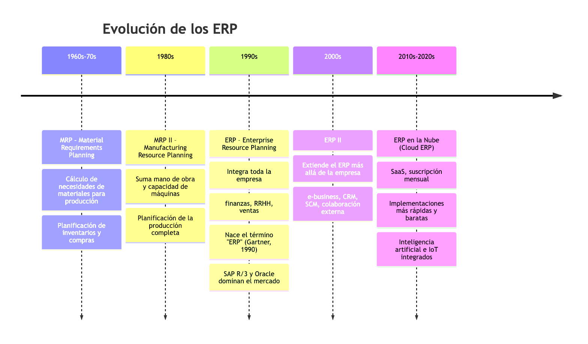
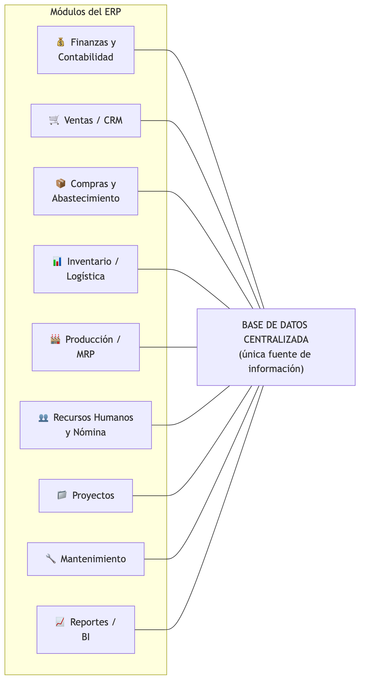
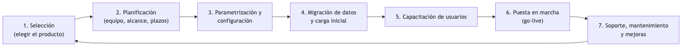
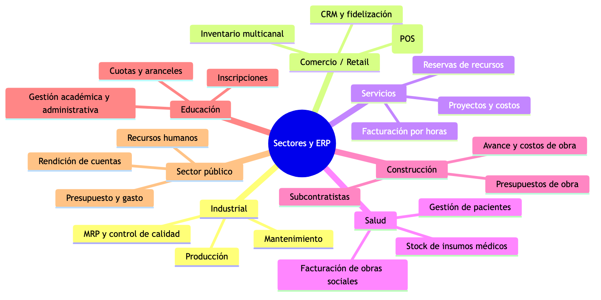
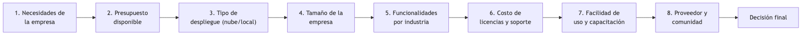
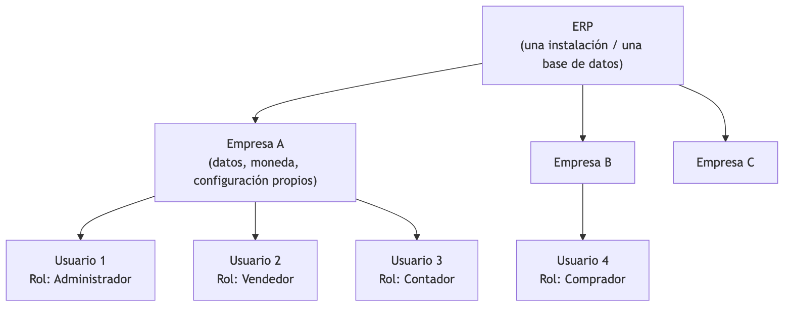
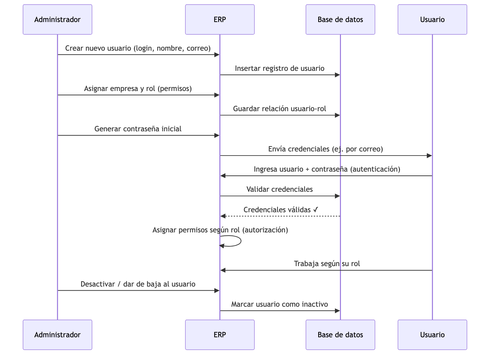
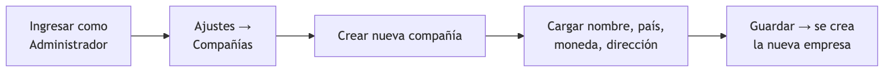

# UNIDAD 1 — INTRODUCCIÓN A LOS SISTEMAS ERP
## Sistemas de Planificación de Recursos Empresariales

**Autor:** Ing. Gaston Genaro Quelali Calcina

---

**Contenido:**
- [1. Introducción a los ERP](#1-introducción-a-los-sistemas-erp)
- [1.1 Usos y aplicaciones](#11-usos-y-aplicaciones)
- [1.2 Tipos de ERP](#12-tipos-de-erp)
- [1.3 Inserción de usuarios y empresas](#13-inserción-de-usuarios-y-empresas)

---

## 1. Introducción a los Sistemas ERP

### 1.1 Definición de ERP

**ERP** son las siglas de **Enterprise Resource Planning** (en español, *Planificación de Recursos Empresariales*).

> **Definición funcional:** Un ERP es un **sistema informático de gestión integrado** que permite a una organización administrar y automatizar sus procesos de negocio (ventas, compras, producción, inventario, contabilidad, recursos humanos, etc.) a partir de una **única base de datos centralizada** y de un conjunto de **módulos** que comparten la misma información.

| Sigla | Inglés | Español |
|---|---|---|
| E | Enterprise | Empresa |
| R | Resource | Recursos |
| P | Planning | Planificación |

**Ideas clave de la definición:**

1. **Integrado:** todos los módulos trabajan sobre los mismos datos. Lo que registra un área (por ejemplo, ventas) está disponible automáticamente para el resto (inventario, facturación, producción).
2. **Única base de datos:** la información se registra **una sola vez** y todos la usan. Esto elimina la duplicación de datos y las versiones contradictorias de una misma información.
3. **Multimodular:** el sistema se organiza en módulos según el área funcional de la empresa.
4. **Procesos de negocio:** automatiza el flujo de trabajo de la organización, no tareas aisladas.

> **Metáfora:** una empresa sin ERP es como un grupo de personas que hablan idiomas distintos: cada área lleva "su" lista de clientes, "su" stock y "su" contabilidad. Un ERP hace que todas hablen el mismo idioma y compartan una única "carpeta" de información.

---

### 1.2 Historia y evolución

Los ERP no surgieron de la nada: evolucionaron a partir de los sistemas de producción y de control de inventarios.

*Figura: Evolución histórica de los ERP*

**Línea del tiempo resumida:**

| Período | Sistema | Qué agregó |
|---|---|---|
| 1960-1970 | MRP | Cálculo de materiales necesarios para producir |
| 1980 | MRP II | Capacidad de producción + mano de obra + máquinas |
| 1990 | ERP | Integración de **toda** la empresa (finanzas, RRHH, ventas…) |
| 2000 | ERP II | Internet: CRM, SCM, e-commerce, colaboración externa |
| 2010 → | Cloud ERP | Software como servicio (SaaS), acceso desde cualquier lugar |

> **Dato histórico:** el término **ERP fue acuñado por la consultora Gartner en 1990** para describir la evolución de los sistemas MRP II hacia sistemas que integraban toda la organización.

---

### 1.3 Objetivos fundamentales

1. **Integrar** todos los procesos y áreas de la empresa en un único sistema.
2. **Unificar la información:** un solo dato, una sola fuente de verdad.
3. **Automatizar** los procesos repetitivos para ganar eficiencia y reducir errores.
4. **Proveer una visión global** en tiempo real del estado de la organización (reportes, indicadores).
5. **Estandarizar** la forma de trabajar (los mismos procedimientos en todas las sucursales).
6. **Soportar la toma de decisiones** con información confiable y actualizada.

---

### 1.4 Características esenciales

| Característica | Descripción |
|---|---|
| **Modularidad** | El sistema está formado por módulos que se pueden instalar según necesidad |
| **Base de datos centralizada** | Todos los módulos leen y escriben en la misma base de datos |
| **Integración de procesos** | Un proceso dispara automáticamente los siguientes (ej. venta → factura → stock) |
| **Parametrización / configuración** | Se adapta a la empresa mediante configuración, sin reprogramar |
| **Multiusuario** | Muchos usuarios trabajan simultáneamente con permisos distintos |
| **Multientidad / multitenant** | Un solo sistema puede administrar varias empresas o compañías |
| **Estandarización** | Impone buenas prácticas y procesos uniformes |
| **Escalabilidad** | Crece junto con la empresa (usuarios, datos, módulos) |

---

### 1.5 Componentes de un ERP: arquitectura y módulos

#### a) Arquitectura en capas (modelo de 3 capas)

*Figura: Arquitectura en 3 capas de un ERP*

**Las tres capas:**
- **Capa de presentación:** lo que ve el usuario (navegador web o aplicación cliente).
- **Capa de aplicación:** la lógica de negocio; donde se ejecutan las reglas y los módulos.
- **Capa de datos:** la base de datos centralizada que almacena toda la información.

> ⚠️ **Conexión con la materia:** la capa de datos es, justamente, una **base de datos relacional** (el tema de las Unidades 2 a 6). Un ERP es, en el fondo, una aplicación enorme construida sobre una base de datos.

#### b) Módulos típicos

*Figura: Módulos típicos de un ERP en torno a la base de datos centralizada*

| Módulo | Función principal | Ejemplo de proceso |
|---|---|---|
| **Finanzas y Contabilidad** | Cuentas por cobrar/pagar, libro mayor, activos fijos, cierre contable | Registrar y conciliar una factura de venta |
| **Ventas / CRM** | Gestión de clientes, pedidos, cotizaciones, fuerza de ventas | Cargar un pedido de un cliente |
| **Compras / Abastecimiento** | Órdenes de compra, proveedores, recepción de mercadería | Generar la orden de compra de insumos |
| **Inventario / Logística** | Stock, almacenes, ubicaciones, traslados | Descontar stock cuando se despacha la venta |
| **Producción / MRP** | Órdenes de fabricación, listas de materiales, capacidad | Planificar la fabricación de un producto |
| **Recursos Humanos y Nómina** | Empleados, ausencias, liquidación de sueldos, capacitación | Liquidar el sueldo mensual de un empleado |
| **Proyectos** | Planificación, presupuesto y avance de proyectos | Controlar costos de un proyecto |
| **Mantenimiento** | Mantenimiento preventivo/correctivo de equipos | Programar el mantenimiento de una máquina |
| **Reportes / BI** | Consultas, indicadores (KPI), tableros de control | Ver el margen de ganancia por producto |

Además de los módulos funcionales, existe el **módulo de administración del sistema**, que no es visible para el usuario común pero es esencial: allí se gestionan las **empresas, los usuarios, los roles, los permisos y la parametrización general** (es el tema del punto 1.3).

---

### 1.6 Cómo funciona: el flujo de datos integrado

La verdadera ventaja del ERP se ve en el **flujo automático de información entre módulos**. Ejemplo típico: **una venta**.

*Figura: Flujo de datos integrado: una venta*

**Lectura del flujo:** cuando el vendedor registra la venta, el ERP (1) verifica el stock, (2) lo descuenta automáticamente, (3) emite la factura, (4) dispara la orden de fabricación si no hay stock suficiente, (5) genera la orden de compra al proveedor cuando el material baja del punto de reposición y (6) actualiza los indicadores. Todo esto **sin que nadie vuelva a tipear los datos**, porque todos los módulos comparten la misma base de datos.

> **Comparación sin ERP:** sin ERP, la venta se registraba varias veces (una vez en el cuaderno del vendedor, otra en la planilla de stock, otra en el sistema contable), con errores y demoras. Con ERP, un solo registro alimenta todo el sistema.

---

### 1.7 Beneficios de implementar un ERP

1. **Información unificada y en tiempo real** → todos deciden con los mismos datos.
2. **Eliminación de datos duplicados** y de inconsistencias entre áreas.
3. **Automatización de procesos** → menos trabajo manual y menos errores.
4. **Reducción de costos** operativos (menos stock innecesario, menos reprocesos).
5. **Mejor control y trazabilidad** (auditoría de quién hizo qué y cuándo).
6. **Reportes e indicadores confiables** para la toma de decisiones.
7. **Escalabilidad** → la empresa puede crecer sin cambiar de sistema.
8. **Cumplimiento normativo** (facturación electrónica, impuestos, auditorías).

### 1.8 Desafíos y limitaciones

1. **Costo elevado** de licencias, implementación y consultoría (según el producto).
2. **Implementación larga y compleja** (meses o años en grandes organizaciones).
3. **Resistencia al cambio** del personal que debe aprender a trabajar distinto.
4. **Reingeniería de procesos**: la empresa debe adaptar su forma de trabajar.
5. **Curva de aprendizaje** y necesidad de capacitación continua.
6. **Dependencia del proveedor** (sobre todo en soluciones propietarias).
7. **Riesgo de fracaso** si no hay compromiso de la dirección ni gestión del cambio.

---

### 1.9 El ciclo de vida de un ERP

*Figura: Ciclo de vida de un ERP*

---

## 1.1 Usos y aplicaciones

### 1.1.1 Usos por área funcional

| Área | Usos típicos del ERP |
|---|---|
| **Dirección** | Tableros de control, indicadores (KPI), presupuesto, planificación |
| **Ventas / Marketing** | Gestión de clientes (CRM), cotizaciones, pedidos, historial de compras, comisiones |
| **Compras** | Órdenes de compra, evaluación de proveedores, control de precios |
| **Producción** | Planificación de fabricación, listas de materiales, control de calidad |
| **Logística** | Stock por almacén, trazabilidad, traslados, recepción y despacho |
| **Finanzas** | Contabilidad general, facturación, cobranzas y pagos, tesorería, impuestos |
| **Recursos Humanos** | Legajos, asistencia, sueldos, vacaciones, capacitación |
| **Administración del sistema** | Alta de empresas, usuarios, roles, permisos y configuración (1.3) |

### 1.1.2 Aplicaciones por sector

*Figura: Aplicaciones de los ERP por sector*

| Sector | Módulos que más se usan | Ejemplo de aplicación |
|---|---|---|
| **Industrial** | Producción, Inventario, Compras | Fabricar un lote de 500 unidades y descontar materiales automáticamente |
| **Retail / Comercio** | Ventas, Inventario, Finanzas | Registrar ventas en el punto de venta y actualizar stock en tiempo real |
| **Servicios profesionales** | Proyectos, Finanzas, RRHH | Facturar horas trabajadas de consultores a clientes |
| **Salud** | Ventas, Inventario, RRHH | Controlar stock de medicamentos con vencimiento y lotes |
| **Construcción** | Proyectos, Compras, Finanzas | Seguir costos y avance de una obra por etapa |
| **Educación** | Finanzas, RRHH, Ventas | Gestionar inscripciones, aranceles y legajos docentes |
| **Sector público** | Finanzas, Compras, RRHH | Ejecutar el presupuesto y rendir cuentas |

### 1.1.3 Casos de uso concretos (escenarios)

**Caso 1 — Comercio minorista (una ferretería con 3 sucursales):**
- El vendedor carga el pedido del cliente. El ERP verifica stock en las 3 sucursales y reserva el producto de la que tenga más stock.
- Al confirmar, se genera la factura electrónica y se descuenta el stock.
- Si el producto queda por debajo del punto de reposición, el sistema sugiere la orden de compra al proveedor habitual.

**Caso 2 — Empresa industrial (fábrica de muebles):**
- Ingresa una orden de fabricación de 50 mesas. El ERP calcula cuánta madera, pintura y tornillos hacen falta (MRP).
- Si falta material, genera automáticamente la orden de compra.
- Cuando el producto se fabrica, se incorpora al stock y el costo real se compara con el estimado.

**Caso 3 — Empresa de servicios (estudio de software):**
- Cada proyecto tiene presupuesto y horas asignadas. Los consultores cargan su tiempo.
- El ERP factura las horas al cliente, calcula la rentabilidad del proyecto y liquida comisiones.

---

## 1.2 Tipos de ERP

### 1.2.1 Clasificación general

*Figura: Clasificación de los tipos de ERP*

### 1.2.2 Según el despliegue (dónde se instala)

| Criterio | **On-premise** | **Cloud / SaaS** | **Híbrido** |
|---|---|---|---|
| Instalación | Servidores propios de la empresa | Servidores del proveedor (internet) | Mixto (parte propia, parte nube) |
| Pago | Compra de licencias + mantenimiento | Suscripción mensual/anual | Combinado |
| Acceso | Solo dentro de la red de la empresa | Desde cualquier lugar con internet | Según el módulo |
| Mantenimiento | A cargo de la empresa | Lo maneja el proveedor | Mixto |
| Actualizaciones | Manuales, cada varios años | Continuas y automáticas | Según componente |
| Costo inicial | Alto | Bajo (se reparte en el tiempo) | Medio |
| Costo a largo plazo | Menor mensual, pero gran inversión inicial | Acumulativo (se paga siempre) | Medio |
| Seguridad/control | Total control de los datos | Depende del proveedor | Mixto |
| Ejemplos | SAP ECC, Oracle EBS | Odoo Online, SAP S/4HANA Cloud, Oracle Cloud | — |

> **Dato actual:** la tendencia del mercado es migrar a **ERP en la nube (SaaS)**, porque reduce la inversión inicial, facilita las actualizaciones y permite el acceso desde cualquier dispositivo.

### 1.2.3 Según el alcance

| Tipo | Qué es | Ventaja | Ejemplo |
|---|---|---|---|
| **Horizontal (genérico)** | Sirve para cualquier tipo de empresa; se configura según la actividad | Flexible, probado en miles de empresas | SAP, Oracle, Microsoft Dynamics, Odoo |
| **Vertical (especializado)** | Diseñado para una industria específica (salud, construcción, agro) | Incluye procesos y reglas específicas del rubro | ERP para clínicas, ERPs agropecuarios, ERPs para construcción |

### 1.2.4 Según la licencia

| Tipo | Características | Ventajas | Desventajas | Ejemplos |
|---|---|---|---|---|
| **Propietario** | Código cerrado; se paga licencia | Soporte y consultoría profesional, madurez | Costo alto, dependencia del proveedor | SAP, Oracle, Microsoft Dynamics, Infor |
| **Open Source** | Código abierto; la empresa puede adaptarlo | Costo bajo o nulo de licencia, flexibilidad | El mantenimiento lo hace la propia empresa o un partner | Odoo, ERPNext, Dolibarr, Apache OFBiz |

### 1.2.5 Comparativa de productos líderes

| Característica | **SAP S/4HANA** | **Oracle Cloud ERP** | **Microsoft Dynamics 365** | **Odoo** | **ERPNext** |
|---|---|---|---|---|---|
| Modelo | Propietario | Propietario | Propietario | Open Source (y SaaS) | Open Source |
| Tipo | Horizontal | Horizontal | Horizontal | Horizontal | Horizontal |
| Tamaño de empresa | Grande | Grande | Grande/Media | PYME/Grande | PYME |
| Despliegue | Cloud / On-premise | Cloud | Cloud | Cloud / On-premise | Cloud / On-premise |
| Módulos | Muy amplios | Amplios | Amplios | ~80 aplicaciones | Completos |
| Costo | Muy alto | Alto | Alto | Gratis (community) / pago (enterprise) | Gratis (self-hosted) / pago (cloud) |
| Curva de aprendizaje | Alta | Alta | Media | Baja/Media | Baja |
| Mejor para | Multinacionales | Grandes corporaciones | Empresas que ya usan Microsoft | PYMEs y universidades | PYMEs |

> **Nota pedagógica:** SAP, Oracle y Microsoft Dynamics se usan en las grandes corporaciones; **Odoo y ERPNext** son ideales para la práctica en la materia por ser **gratuitos, instalables en una PC y fáciles de usar**.

### 1.2.6 Criterios de selección de un ERP

*Figura: Criterios de selección de un ERP*

**Preguntas guía para elegir un ERP:**
1. ¿Qué procesos necesitamos automatizar prioritariamente?
2. ¿Cuánto podemos pagar de licencia, implementación y mantenimiento?
3. ¿Preferimos nube u on-premise?
4. ¿Qué tamaño tiene nuestra empresa y cuántos usuarios lo usarán?
5. ¿Necesitamos módulos específicos de nuestra industria?
6. ¿Quién nos dará soporte y capacitación?
7. ¿Cuánto tiempo tomará implementarlo?

---

## 1.3 Inserción de usuarios y empresas

### 1.3.1 Conceptos clave

Antes de trabajar en la práctica, es fundamental definir los conceptos:

| Concepto | Definición |
|---|---|
| **Empresa (tenant / compañía)** | Entidad u organización que se administra dentro del ERP. Un mismo ERP puede contener varias empresas independientes, cada una con sus propios datos, moneda y configuración |
| **Usuario** | Persona que accede al sistema con un **usuario (login)** y una **contraseña**. Se identifica con su nombre, correo electrónico y rol |
| **Rol** | Conjunto de permisos que define **qué puede hacer** un usuario (ej. "vendedor", "contador", "administrador") |
| **Perfil / grupo de acceso** | Agrupación de permisos y funcionalidades que se asigna a los usuarios. Equivalente práctico del rol |
| **Permiso** | Derecho concreto de un usuario: ver, crear, modificar o eliminar un tipo de registro, acceder a un módulo, etc. |
| **Autenticación** | Proceso de **verificar la identidad** de quien ingresa (usuario + contraseña, y a veces doble factor) |
| **Autorización** | Proceso de **verificar qué puede hacer** el usuario ya autenticado, según sus permisos |

> **Diferencia clave:** la **autenticación** responde a *"¿quién sos?"*, y la **autorización** a *"¿qué podés hacer?"*. Un usuario puede estar correctamente autenticado (entra al sistema) y aun así no estar autorizado para ver la nómina salarial.

### 1.3.2 Estructura multientidad (multitenant)

La mayoría de los ERP modernos permiten administrar **varias empresas dentro de la misma instalación**. Esto se llama **arquitectura multientidad o multitenant**.

*Figura: Estructura multientidad (multitenant)*

**Beneficios de la estructura multientidad:**
- **Un solo sistema** para administrar varias empresas (ideal para holdings o grupos).
- **Aislamiento de datos:** la Empresa A no ve los datos de la Empresa B.
- **Un mismo usuario** puede tener acceso a varias empresas con distintos roles.
- **Configuración separada:** moneda, impuestos, planes de cuentas y usuarios propios por empresa.

> **Ejemplo real:** un contador atiende a varias pymes. Con un solo ERP puede administrar la contabilidad de cada cliente en su propia "empresa" dentro del sistema, sin mezclar datos.

### 1.3.3 Ciclo de vida de un usuario

*Figura: Ciclo de vida de un usuario*

**Etapas del ciclo de vida del usuario:**

| Etapa | Acciones típicas |
|---|---|
| **Alta (creación)** | Crear el usuario, asignar empresa, definir rol, generar contraseña inicial |
| **Activación** | El usuario ingresa por primera vez y (recomendado) cambia la contraseña |
| **Modificación** | Cambios de rol, datos personales, asignación a otra empresa |
| **Suspensión / baja** | Desactivar temporalmente (licencia, vacaciones) o eliminar definitivamente |

### 1.3.4 Seguridad: autenticación y contraseñas

**Buenas prácticas de autenticación:**
1. **Contraseñas fuertes:** mínimo 8 caracteres, con mayúsculas, minúsculas, números y símbolos.
2. **Cambio periódico** de contraseña y **cambio obligatorio** en el primer ingreso.
3. **Bloqueo de cuenta** tras varios intentos fallidos (ej. 5).
4. **Autenticación de doble factor (2FA)** para usuarios administrativos.
5. **No compartir credenciales** ni usar la misma contraseña en varios sistemas.
6. **Política de contraseñas configurable** por el administrador del sistema.
7. **Registro de auditoría (log):** el sistema guarda quién entró, cuándo y qué acciones realizó.

### 1.3.5 Seguridad por roles (RBAC)

**RBAC** (del inglés *Role-Based Access Control*, *control de acceso basado en roles*) es el modelo de seguridad estándar de los ERP: **el usuario NO recibe permisos directos; recibe un rol, y ese rol concentra los permisos**.

*Figura: Modelo de seguridad RBAC*

**Ventajas del modelo RBAC:**
- **Simple de administrar:** se cambia el rol y todos los permisos se actualizan.
- **Principio de mínimo privilegio:** cada usuario tiene solo los permisos necesarios para su tarea.
- **Facilita la auditoría:** se sabe qué rol ejecutó cada acción.
- **Evita errores:** un vendedor no puede borrar una factura, un contador no puede borrar un pedido, etc.

### 1.3.6 Permisos típicos por rol

| Permiso | Administrador | Vendedor | Contador | Comprador |
|---|---|---|---|---|
| Crear/editar usuarios | ✓ | ✗ | ✗ | ✗ |
| Configurar empresa | ✓ | ✗ | ✗ | ✗ |
| Cargar pedidos de venta | ✓ | ✓ | ✗ | ✗ |
| Facturar | ✓ | ✗ | ✓ | ✗ |
| Ver reportes contables | ✓ | ✗ | ✓ | ✗ |
| Crear órdenes de compra | ✓ | ✗ | ✗ | ✓ |
| Ver costos internos | ✓ | ✗ | ✓ | ✓ |

> **Regla de oro:** un usuario **administrador** tiene todos los permisos; los demás roles, solo los necesarios para su función.

### 1.3.7 Práctica guiada con Odoo (aplicación de los conceptos)

> **¿Por qué Odoo?** Es un ERP de **código abierto**, gratuito para educación, que se puede usar online (Odoo Online) o instalado localmente, y permite crear empresas, usuarios y roles de forma visual e intuitiva.

**Opción A — Usar Odoo Online (recomendada para clase):**
1. Entrar a https://www.odoo.com y crear una cuenta gratuita (se puede usar para pruebas).
2. Seleccionar "Iniciar prueba" / crear una base de datos de demostración.
3. Odoo crea automáticamente una **empresa** de ejemplo con datos de demostración.

**Opción B — Instalar Odoo Community localmente:**
- Requisitos: Python + PostgreSQL (o usar el instalador oficial para Windows/macOS).
- Alternativa simple: usar una máquina virtual o Docker (`docker run -p 8069:8069 odoo`).

#### Paso 1: Crear una empresa

*Figura: Paso 1 de la práctica en Odoo: crear una empresa*

1. Iniciar sesión como **administrador**.
2. Ir a **Ajustes → General → Compañías**.
3. Pulsar **Crear** y cargar: nombre (ej. "Empresa Práctica SA"), país, moneda, dirección.
4. Guardar. La nueva empresa aparece en la lista de compañías y queda disponible para ser seleccionada.

#### Paso 2: Crear un usuario

1. Ir a **Ajustes → Usuarios**.
2. Pulsar **Crear**.
3. Completar los datos:
   - **Nombre:** nombre y apellido (ej. "Ana Pérez").
   - **Dirección de correo electrónico:** será el nombre de usuario (login).
   - **Idioma / zona horaria:** según corresponda.
   - **Compañías:** seleccionar la empresa creada (o dejarla "todas").
4. En **Acceso** (o pestaña de permisos) elegir el **tipo de usuario**: interno, portal (externo), etc.
5. En **Ajustes de acceso**, Odoo asigna grupos de acceso según los roles marcados (ver Paso 3).
6. Guardar. Se generará un correo de invitación al usuario; si no hay servidor de correo, se puede asignar una contraseña manualmente (opción **Cambiar contraseña**).

#### Paso 3: Asignar roles y permisos (grupos de acceso)

1. Con el usuario creado, entrar a la pestaña **Permisos**.
2. Para cada aplicación (Ventas, Inventario, Contabilidad, etc.) seleccionar el **nivel de acceso**:
   - **Sin acceso** — no puede ver nada del módulo.
   - **Usuario: solo lectura** — solo puede ver.
   - **Usuario: operaciones propias** — ver y operar lo suyo.
   - **Usuario: operaciones de todos** — ve y opera todo el módulo.
   - **Administrador** — control total del módulo.
3. Ejemplo para **Ana Pérez (vendedora):**
   - Ventas → **Usuario: operaciones propias**
   - Inventario → **Usuario: solo lectura**
   - Contabilidad → **Sin acceso**
   - Ajustes → **Sin acceso**
4. Guardar y probar: iniciar sesión con el usuario **Ana Pérez** y verificar qué ve y qué no ve.

#### Paso 4: Verificación

| Verificación | Resultado esperado |
|---|---|
| Ana inicia sesión con su login y contraseña | Entra al sistema |
| Ana abre el módulo Contabilidad | Error de permisos (sin acceso) |
| Ana abre Ventas y carga un pedido | Puede crearlo |
| Ana intenta borrar una factura | No puede (no tiene permiso) |
| El administrador ve todos los módulos | Acceso total |

> **Actividad de cierre:** crear **3 usuarios** (vendedor, contador, comprador), asignar los roles de la tabla del punto 1.3.6 y verificar los accesos de cada uno.

---

## Preguntas de repaso

1. ¿Qué significa ERP y cuáles son sus cuatro ideas clave (integrado, única BD, modular, procesos)?
2. ¿Qué diferencia hay entre MRP, MRP II y ERP?
3. ¿Cuál es la diferencia entre autenticación y autorización? Da un ejemplo.
4. ¿Qué es un "tenant" o empresa dentro de un ERP y qué ventaja tiene la estructura multientidad?
5. Enumera 5 módulos típicos de un ERP y su función.
6. ¿Qué es RBAC y por qué es más seguro que asignar permisos individuales a cada usuario?
7. Describe el flujo de datos completo de una venta dentro de un ERP.
8. Nombra las diferencias entre ERP on-premise y cloud (3 puntos).
9. ¿Qué es un ERP vertical? Da un ejemplo.
10. ¿Qué pasos se siguen para dar de alta un usuario en Odoo?

---

## Glosario

| Término | Significado |
|---|---|
| **BI** (Business Intelligence) | Conjunto de herramientas para analizar datos y generar reportes e indicadores |
| **CRM** | Gestión de relaciones con el cliente (ventas, contactos, oportunidades) |
| **KPI** | Indicador clave de rendimiento (ej. margen, rotación de stock) |
| **MRP** | Planificación de requerimientos de materiales |
| **MRP II** | Planificación de recursos de manufactura |
| **Multitenant** | Arquitectura donde un mismo sistema sirve a varias entidades (empresas) |
| **On-premise** | Software instalado en los servidores de la propia organización |
| **RBAC** | Control de acceso basado en roles |
| **SaaS** | Software como servicio (software en la nube, por suscripción) |
| **SCM** | Gestión de la cadena de suministro |
| **Tenant** | Cliente/empresa dentro de una arquitectura multientidad |
