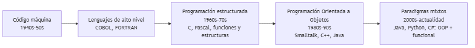
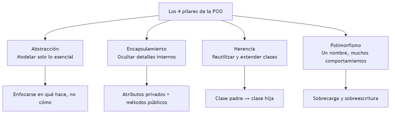
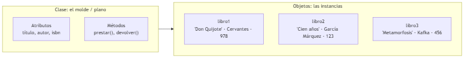
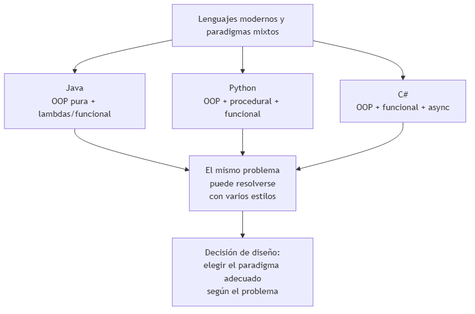

# UNIDAD 1 — INTRODUCCIÓN A LA PROGRAMACIÓN ORIENTADA A OBJETOS MODERNA

**Autor:** Ing. Gaston Genaro Quelali Calcina

---

**Contenido:**
- [0.1 Evolución: de la programación estructurada a la orientada a objetos](#01-evolución-de-la-programación-estructurada-a-la-orientada-a-objetos)
- [0.2 Principios de la POO](#02-principios-de-la-poo)
- [0.3 Clase vs objeto](#03-clase-vs-objeto)
- [0.4 Ejemplos prácticos en distintos lenguajes](#04-ejemplos-prácticos-en-distintos-lenguajes)
- [Preguntas de repaso](#preguntas-de-repaso)
- [Glosario](#glosario)

---

## 0.1 Evolución: de la programación estructurada a la orientada a objetos

### 0.1.1 ¿Cómo se llegó a la POO?

La programación no siempre fue como la conocemos hoy. Cada etapa resolvió un problema de la anterior.



*Figura: Evolución de los paradigmas de programación*

**Línea del tiempo resumida:**

| Etapa | Período | Idea central | Problema que resolvió |
|---|---|---|---|
| Código máquina | 1940-1950 | Instrucciones binarias directas | Automatizar cálculos |
| Lenguajes de alto nivel | 1950-1960 | Instrucciones legibles por humanos | Legibilidad del código |
| Programación estructurada | 1960-1970 | Funciones, bucles, estructuras de control | Código espagueti, falta de orden |
| Programación Orientada a Objetos | 1980-1990 | Objetos que combinan datos + comportamiento | Reutilización y mantenimiento |
| Paradigmas mixtos | 2000 → | OOP + funcional + reactivo | Escalabilidad de sistemas modernos |

> **La idea central de la POO:** en lugar de separar *datos* y *funciones*, se agrupan ambos en **objetos** que representan entidades del problema real (un cliente, una factura, una cuenta bancaria).

---

## 0.2 Principios de la POO

### 0.2.1 Los cuatro pilares

La POO se apoya en **cuatro principios fundamentales**:



*Figura: Los cuatro pilares de la POO*

### 0.2.2 Abstracción

**Abstraer** es identificar lo **esencial** de una entidad e ignorar lo irrelevante para el contexto.

> **Ejemplo:** para un sistema de biblioteca, lo esencial de un *Libro* es su título, autor, ISBN y estado (disponible/prestado). Su color de portada o su peso NO son relevantes para el sistema.

La abstracción responde a: *"¿Qué debe saber el sistema sobre esta entidad?"*.

### 0.2.3 Encapsulamiento

**Encapsular** es **ocultar los detalles internos** de un objeto y exponer solo una interfaz controlada (sus métodos públicos).

> **Ejemplo:** una cuenta bancaria con saldo privado. El saldo solo se modifica mediante `depositar()` y `retirar()`, que validan las operaciones. Nadie puede cambiar el saldo directamente.

El encapsulamiento protege la **integridad** del objeto y permite cambiar su implementación interna sin afectar a quien lo usa.

### 0.2.4 Herencia

**Herencia** es la capacidad de crear una clase nueva a partir de una existente, **reutilizando** atributos y métodos, y **extendiéndolos** con nuevos elementos.

> **Ejemplo:** `Vehiculo` (base) → `Auto` y `Moto` (derivadas). Toda moto *es un* vehículo: hereda `marca`, `encender()`, pero agrega `cascos` o `cabalgar()`.

La herencia modela relaciones **"es-un"** (is-a).

### 0.2.5 Polimorfismo

**Polimorfismo** (del griego "muchas formas") permite que **un mismo nombre** de método se comporte de **distintas maneras** según el objeto que lo invoca.

| Tipo | ¿Cuándo se define? | ¿Cómo cambia? |
|---|---|---|
| **Sobrecarga** (overloading) | En la misma clase | Mismo nombre, distintos parámetros |
| **Sobreescritura** (overriding) | En una clase hija | Redefine el método de la clase padre |

> **Ejemplo:** `hacerSonido()` es polimórfico: un `Perro` hace "guau", un `Gato` hace "miau". El programa llama `hacerSonido()` sin importar qué animal sea.

---

## 0.3 Clase vs objeto

### 0.3.1 Definiciones

| Concepto | Definición | Analogía |
|---|---|---|
| **Clase** | Plantilla o molde que define atributos y métodos | El plano de una casa |
| **Objeto** | Instancia concreta creada a partir de la clase | La casa construida con ese plano |



*Figura: Clase como molde y objetos como instancias*

### 0.3.2 Ejemplo en Java

```java
// Definición de la clase (el molde)
public class Libro {
    private String titulo;
    private String autor;

    public Libro(String titulo, String autor) {
        this.titulo = titulo;
        this.autor = autor;
    }

    public void mostrar() {
        System.out.println(titulo + " — " + autor);
    }
}

// Uso: creación de objetos (las instancias)
public class Main {
    public static void main(String[] args) {
        Libro libro1 = new Libro("Don Quijote", "Cervantes");
        Libro libro2 = new Libro("Cien años de soledad", "García Márquez");
        libro1.mostrar();
        libro2.mostrar();
    }
}
```

---

## 0.4 Ejemplos prácticos en distintos lenguajes

### 0.4.1 Un mismo problema en varios lenguajes

El contenido del PCA indica que la POO se aplica en **Java, Python, C#**, entre otros. El objetivo es ver que los **conceptos son universales** y que solo cambia la sintaxis.



*Figura: Lenguajes modernos y paradigmas mixtos*

### 0.4.2 El mismo objeto en los tres lenguajes

```java
// Java: sintaxis clásica de la POO
public class Usuario {
    private String nombre;
    public Usuario(String nombre) { this.nombre = nombre; }
    public String getNombre() { return nombre; }
}
```

```python
# Python: atributos y métodos simples
class Usuario:
    def __init__(self, nombre):
        self.nombre = nombre

    def get_nombre(self):
        return self.nombre
```

```csharp
// C#: muy parecido a Java
public class Usuario {
    private string nombre;
    public Usuario(string nombre) { this.nombre = nombre; }
    public string GetNombre() { return nombre; }
}
```

> **Conclusión:** los **cuatro pilares** se aplican igual en los tres lenguajes. La diferencia es sintáctica (mayúsculas, llaves, tipos, convenciones).

### 0.4.3 ¿Por qué "orientada a objetos moderna"?

La POO actual no es solo clases y objetos: se combina con:

1. **Programación funcional** (lambdas, streams) para código más conciso y seguro.
2. **Frameworks y librerías** que imponen patrones de diseño.
3. **Buenas prácticas** (SOLID, testing, control de versiones) que veremos en las unidades siguientes.

---

## Preguntas de repaso

1. ¿Cuál es el problema que resolvió la POO frente a la programación estructurada?
2. Menciona los **cuatro pilares** de la POO y da un ejemplo de cada uno.
3. ¿Cuál es la diferencia entre una **clase** y un **objeto**?
4. ¿Qué es la **abstracción**? ¿Qué datos de un `Estudiante` serían esenciales para un sistema de notas?
5. Explica con tus palabras la diferencia entre **sobrecarga** y **sobreescritura**.
6. ¿Por qué el encapsulamiento protege la integridad de los datos de un objeto?
7. Escribe la clase `Perro` en Java con atributos `nombre` y `raza`, un constructor y un método `ladrar()`.

---

## Glosario

| Término | Definición |
|---|---|
| **Abstracción** | Identificar lo esencial de una entidad e ignorar lo irrelevante |
| **Encapsulamiento** | Ocultar los detalles internos y exponer una interfaz controlada |
| **Herencia** | Crear clases nuevas a partir de clases existentes ("es-un") |
| **Polimorfismo** | Un mismo nombre con distintos comportamientos (sobrecarga/sobreescritura) |
| **Clase** | Plantilla que define atributos y métodos |
| **Objeto** | Instancia concreta de una clase |
| **Paradigma mixto** | Combinar varios paradigmas (OOP + funcional) en un mismo lenguaje |
