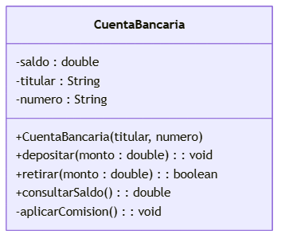
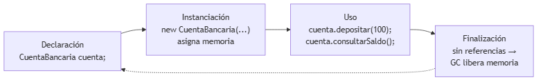
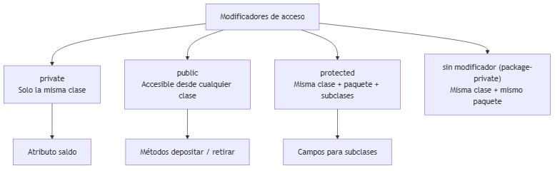
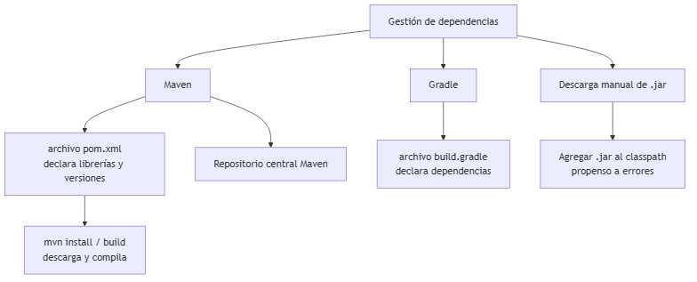

<!-- _class: title -->

# Clases, Objetos y Tipos de Datos
## Unidad 2
### Ing. Gaston Genaro Quelali Calcina

---

## Agenda

1. **Estructura de clases** — atributos, métodos, constructor
2. **Instanciación y alcance** — `new`, ciclo de vida, tipos de variables
3. **Modificadores de acceso** — private, public, protected
4. **Sobrecarga vs sobreescritura**
5. **Librerías y dependencias** — Maven y Gradle

---

## Anatomía de una clase

<!-- fuente: assets/mermaid/01_anatomia_clase.mmd -->


| Símbolo | Significado |
|---|---|
| `-` | Privado |
| `+` | Público |
| `#` | Protegido |

---

## Estructura en código

```java
public class CuentaBancaria {
    private double saldo;        // atributo (estado)
    private String titular;

    public CuentaBancaria(String t, String n) {  // constructor
        this.titular = t;
        this.saldo = 0.0;
    }

    public void depositar(double monto) {        // método
        if (monto > 0) this.saldo += monto;
    }
}
```

---

## Instanciación: `new`

```java
CuentaBancaria cuenta = new CuentaBancaria("Ana", "001-2345");
```

1. `new` **reserva memoria**
2. El **constructor** inicializa
3. La variable guarda una **referencia**

> **Clase = molde · Objeto = instancia**

---

## Ciclo de vida de un objeto

<!-- fuente: assets/mermaid/03_ciclo_vida_objeto.mmd -->


> En Java **no hay `delete`**: el **Garbage Collector** libera la memoria.

---

## Alcance de variables

| Tipo | Dónde vive | Alcance |
|---|---|---|
| **Local** | En un método | Solo ese método |
| **De instancia** | En la clase | Cada objeto tiene la suya |
| **De clase** (`static`) | En la clase | Compartida por todos |

```java
private int instancia = 0;      // cada objeto
private static int total = 0;   // compartida
```

---

## Modificadores de acceso

<!-- fuente: assets/mermaid/02_modificadores_acceso.mmd -->


**Regla:** atributos `private`, servicios `public`, `protected` para herencia.

---

## Constructores

- Mismo **nombre** de la clase, **sin tipo** de retorno
- Inicializan los atributos al crear el objeto
- Si no hay ninguno → **constructor por defecto**

```java
public class Libro {
    private String titulo;
    public Libro(String titulo) { this.titulo = titulo; }
    public Libro() { this.titulo = "Sin título"; }  // sobrecarga
}
```

---

## Destructores en Java?

> **No existen.** El **Garbage Collector** libera memoria.

Para recursos (archivos, conexiones) usar `try-with-resources`:

```java
try (BufferedReader br = new BufferedReader(new FileReader("d.txt"))) {
    // se cierra solo al terminar
}
```

---

## Sobrecarga vs sobreescritura

| Aspecto | Sobrecarga | Sobreescritura |
|---|---|---|
| Dónde | Misma clase | Clase hija |
| Firma | Parámetros distintos | Misma firma |
| Propósito | Flexibilidad | Especialización |

```java
public int sumar(int a, int b) { ... }
public double sumar(double a, double b) { ... }  // sobrecarga

@Override
public void mover() { ... }                       // sobreescritura
```

---

## Librerías estándar y externas

- **Estándar (JDK):** `java.util`, `java.io`, `java.time`
- **Externas:** Jackson, JUnit, Log4j → se agregan como **dependencias**

<!-- fuente: assets/mermaid/04_gestion_dependencias.mmd -->


---

## Maven en 30 segundos

```xml
<dependency>
    <groupId>com.fasterxml.jackson.core</groupId>
    <artifactId>jackson-databind</artifactId>
    <version>2.17.0</version>
</dependency>
```

| Comando | Qué hace |
|---|---|
| `mvn compile` | Compila |
| `mvn test` | Pruebas |
| `mvn package` | Genera `.jar` |

---

## Resumen

- Clase = atributos + métodos; objeto = instancia con `new`
- Variables: local, de instancia, de clase (`static`)
- Acceso: `private` < `protected` < `public`
- Sobrecarga cambia parámetros; sobreescritura reimplementa
- Maven gestiona dependencias declarándolas en `pom.xml`

---

## Preguntas de repaso

1. ¿Qué hace `new`?
2. Diferencia variable local, de instancia y de clase.
3. ¿Sobrecarga o sobreescritura? `sumar(int,int)` y `sumar(double,double)`.
4. ¿Por qué Java no tiene destructores?

---

## Gracias

> **Tarea:** crear la clase `Producto` (nombre, precio, stock, `aplicarDescuento()`) en un proyecto Maven.
