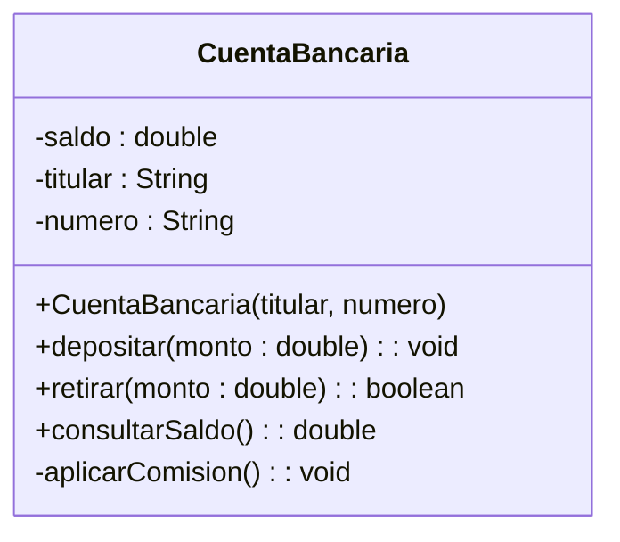
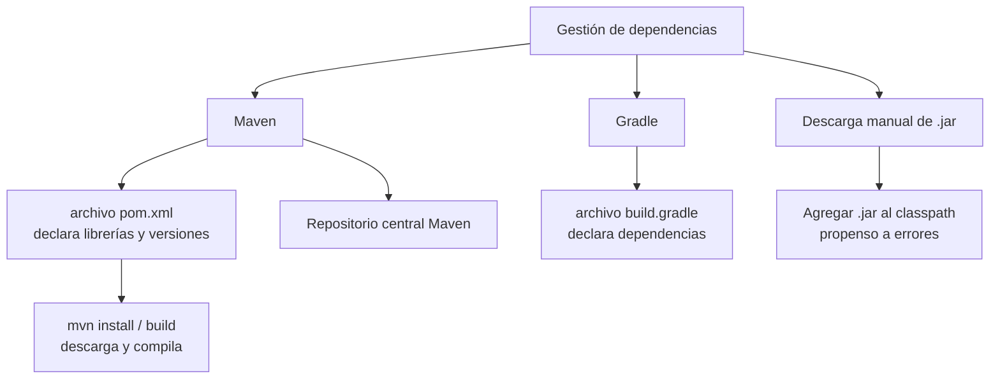

# UNIDAD 2 — CLASES, OBJETOS Y TIPOS DE DATOS

**Autor:** Ing. Gaston Genaro Quelali Calcina

---

**Contenido:**
- [1.1 Definición y estructura de clases](#11-definición-y-estructura-de-clases)
- [1.2 Objetos, instanciación y alcance de variables](#12-objetos-instanciación-y-alcance-de-variables)
- [1.3 Modificadores de acceso, constructores y destructores](#13-modificadores-de-acceso-constructores-y-destructores)
- [1.4 Sobrecarga y sobreescritura de métodos](#14-sobrecarga-y-sobreescritura-de-métodos)
- [1.5 Librerías estándar y externas (gestión de dependencias)](#15-librerías-estándar-y-externas-gestión-de-dependencias)
- [Preguntas de repaso](#preguntas-de-repaso)
- [Glosario](#glosario)

---

## 1.1 Definición y estructura de clases

### 1.1.1 ¿Qué es una clase?

Una **clase** es la **plantilla** que define:
- **Atributos** (estado): los datos que guarda cada objeto.
- **Métodos** (comportamiento): las operaciones que puede realizar.



| Símbolo | Significado |
|---|---|
| `-` | Privado (solo accesible dentro de la clase) |
| `+` | Público (accesible desde cualquier lugar) |
| `#` | Protegido (accesible para subclases) |

### 1.1.2 Anatomía en código Java

```java
public class CuentaBancaria {

    // Atributos (estado del objeto)
    private double saldo;
    private String titular;
    private String numero;

    // Constructor (crea e inicializa el objeto)
    public CuentaBancaria(String titular, String numero) {
        this.titular = titular;
        this.numero = numero;
        this.saldo = 0.0;
    }

    // Métodos (comportamiento)
    public void depositar(double monto) {
        if (monto > 0) {
            this.saldo += monto;
        }
    }

    public boolean retirar(double monto) {
        if (monto > 0 && monto <= this.saldo) {
            this.saldo -= monto;
            return true;
        }
        return false;
    }

    public double consultarSaldo() {
        return this.saldo;
    }
}
```

---

## 1.2 Objetos, instanciación y alcance de variables

### 1.2.1 Instanciación

Un **objeto** es una **instancia** de una clase. Se crea con el operador `new`:

```java
CuentaBancaria cuenta = new CuentaBancaria("Ana Pérez", "001-2345");
```

1. `new` reserva memoria para el objeto.
2. El **constructor** inicializa los atributos.
3. La variable `cuenta` guarda una **referencia** al objeto.

### 1.2.2 Ciclo de vida de un objeto

```mermaid
flowchart LR
    A[Declaración<br/>CuentaBancaria cuenta;] --> B[Instanciación<br/>new CuentaBancaria(...)<br/>asigna memoria]
    B --> C[Uso<br/>cuenta.depositar(100);<br/>cuenta.consultarSaldo();]
    C --> D[Finalización<br/>sin referencias →<br/>GC libera memoria]
    D -.-> A
```

> **Dato Java:** el **Garbage Collector (GC)** libera automáticamente la memoria de los objetos que ya no tienen referencias. No hay `delete` como en C++.

### 1.2.3 Alcance de variables

| Tipo de variable | Dónde vive | Alcance |
|---|---|---|
| **Local** | Dentro de un método | Solo dentro de ese método |
| **De instancia** | En la clase (sin `static`) | Cada objeto tiene su propia copia |
| **De clase** | Con `static` | Compartida por todos los objetos |

```java
public class Contador {
    private int instancia = 0;   // de instancia: cada objeto tiene la suya
    private static int total = 0; // de clase: compartida

    public void incrementar() {
        int local = 5;           // local: solo vive en este método
        this.instancia += local;
        Contador.total += 1;
    }
}
```

---

## 1.3 Modificadores de acceso, constructores y destructores

### 1.3.1 Modificadores de acceso

```mermaid
flowchart TD
    M[Modificadores de acceso] --> P[private<br/>Solo la misma clase]
    M --> PP[public<br/>Accesible desde cualquier clase]
    M --> PR[protected<br/>Misma clase + paquete + subclases]
    M --> PAQ[sin modificador (package-private)<br/>Misma clase + mismo paquete]
    P --> E1[Atributo saldo]
    PP --> E2[Métodos depositar / retirar]
    PR --> E3[Campos para subclases]
```

| Modificador | Misma clase | Mismo paquete | Subclase | Cualquier clase |
|---|---|---|---|---|
| `private` | ✔ | ✘ | ✘ | ✘ |
| *(ninguno)* | ✔ | ✔ | ✘ | ✘ |
| `protected` | ✔ | ✔ | ✔ | ✘ |
| `public` | ✔ | ✔ | ✔ | ✔ |

**Regla práctica:** atributos `private`, métodos de servicio `public`, y `protected` para lo que debe heredarse.

### 1.3.2 Constructores

- Tienen **el mismo nombre** de la clase y **no devuelven** tipo.
- Inicializan los atributos al crear el objeto.
- Si no definimos ninguno, Java crea el **constructor por defecto** (sin parámetros).

```java
public class Libro {
    private String titulo;

    // Constructor explícito
    public Libro(String titulo) {
        this.titulo = titulo;
    }

    // Sobrecarga de constructor: sin parámetro
    public Libro() {
        this.titulo = "Sin título";
    }
}
```

### 1.3.3 Destructores

En Java **no existen destructores**: el **Garbage Collector** se encarga de liberar memoria. La alternativa para "limpiar" recursos (archivos, conexiones) es:

```java
// Patrón try-with-resources (Java 7+)
try (BufferedReader br = new BufferedReader(new FileReader("datos.txt"))) {
    // se cierra automáticamente al terminar
}
```

> La unidad 4 (E/S) profundiza en esto. Por ahora: **recuerda que en Java el GC reemplaza a los destructores**.

---

## 1.4 Sobrecarga y sobreescritura de métodos

### 1.4.1 Sobrecarga (overloading)

Mismo nombre, **distinta lista de parámetros** (cantidad o tipos), en la misma clase:

```java
public class Calculadora {
    public int sumar(int a, int b) {
        return a + b;
    }

    public double sumar(double a, double b) {
        return a + b;
    }

    public int sumar(int a, int b, int c) {
        return a + b + c;
    }
}
```

El compilador elige el método correcto según los **argumentos** pasados.

### 1.4.2 Sobreescritura (overriding)

La clase hija **redefine** un método heredado con la misma firma:

```java
public class Vehiculo {
    public void mover() {
        System.out.println("El vehículo se mueve");
    }
}

public class Auto extends Vehiculo {
    @Override
    public void mover() {
        System.out.println("El auto avanza por la ruta");
    }
}
```

| Aspecto | Sobrecarga | Sobreescritura |
|---|---|---|
| Clases | Misma clase | Clase padre → hija |
| Firma | Cambian los parámetros | Misma firma |
| Motivo | Flexibilidad | Especializar el comportamiento |

> La sobreescritura es la base del **polimorfismo** que profundizaremos en la Unidad 4.

---

## 1.5 Librerías estándar y externas (gestión de dependencias)

### 1.5.1 Librería estándar vs externa

- **Librería estándar (JDK):** clases que vienen con Java (`java.util`, `java.io`, `java.time`…). No requieren instalación.
- **Librería externa:** desarrolladas por terceros (Jackson para JSON, JUnit para pruebas, Log4j para logs). Se integran como **dependencias**.

### 1.5.2 Maven y Gradle



**Ejemplo de `pom.xml` (Maven):**

```xml
<dependencies>
    <!-- Jackson: procesamiento de JSON -->
    <dependency>
        <groupId>com.fasterxml.jackson.core</groupId>
        <artifactId>jackson-databind</artifactId>
        <version>2.17.0</version>
    </dependency>
</dependencies>
```

**Comandos básicos de Maven:**

| Comando | Qué hace |
|---|---|
| `mvn compile` | Compila el proyecto |
| `mvn test` | Ejecuta las pruebas |
| `mvn package` | Genera el `.jar` ejecutable |
| `mvn clean` | Elimina archivos compilados |

> **Beneficio:** declaras la dependencia **una vez** y Maven la descarga (con sus versiones correctas) desde el repositorio central. Adiós a "bajar el .jar a mano".

---

## Preguntas de repaso

1. ¿Cuáles son las partes de una clase? Da un ejemplo propio.
2. ¿Qué hace el operador `new` en Java?
3. Explica la diferencia entre variable **local**, **de instancia** y **de clase**.
4. ¿Qué modificadores de acceso existen y cuándo usarías cada uno?
5. ¿Para qué sirve el constructor? ¿Qué es el constructor por defecto?
6. ¿Por qué Java no necesita destructores? ¿Qué lo reemplaza?
7. Diferencia **sobrecarga** y **sobreescritura** con un ejemplo.
8. ¿Qué problema resuelve Maven en la gestión de dependencias?
9. Escribe una clase `Producto` con atributos `nombre`, `precio` y `stock` (private), constructor y métodos `getPrecio()` y `aplicarDescuento(double)`.

---

## Glosario

| Término | Definición |
|---|---|
| **Clase** | Plantilla con atributos y métodos |
| **Objeto / Instancia** | Creación concreta de una clase mediante `new` |
| **Constructor** | Método especial que inicializa el objeto al crearlo |
| **Garbage Collector** | Mecanismo de Java que libera memoria automáticamente |
| **Sobrecarga** | Mismo nombre de método, distintos parámetros |
| **Sobreescritura** | Redefinir un método heredado en la clase hija |
| **Dependencia** | Librería externa que el proyecto necesita |
| **Maven / Gradle** | Herramientas de gestión de dependencias y construcción |
