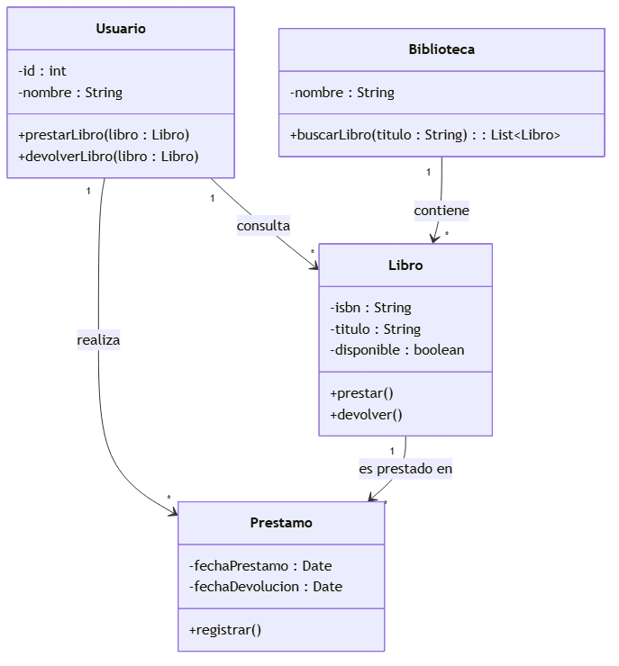
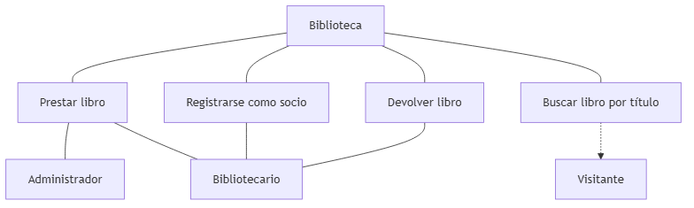
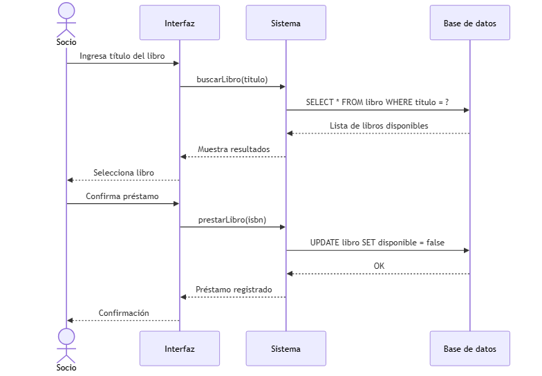
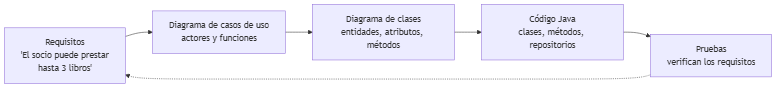
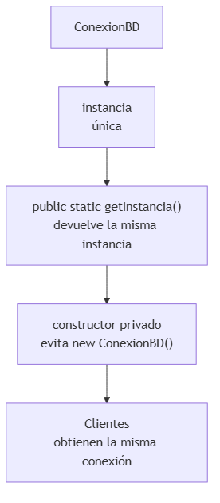
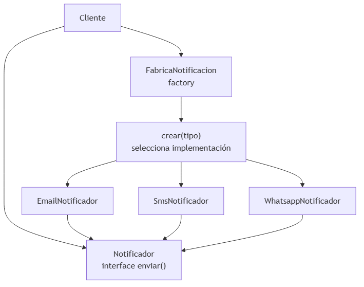

<!-- _class: title -->

# Diseño Orientado a Objetos y UML
## Unidad 3
### Ing. Gaston Genaro Quelali Calcina

---

## Agenda

1. **UML** — ¿qué es y para qué sirve?
2. **Diagrama de clases** — estructura del sistema
3. **Casos de uso y secuencia** — funcionalidad y comportamiento
4. **Del análisis al código** — del modelo a Java
5. **Patrones de diseño** — singleton, factory, strategy

---

## ¿Qué es UML?

**UML** = *Unified Modeling Language*

- Lenguaje **gráfico estándar** para modelar software
- No es código, pero se traduce a código casi directo

**Beneficios:**
1. Visualiza el diseño antes de programar
2. Comunica el diseño al equipo
3. Detecta errores de diseño **temprano**

---

## Diagrama de clases

<!-- fuente: assets/mermaid/01_diagrama_clases.mmd -->


> `Usuario "1" --> "*" Prestamo` → *un usuario realiza muchos préstamos*

---

## Diagrama de casos de uso

<!-- fuente: assets/mermaid/02_casos_uso.mmd -->


**¿Quién puede hacer qué?** — sin detalles internos

---

## Diagrama de secuencia

<!-- fuente: assets/mermaid/03_secuencia.mmd -->


**Orden temporal de los mensajes** durante un caso de uso.

---

## Los 3 diagramas más usados

| Diagrama | Responde | Tipo |
|---|---|---|
| **Clases** | ¿Cuál es la estructura? | Estructura |
| **Casos de uso** | ¿Qué funciones hay? | Funcionalidad |
| **Secuencia** | ¿Cómo se ejecuta? | Comportamiento |

---

## Del análisis al código

<!-- fuente: assets/mermaid/04_analisis_a_codigo.mmd -->


---

## De la clase UML al código

```java
public class Usuario {
    private int id;
    private String nombre;

    public Usuario(int id, String nombre) {
        this.id = id;
        this.nombre = nombre;
    }

    public void prestarLibro(Libro libro) {
        libro.prestar();
    }
}
```

> Modelar primero **reduce errores** y acelera la codificación.

---

## Patrones de diseño

**Solución reutilizable** a un problema de diseño recurrente.

| Patrón | Problema que resuelve |
|---|---|
| **Singleton** | Una sola instancia global |
| **Factory** | Crear objetos sin acoplar al tipo |
| **Strategy** | Cambiar algoritmos en ejecución |

---

## Patrón Singleton

<!-- fuente: assets/mermaid/05_patron_singleton.mmd -->


```java
public class ConexionBD {
    private static ConexionBD instancia;
    private ConexionBD() {}
    public static ConexionBD getInstancia() {
        if (instancia == null) instancia = new ConexionBD();
        return instancia;
    }
}
```

---

## Patrón Factory

```java
public class FabricaNotificacion {
    public static Notificador crear(String tipo) {
        return switch (tipo) {
            case "email" -> new EmailNotificador();
            case "sms"   -> new SmsNotificador();
            default      -> new WhatsappNotificador();
        };
    }
}
```

El cliente **no sabe** qué clase concreta se crea.

---

## Patrón Strategy

<!-- fuente: assets/mermaid/06_patrones_factory_strategy.mmd -->


```java
public interface Notificador {
    void enviar(String mensaje);
}
```

---

## Strategy en acción

```java
public class Pedido {
    private Notificador notificador;

    public void setNotificador(Notificador notificador) {
        this.notificador = notificador;
    }

    public void confirmar() {
        notificador.enviar("Tu pedido fue confirmado");
    }
}
```

> **Se cambia el algoritmo en tiempo de ejecución** sin tocar la clase `Pedido`.

---

## Resumen

- **UML** modela antes de codificar → menos errores
- **Clases**: estructura · **Casos de uso**: funciones · **Secuencia**: orden
- **Singleton** → instancia única · **Factory** → creación centralizada · **Strategy** → algoritmos intercambiables

---

## Preguntas de repaso

1. ¿Qué muestra un diagrama de clases?
2. ¿Caso de uso vs secuencia?
3. Traduce `Empleado(-id:int, -nombre:String, +getNombre():String)` a Java.
4. ¿Qué resuelve Factory? ¿Y Strategy?

---

## Gracias

> **Tarea:** modelar en UML (diagrama de clases) un sistema de ventas: `Cliente`, `Pedido`, `Producto`, `DetallePedido`.
