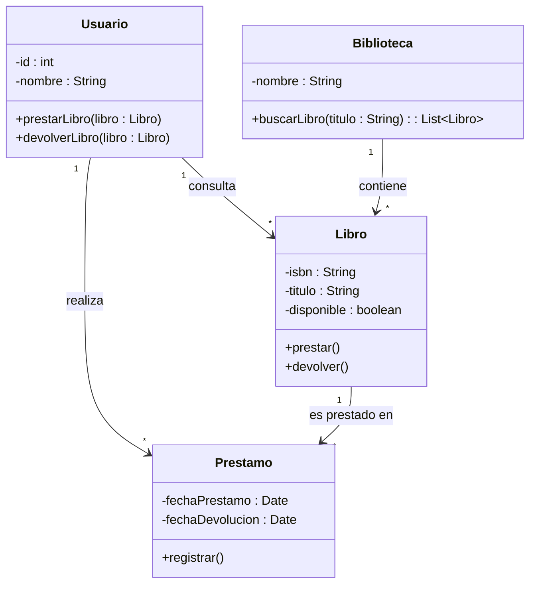
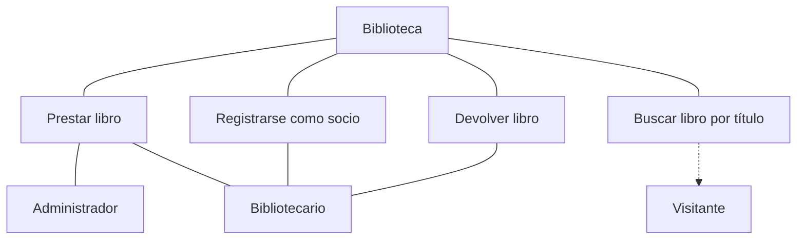
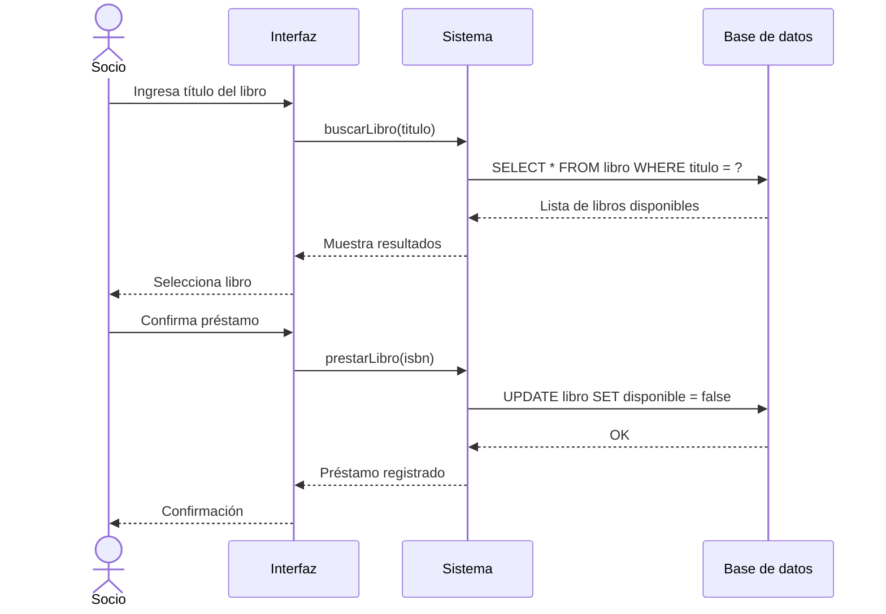
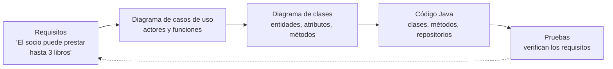

# UNIDAD 3 — DISEÑO ORIENTADO A OBJETOS Y UML

**Autor:** Ing. Gaston Genaro Quelali Calcina

---

**Contenido:**
- [2.1 Diagramas de clases y de interacción (UML)](#21-diagramas-de-clases-y-de-interacción-uml)
- [2.2 Casos de uso y diagramas de secuencia](#22-casos-de-uso-y-diagramas-de-secuencia)
- [2.3 Modelado de soluciones: del análisis al código](#23-modelado-de-soluciones-del-análisis-al-código)
- [2.4 Introducción a patrones de diseño (singleton, factory, strategy)](#24-introducción-a-patrones-de-diseño-singleton-factory-strategy)
- [Preguntas de repaso](#preguntas-de-repaso)
- [Glosario](#glosario)

---

## 2.1 Diagramas de clases y de interacción (UML)

### 2.1.1 ¿Qué es UML?

**UML** (*Unified Modeling Language*, Lenguaje de Modelado Unificado) es un **lenguaje gráfico estándar** para modelar software. No es código, pero se traduce a código casi directamente.

**Ventajas de modelar antes de programar:**
1. **Visualiza** el diseño antes de escribir código.
2. **Comunica** el diseño entre el equipo.
3. **Detecta errores** de diseño temprano (más baratos de corregir).

### 2.1.2 Diagrama de clases

El **diagrama de clases** muestra las clases del sistema, sus atributos, métodos y relaciones.



**Lectura de la notación:**
- `Usuario "1" --> "*" Prestamo` → "un Usuario realiza muchos Préstamos" (1 a muchos).
- `-id : int` → atributo privado `id` de tipo `int`.
- `+prestarLibro(libro : Libro)` → método público.

> **Práctica:** dibujar el diagrama de clases de tu proyecto **antes** de codificar. Después, cada clase UML se convierte casi literalmente en una clase Java.

---

## 2.2 Casos de uso y diagramas de secuencia

### 2.2.1 Diagrama de casos de uso

Describe **qué** puede hacer el sistema y **quiénes** lo usan (actores), sin entrar en detalles internos.



| Elemento | Pregunta que responde |
|---|---|
| **Actor** | ¿Quién interactúa con el sistema? |
| **Caso de uso** | ¿Qué acción realiza el actor? |
| **Relación** | ¿Quién puede hacer qué? |

### 2.2.2 Diagrama de secuencia

Muestra el **orden temporal** de los mensajes entre objetos durante un caso de uso.



> **Los 3 diagramas más usados en proyectos reales:** clases (estructura), casos de uso (funcionalidad) y secuencia (comportamiento).

---

## 2.3 Modelado de soluciones: del análisis al código

### 2.3.1 El flujo completo



### 2.3.2 De la clase UML al código Java

Clase UML → Clase Java:

```java
public class Usuario {
    private int id;
    private String nombre;

    public Usuario(int id, String nombre) {
        this.id = id;
        this.nombre = nombre;
    }

    public void prestarLibro(Libro libro) {
        libro.prestar();
    }

    public void devolverLibro(Libro libro) {
        libro.devolver();
    }
}
```

> **Beneficio:** el modelado UML previo **reduce errores** y acelera la codificación, porque la estructura ya está decidida.

---

## 2.4 Introducción a patrones de diseño (singleton, factory, strategy)

### 2.4.1 ¿Qué es un patrón de diseño?

Un **patrón de diseño** es una **solución reutilizable** a un problema de diseño recurrente. No es código copiado, sino una **plantilla de diseño** con un nombre conocido.

### 2.4.2 Patrón Singleton

Garantiza que una clase tenga **una sola instancia** en todo el programa (útil para conexiones a BD, configuración).

```mermaid
flowchart TD
    M[ConexionBD] --> I[instancia<br/>única]
    I --> P1[public static getInstancia()<br/>devuelve la misma instancia]
    P1 --> P2[constructor privado<br/>evita new ConexionBD()]
    P2 --> P3[Clientes<br/>obtienen la misma conexión]
```

```java
public class ConexionBD {
    private static ConexionBD instancia;

    private ConexionBD() {}  // constructor privado

    public static ConexionBD getInstancia() {
        if (instancia == null) {
            instancia = new ConexionBD();
        }
        return instancia;
    }
}
```

### 2.4.3 Patrón Factory

Encapsula la **creación de objetos** en un método, sin que el cliente sepa qué clase concreta se instancia.

```java
public class FabricaNotificacion {
    public static Notificador crear(String tipo) {
        return switch (tipo) {
            case "email" -> new EmailNotificador();
            case "sms"   -> new SmsNotificador();
            default      -> new WhatsappNotificador();
        };
    }
}
```

### 2.4.4 Patrón Strategy

Permite **cambiar el algoritmo** en tiempo de ejecución, encapsulando cada algoritmo en una clase intercambiable.

```mermaid
flowchart TD
    C[Cliente] --> F[FabricaNotificacion<br/>factory]
    F --> P[crear(tipo)<br/>selecciona implementación]
    P --> E[EmailNotificador]
    P --> S[SmsNotificador]
    P --> W[WhatsappNotificador]
    C --> N[Notificador<br/>interface enviar()]
    E --> N
    S --> N
    W --> N
```

```java
// Interfaz común (contrato)
public interface Notificador {
    void enviar(String mensaje);
}

// Implementación concreta
public class EmailNotificador implements Notificador {
    public void enviar(String mensaje) {
        System.out.println("Enviando email: " + mensaje);
    }
}

// Uso con Strategy
public class Pedido {
    private Notificador notificador;

    public void setNotificador(Notificador notificador) {
        this.notificador = notificador;
    }

    public void confirmar() {
        notificador.enviar("Tu pedido fue confirmado");
    }
}
```

> **Comparación rápida:**
> | Patrón | Problema que resuelve |
> |---|---|
> | **Singleton** | Una sola instancia global |
> | **Factory** | Crear objetos sin acoplar al tipo concreto |
> | **Strategy** | Cambiar algoritmos en tiempo de ejecución |

---

## Preguntas de repaso

1. ¿Qué es UML y por qué conviene modelar antes de programar?
2. ¿Qué información muestra un **diagrama de clases**?
3. ¿Qué diferencia hay entre un **caso de uso** y un **diagrama de secuencia**?
4. Traduce esta clase UML a Java: `Empleado` con `-id:int`, `-nombre:String`, `+getNombre():String`.
5. ¿Qué problema resuelve el patrón **Singleton**? ¿Y el **Factory**?
6. Explica con tus palabras en qué consiste el patrón **Strategy**.
7. Modela en UML (diagrama de clases) un sistema de ventas con `Cliente`, `Pedido`, `Producto` y `DetallePedido`.

---

## Glosario

| Término | Definición |
|---|---|
| **UML** | Lenguaje gráfico estándar para modelar software |
| **Diagrama de clases** | Estructura: clases, atributos, métodos y relaciones |
| **Caso de uso** | Funcionalidad del sistema desde la vista del actor |
| **Diagrama de secuencia** | Orden temporal de mensajes entre objetos |
| **Patrón de diseño** | Solución reutilizable a un problema recurrente |
| **Singleton** | Patrón que garantiza una única instancia |
| **Factory** | Patrón que centraliza la creación de objetos |
| **Strategy** | Patrón que permite cambiar algoritmos en ejecución |
