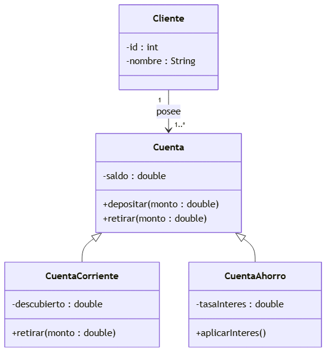
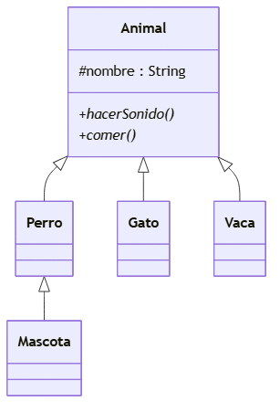
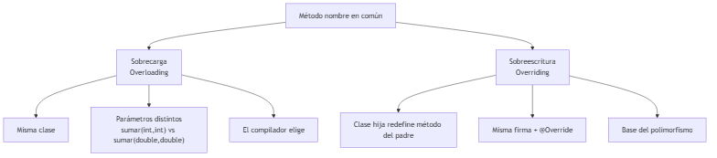
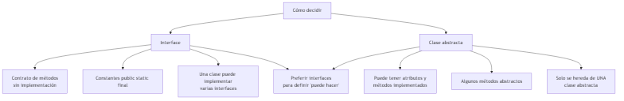
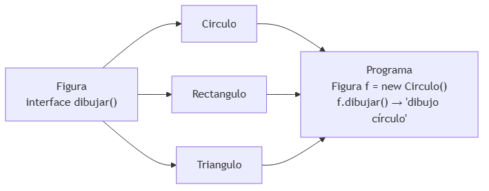
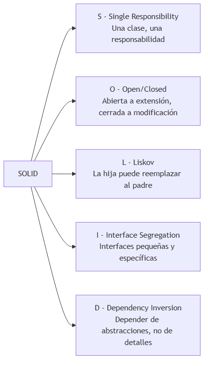

# UNIDAD 4 — COMPOSICIÓN, HERENCIA Y POLIMORFISMO

**Autor:** Ing. Gaston Genaro Quelali Calcina

---

**Contenido:**
- [3.1 Relaciones entre clases: asociación, composición y agregación](#31-relaciones-entre-clases-asociación-composición-y-agregación)
- [3.2 Herencia: extensibilidad y reutilización](#32-herencia-extensibilidad-y-reutilización)
- [3.3 Polimorfismo: sobrecarga y sobreescritura](#33-polimorfismo-sobrecarga-y-sobreescritura)
- [3.4 Interfaces y clases abstractas](#34-interfaces-y-clases-abstractas)
- [3.5 Principios SOLID para diseño robusto](#35-principios-solid-para-diseño-robusto)
- [Preguntas de repaso](#preguntas-de-repaso)
- [Glosario](#glosario)

---

## 3.1 Relaciones entre clases: asociación, composición y agregación

### 3.1.1 Los tres tipos de relación

Cuando los objetos colaboran, se relacionan de distintas maneras:



*Figura: Asociación, agregación, composición y herencia*

| Relación | Significado | Fuerza | ¿Existe sin el otro? |
|---|---|---|---|
| **Asociación** | Se usan mutuamente | Débil | Sí (cliente → préstamo) |
| **Agregación** | "Tiene-un" (parte de) | Media | Sí (equipo → jugadores) |
| **Composición** | "Tiene-un" con ciclo de vida ligado | Fuerte | No (pedido → líneas) |

### 3.1.2 En código

```java
// Asociación: un Usuario usa una Biblioteca (la conoce como referencia)
public class Usuario {
    private Biblioteca biblioteca;  // puede ser null
}

// Agregación: un Equipo tiene Jugadores (los jugadores viven sin el equipo)
public class Equipo {
    private List<Jugador> jugadores = new ArrayList<>();
}

// Composición: un Pedido tiene LineasPedido (sin pedido no hay líneas)
public class Pedido {
    private List<LineaPedido> lineas = new ArrayList<>();

    public Pedido() {
        // las líneas nacen y mueren con el pedido
    }
}
```

> **Regla rápida:** si el objeto contenido **no existe sin el contenedor** → composición. Si puede existir por su cuenta → agregación. Si solo se conocen → asociación.

---

## 3.2 Herencia: extensibilidad y reutilización

### 3.2.1 Jerarquía de herencia

La herencia modela relaciones **"es-un"** y se expresa en Java con `extends`:



*Figura: Jerarquía de herencia de Animal*

```java
public class Animal {
    protected String nombre;

    public Animal(String nombre) {
        this.nombre = nombre;
    }

    public void comer() {
        System.out.println(nombre + " está comiendo");
    }
}

public class Perro extends Animal {
    public Perro(String nombre) {
        super(nombre);
    }

    public void moverCola() {
        System.out.println(nombre + " mueve la cola");
    }
}
```

### 3.2.2 ¿Herencia o composición?

| Criterio | Herencia | Composición |
|---|---|---|
| Relación | "Es-un" (es un perro) | "Tiene-un" (tiene un motor) |
| Reutilización | Hereda métodos | Contiene objetos |
| Acoplamiento | Alto (padre-hija) | Bajo |
| Cambios | Modificar padre afecta hijas | Aislado |

> **Recomendación moderna:** **preferir composición sobre herencia** cuando sea posible. La herencia se reserva para verdaderas relaciones "es-un".

---

## 3.3 Polimorfismo: sobrecarga y sobreescritura

### 3.3.1 Los dos mecanismos



*Figura: Sobrecarga vs sobreescritura*

### 3.3.2 Polimorfismo en acción



*Figura: Interface vs clase abstracta*

```java
// Interfaz que define el contrato
public interface Figura {
    void dibujar();
}

// Implementaciones concretas
public class Circulo implements Figura {
    public void dibujar() {
        System.out.println("Dibujando un círculo");
    }
}

public class Rectangulo implements Figura {
    public void dibujar() {
        System.out.println("Dibujando un rectángulo");
    }
}

// Uso polimórfico: el código NO sabe qué figura concreta es
public class Editor {
    public void pintar(Figura figura) {
        figura.dibujar();  // se comporta según la instancia real
    }
}
```

> **La esencia del polimorfismo:** el programa llama `dibujar()` y **cada figura hace lo suyo**; el código llamador no necesita `if/else` por tipo.

---

## 3.4 Interfaces y clases abstractas

### 3.4.1 ¿Cuál usar?



*Figura: Polimorfismo en acción con Figuras*

### 3.4.2 Ejemplo con ambos

```java
// Interface: contrato de comportamiento
public interface Volador {
    void volar();
}

// Clase abstracta: base con estado + algunos métodos implementados
public abstract class Vehiculo {
    protected String marca;

    public Vehiculo(String marca) {
        this.marca = marca;
    }

    public void encender() {
        System.out.println(marca + " encendido");
    }

    public abstract void mover();  // la hija debe implementarlo
}

// Una clase hereda de UNA abstracta y puede implementar VARIAS interfaces
public class Avion extends Vehiculo implements Volador {
    public Avion(String marca) {
        super(marca);
    }

    public void mover() { System.out.println("Rodando por la pista"); }
    public void volar() { System.out.println("Despegando"); }
}
```

| Característica | Interface | Clase abstracta |
|---|---|---|
| Métodos implementados | No (salvo `default`) | Sí |
| Atributos | Solo constantes | Puede tener estado |
| Herencia múltiple | Sí (varias interfaces) | No (una sola) |
| Uso típico | Definir "puede hacer" | Base con estado común |

---

## 3.5 Principios SOLID para diseño robusto

### 3.5.1 El acrónimo



*Figura: Los cinco principios SOLID*

### 3.5.2 Ejemplo práctico (SRP y DIP)

**Antes (viola SRP):** una clase `Factura` que calcula total, guarda en BD y envía por email.

```java
public class Factura {
    private double total;

    public double calcularTotal() { ... }

    public void guardarEnBD() { ... }      // responsabilidad ajena
    public void enviarEmail() { ... }      // responsabilidad ajena
}
```

**Después (cumple SRP + DIP):** cada responsabilidad en su clase, dependiendo de abstracciones.

```java
public interface RepositorioFactura {
    void guardar(Factura f);
}

public class FacturaRepositorioBD implements RepositorioFactura {
    public void guardar(Factura f) { ... }
}

public class Factura {
    private RepositorioFactura repositorio;  // DIP: depende de la abstracción

    public Factura(RepositorioFactura repositorio) {
        this.repositorio = repositorio;
    }

    public double calcularTotal() { ... }
}
```

> **Los 5 principios SOLID** son la base del diseño robusto que se exige en proyectos profesionales. Los repasaremos en la práctica y en los foros.

---

## Preguntas de repaso

1. Diferencia **asociación**, **agregación** y **composición** con un ejemplo de cada una.
2. ¿Qué significa que una relación sea "es-un"?
3. ¿Cuándo conviene **herencia** y cuándo **composición**?
4. Explica el polimorfismo con un ejemplo de `Figura` y sus implementaciones.
5. ¿Qué diferencias hay entre **interface** y **clase abstracta**? ¿Cuándo usarías cada una?
6. Nombra los **5 principios SOLID** y explica el "S".
7. Refactoriza una clase que hace "todo" (calcular, guardar, enviar) aplicando SRP.

---

## Glosario

| Término | Definición |
|---|---|
| **Asociación** | Relación débil: los objetos se conocen |
| **Agregación** | "Tiene-un" donde la parte puede existir sola |
| **Composición** | "Tiene-un" donde la parte no existe sin el todo |
| **Herencia** | Reutilizar y extender mediante "es-un" |
| **Polimorfismo** | Un mismo método, distintos comportamientos |
| **Interface** | Contrato de métodos sin implementación |
| **Clase abstracta** | Base con estado y métodos parcialmente implementados |
| **SOLID** | 5 principios de diseño robusto |
