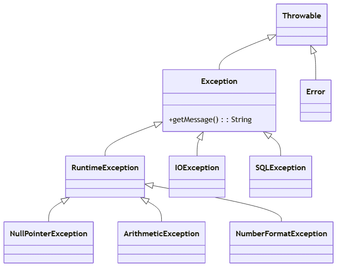
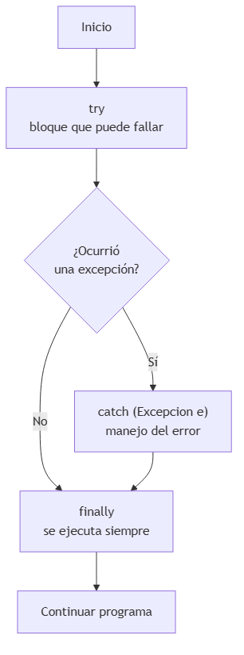
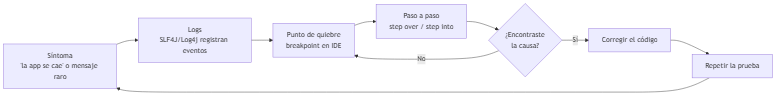

# UNIDAD 5 — MANEJO DE ERRORES Y EXCEPCIONES

**Autor:** Ing. Gaston Genaro Quelali Calcina

---

**Contenido:**
- [4.1 Tipos y jerarquía de excepciones](#41-tipos-y-jerarquía-de-excepciones)
- [4.2 Try, catch, finally y manejo avanzado](#42-try-catch-finally-y-manejo-avanzado)
- [4.3 Creación de excepciones personalizadas](#43-creación-de-excepciones-personalizadas)
- [4.4 Logging y debugging](#44-logging-y-debugging)
- [Preguntas de repaso](#preguntas-de-repaso)
- [Glosario](#glosario)

---

## 4.1 Tipos y jerarquía de excepciones

### 4.1.1 ¿Qué es una excepción?

Una **excepción** es un **evento anómalo** que interrumpe el flujo normal del programa (dividir por cero, archivo inexistente, valor nulo). Java la representa como un **objeto** que puede ser capturado y manejado.



*Figura: Jerarquía de excepciones en Java*

### 4.1.2 Las tres ramas principales

| Rama | Ejemplos | ¿Obligatorio manejarla? |
|---|---|---|
| **`Error`** | `OutOfMemoryError`, `StackOverflowError` | No (es grave, no se maneja) |
| **`Exception`** (checked) | `IOException`, `SQLException` | Sí (el compilador lo exige) |
| **`RuntimeException`** (unchecked) | `NullPointerException`, `ArithmeticException`, `NumberFormatException` | No (falla de lógica) |

> **Checked vs unchecked:** las **checked** deben declararse o capturarse (el compilador obliga). Las **unchecked** (RuntimeException) suelen indicar errores de programación.

```java
public class Main {
    public static void main(String[] args) {
        // RuntimeException: no obliga a capturar
        int division = 10 / 0;   // ArithmeticException

        // Exception checked: el compilador OBLIGA a manejarla
        FileReader fr = new FileReader("datos.txt");  // IOException
    }
}
```

---

## 4.2 Try, catch, finally y manejo avanzado

### 4.2.1 La estructura básica



*Figura: Flujo de try/catch/finally*

```java
public class Division {
    public static void main(String[] args) {
        try {
            int a = 10;
            int b = 0;
            int resultado = a / b;         // lanza ArithmeticException
            System.out.println(resultado);
        } catch (ArithmeticException e) {
            System.out.println("No se puede dividir por cero: " + e.getMessage());
        } finally {
            System.out.println("El bloque finally siempre se ejecuta");
        }
    }
}
```

### 4.2.2 Manejo avanzado

**Varios catch (del más específico al más general):**

```java
try {
    Integer.parseInt(texto);
} catch (NumberFormatException e) {
    // específica primero
} catch (RuntimeException e) {
    // general después
}
```

**try-with-resources (cierre automático de recursos):**

```java
try (BufferedReader br = new BufferedReader(new FileReader("datos.txt"))) {
    String linea = br.readLine();
} catch (IOException e) {
    System.out.println("Error al leer el archivo: " + e.getMessage());
}
// el recurso se cierra solo, sin finally explícito
```

**Multi-catch (una sola línea):**

```java
try {
    // operación que puede fallar de varias formas
} catch (IOException | SQLException e) {
    System.out.println("Error de entrada/salida o de BD: " + e.getMessage());
}
```

### 4.2.3 Lanzar excepciones (`throw`) y propagar (`throws`)

```java
public void retirar(double monto) throws SaldoInsuficienteException {
    if (monto > this.saldo) {
        throw new SaldoInsuficienteException("Saldo insuficiente");
    }
    this.saldo -= monto;
}
```

| Palabra | Significado |
|---|---|
| `throw` | Lanza **una** excepción en ese punto |
| `throws` | Declara en la firma que el método **puede lanzar** |

---

## 4.3 Creación de excepciones personalizadas

### 4.3.1 ¿Por qué crear excepciones propias?

Las excepciones del JDK son genéricas. Una excepción personalizada **comunica el contexto del negocio** (`SaldoInsuficienteException` dice mucho más que `IllegalStateException`).

```java
// Excepción personalizada (unchecked)
public class SaldoInsuficienteException extends RuntimeException {
    public SaldoInsuficienteException(String mensaje) {
        super(mensaje);
    }

    public SaldoInsuficienteException(String mensaje, Throwable causa) {
        super(mensaje, causa);
    }
}

// Uso
public class CuentaBancaria {
    private double saldo;

    public void retirar(double monto) {
        if (monto > saldo) {
            throw new SaldoInsuficienteException(
                "Saldo insuficiente: disponibles " + saldo + ", solicitó " + monto);
        }
        saldo -= monto;
    }
}
```

**Buenas prácticas al crear excepciones:**
1. Heredar de `Exception` (checked) o `RuntimeException` (unchecked).
2. Nombre descriptivo que termine en `Exception`.
3. Proveer al menos el constructor con mensaje y el de causa.

---

## 4.4 Logging y debugging

### 4.4.1 Logging con SLF4J / Log4j

Los logs permiten **registrar lo que pasa** en la aplicación para diagnosticar problemas sin interrumpirla.

```xml
<!-- pom.xml: dependencia de Log4j -->
<dependency>
    <groupId>org.apache.logging.log4j</groupId>
    <artifactId>log4j-core</artifactId>
    <version>2.23.0</version>
</dependency>
```

```java
import org.apache.logging.log4j.LogManager;
import org.apache.logging.log4j.Logger;

public class Procesador {
    private static final Logger log = LogManager.getLogger(Procesador.class);

    public void procesar(String nombre) {
        log.info("Procesando: {}", nombre);
        try {
            // ...
        } catch (Exception e) {
            log.error("Error al procesar {}", nombre, e);
        }
    }
}
```

**Niveles de log (de menor a mayor severidad):**

| Nivel | Uso |
|---|---|
| `DEBUG` | Detalles para desarrollo |
| `INFO` | Eventos normales de la app |
| `WARN` | Situaciones sospechosas |
| `ERROR` | Fallos recuperables |

### 4.4.2 Debugging con el IDE



*Figura: Ciclo de depuración con logs y debugger*

**Herramientas del debugger:**
- **Breakpoint:** pausa la ejecución en una línea.
- **Step Over (F8):** ejecuta la línea actual sin entrar en métodos.
- **Step Into (F7):** entra al método llamado.
- **Step Out:** termina el método actual y vuelve al llamador.
- **Watches:** observar el valor de variables en vivo.

> **Diferencia clave:** *logging* responde "¿qué pasó?" (registro permanente). *Debugging* responde "¿por qué pasó?" (análisis interactivo).

---

## Preguntas de repaso

1. ¿Cuál es la diferencia entre `Error`, `Exception` y `RuntimeException` en Java?
2. ¿Qué significa que una excepción sea **checked**?
3. ¿Para qué sirve el bloque `finally`? ¿Siempre se ejecuta?
4. Diferencia `throw` y `throws`.
5. ¿Cuándo conviene crear una **excepción personalizada**?
6. ¿Qué diferencias hay entre los niveles `INFO`, `WARN` y `ERROR` de un log?
7. Explica qué hace un breakpoint y los pasos *step over* / *step into*.
8. Escribe una excepción personalizada `LibroNoDisponibleException` y úsala en un método `prestar()`.

---

## Glosario

| Término | Definición |
|---|---|
| **Excepción** | Evento anómalo que interrumpe el flujo normal |
| **Checked** | Excepción que el compilador obliga a manejar |
| **Unchecked** | RuntimeException: falla de lógica |
| **`try`/`catch`/`finally`** | Bloque para capturar y manejar errores |
| **`throw`** | Lanza una excepción en un punto |
| **`throws`** | Declara que el método puede lanzarla |
| **Logging** | Registro permanente de eventos |
| **Debugging** | Análisis interactivo de la ejecución |
