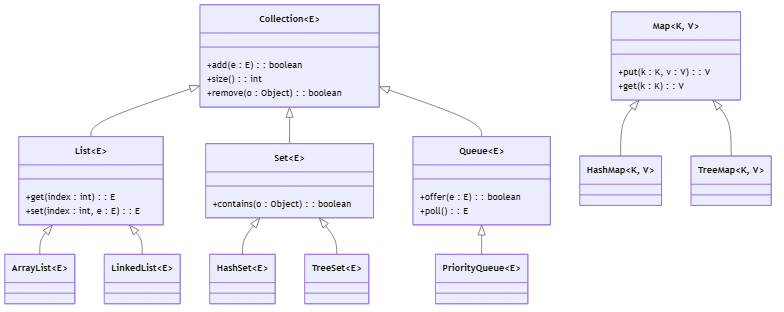
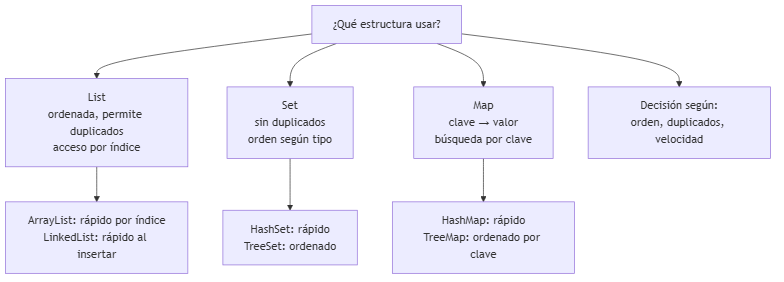
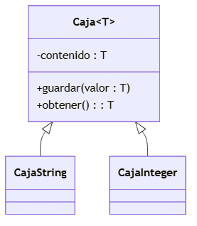
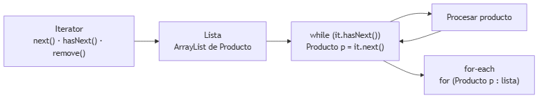

# UNIDAD 6 — PROGRAMACIÓN GENÉRICA, COLECCIONES Y ESTRUCTURAS AVANZADAS

**Autor:** Ing. Gaston Genaro Quelali Calcina

---

**Contenido:**
- [5.1 Introducción a la programación genérica](#51-introducción-a-la-programación-genérica)
- [5.2 Colecciones: listas, sets, mapas y estructuras avanzadas](#52-colecciones-listas-sets-mapas-y-estructuras-avanzadas)
- [5.3 Iteradores, enumeradores y manipulación eficiente de datos](#53-iteradores-enumeradores-y-manipulación-eficiente-de-datos)
- [Preguntas de repaso](#preguntas-de-repaso)
- [Glosario](#glosario)

---

## 5.1 Introducción a la programación genérica

### 5.1.1 ¿Qué son los genéricos?

Los **genéricos** permiten escribir clases y métodos que trabajan con **tipos como parámetro**, sin sacrificar la seguridad de tipos.



*Figura: Jerarquía del framework de colecciones*

```java
// Clase genérica: T es un parámetro de tipo
public class Caja<T> {
    private T contenido;

    public void guardar(T valor) {
        this.contenido = valor;
    }

    public T obtener() {
        return contenido;
    }
}

// Uso: el compilador garantiza el tipo
Caja<String> cajaTexto = new Caja<>();
cajaTexto.guardar("Hola");      // OK
// cajaTexto.guardar(42);        // ERROR en tiempo de compilación

String saludo = cajaTexto.obtener();  // sin cast manual
```

### 5.1.2 Beneficios

| Sin genéricos (antiguo) | Con genéricos |
|---|---|
| `List lista = new ArrayList();` | `List<String> lista = new ArrayList<>();` |
| Se guarda cualquier tipo | Solo el tipo declarado |
| `(String) lista.get(0)` (cast manual) | `String s = lista.get(0);` (automático) |
| `ClassCastException` en ejecución | Error **en compilación** |

### 5.1.3 Métodos y límites genéricos

```java
// Método genérico
public static <T> void imprimir(T[] arreglo) {
    for (T elemento : arreglo) {
        System.out.println(elemento);
    }
}

// Con límite superior: solo tipos que implementan Comparable
public static <T extends Comparable<T>> T maximo(T a, T b) {
    return a.compareTo(b) > 0 ? a : b;
}
```

---

## 5.2 Colecciones: listas, sets, mapas y estructuras avanzadas

### 5.2.1 El framework de colecciones



*Figura: ¿List, Set o Map? Decisión de estructura*

### 5.2.2 ¿Cuál elegir?



*Figura: Clase genérica Caja con T*

### 5.2.3 Ejemplos en código

```java
// LIST: mantiene orden e índices, permite duplicados
List<String> nombres = new ArrayList<>();
nombres.add("Ana");
nombres.add("Juan");
nombres.add("Ana");          // duplicado permitido
String primero = nombres.get(0);   // acceso por índice

// SET: NO permite duplicados
Set<String> alumnos = new HashSet<>();
alumnos.add("Ana");
alumnos.add("Ana");          // se ignora (ya existe)
System.out.println(alumnos.size());  // 1

// MAP: clave → valor, búsqueda rápida por clave
Map<String, Double> precios = new HashMap<>();
precios.put("Libro", 25.5);
precios.put("Cuaderno", 8.0);
Double precio = precios.get("Libro");  // 25.5
```

| Estructura | Permite duplicados | Ordenado | Acceso típico |
|---|---|---|---|
| `List` | Sí | Por inserción | Por índice |
| `Set` | No | Según tipo | Por valor |
| `Map` | Claves únicas | Según tipo | Por clave |
| `Queue` | Sí | FIFO o prioridad | Extraer el primero |

---

## 5.3 Iteradores, enumeradores y manipulación eficiente de datos

### 5.3.1 Iteradores

Un **iterador** recorre una colección de forma segura, permitiendo incluso eliminar elementos durante el recorrido.



*Figura: Recorrido de colecciones con iterador*

```java
Iterator<Producto> it = productos.iterator();
while (it.hasNext()) {
    Producto p = it.next();
    if (p.getStock() == 0) {
        it.remove();   // seguro: elimina durante el recorrido
    }
}
```

### 5.3.2 For-each (azúcar sintáctico)

```java
for (Producto p : productos) {
    System.out.println(p.getNombre());
}
```

> **Nota:** `for-each` NO permite eliminar elementos. Para eso se usa el iterador explícito.

### 5.3.3 Streams (Java 8+): manipulación eficiente

```java
// Filtrar, mapear y recolectar en una sola expresión
List<String> nombresBaratos = productos.stream()
        .filter(p -> p.getPrecio() < 10)
        .map(Producto::getNombre)
        .toList();

// Ordenar y limitar
productos.stream()
        .sorted(Comparator.comparing(Producto::getPrecio))
        .limit(3)
        .forEach(p -> System.out.println(p.getNombre()));
```

| Operación | Qué hace |
|---|---|
| `filter` | Deja pasar solo los que cumplen la condición |
| `map` | Transforma cada elemento |
| `sorted` | Ordena |
| `limit` | Toma solo N elementos |
| `collect` | Recolecta en lista, set, etc. |

> **Eficiencia:** elegir bien la estructura es tan importante como escribir el algoritmo. Un `Map` busca por clave en **O(1)** promedio; una lista en **O(n)**.

---

## Preguntas de repaso

1. ¿Qué problema resuelven los **genéricos**? ¿Qué evitan?
2. ¿Cuál es la diferencia entre `List`, `Set` y `Map`? Da un uso para cada uno.
3. ¿Cuándo usarías `HashSet` en lugar de `TreeSet`?
4. ¿Para qué sirve el `Iterator`? ¿Por qué `for-each` no permite eliminar?
5. ¿Qué hacen `filter`, `map` y `limit` en un Stream?
6. Escribe un método genérico `imprimir` que reciba un `List<T>` y lo muestre.
7. Usando un `Map<String, Double>`, calcula el producto más caro de un catálogo.

---

## Glosario

| Término | Definición |
|---|---|
| **Genérico** | Clase/método parametrizado por tipo |
| **`List`** | Secuencia ordenada con duplicados e índices |
| **`Set`** | Colección sin duplicados |
| **`Map`** | Pares clave → valor |
| **`Queue`** | Cola (FIFO o por prioridad) |
| **Iterator** | Recorrido seguro de una colección |
| **Stream** | Secuencia de operaciones funcionales sobre datos |
