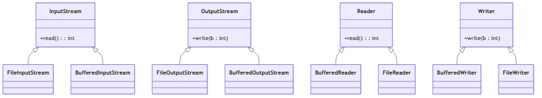
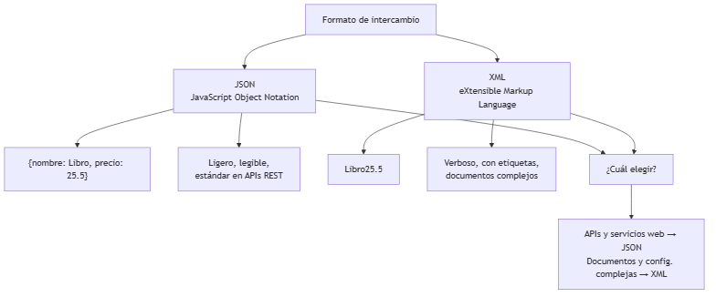

# UNIDAD 7 — ENTRADA/SALIDA, ARCHIVOS Y SERIALIZACIÓN

**Autor:** Ing. Gaston Genaro Quelali Calcina

---

**Contenido:**
- [6.1 Operaciones con archivos (lectura/escritura)](#61-operaciones-con-archivos-lecturaescritura)
- [6.2 Serialización y deserialización (JSON, XML, pickle)](#62-serialización-y-deserialización-json-xml-pickle)
- [6.3 Streams y buffers](#63-streams-y-buffers)
- [Preguntas de repaso](#preguntas-de-repaso)
- [Glosario](#glosario)

---

## 6.1 Operaciones con archivos (lectura/escritura)

### 6.1.1 El flujo de archivos

Los programas necesitan **guardar** información más allá de la ejecución (persistencia) y **leerla** cuando vuelven a ejecutarse.


*Figura: Flujo de lectura y escritura de archivos*

### 6.1.2 Escritura en Java

```java
import java.io.*;

public class Escritura {
    public static void main(String[] args) {
        try (BufferedWriter bw =
                new BufferedWriter(new FileWriter("productos.txt"))) {
            bw.write("Libro;25.5");
            bw.newLine();
            bw.write("Cuaderno;8.0");
            bw.newLine();
        } catch (IOException e) {
            System.out.println("Error de escritura: " + e.getMessage());
        }
    }
}
```

### 6.1.3 Lectura en Java

```java
import java.io.*;

public class Lectura {
    public static void main(String[] args) {
        try (BufferedReader br =
                new BufferedReader(new FileReader("productos.txt"))) {
            String linea;
            while ((linea = br.readLine()) != null) {
                String[] partes = linea.split(";");
                System.out.println("Producto: " + partes[0] +
                                   " | Precio: " + partes[1]);
            }
        } catch (IOException e) {
            System.out.println("Error de lectura: " + e.getMessage());
        }
    }
}
```

> **Siempre** usar `try-with-resources` para que los archivos se cierren automáticamente (visto en la Unidad 5).

---

## 6.2 Serialización y deserialización (JSON, XML, pickle)

### 6.2.1 ¿Qué es serializar?

**Serializar** es convertir un **objeto en memoria** a un **formato almacenable o transmisible**. **Deserializar** es el proceso inverso: reconstruir el objeto desde ese formato.



*Figura: Jerarquía de streams de bytes y caracteres*

### 6.2.2 JSON con Jackson

JSON es el formato **más usado en APIs y servicios web**.

```java
// pom.xml
<dependency>
    <groupId>com.fasterxml.jackson.core</groupId>
    <artifactId>jackson-databind</artifactId>
    <version>2.17.0</version>
</dependency>
```

```java
import com.fasterxml.jackson.databind.ObjectMapper;

public class JsonEjemplo {
    public static void main(String[] args) throws Exception {
        ObjectMapper mapper = new ObjectMapper();

        // Serializar objeto → JSON
        Producto p = new Producto(1, "Libro", 25.5);
        String json = mapper.writeValueAsString(p);
        System.out.println(json);  // {"id":1,"nombre":"Libro","precio":25.5}

        // Deserializar JSON → objeto
        Producto restaurado = mapper.readValue(json, Producto.class);
        System.out.println(restaurado.getNombre());
    }
}
```

### 6.2.3 JSON vs XML


*Figura: Ciclo de serialización y deserialización*

| Característica | JSON | XML |
|---|---|---|
| Legibilidad | Alta | Media |
| Tamaño | Compacto | Verboso |
| Uso típico | APIs REST | Documentos, configuraciones |
| Soporte en Java | Jackson, Gson | DOM, SAX, JAXB |

### 6.2.4 Serialización binaria de Java

El PCA menciona `pickle` (Python). El equivalente en Java es la **serialización nativa** con `Serializable`:

```java
import java.io.*;

public class Producto implements Serializable {
    private static final long serialVersionUID = 1L;
    private int id;
    private String nombre;
    private double precio;

    // getters y setters...
}

// Guardar objeto
try (ObjectOutputStream oos =
        new ObjectOutputStream(new FileOutputStream("producto.bin"))) {
    oos.writeObject(new Producto(1, "Libro", 25.5));
} catch (IOException e) { /* manejo */ }

// Cargar objeto
try (ObjectInputStream ois =
        new ObjectInputStream(new FileInputStream("producto.bin"))) {
    Producto p = (Producto) ois.readObject();
} catch (IOException | ClassNotFoundException e) { /* manejo */ }
```

> **Recomendación:** para intercambio entre sistemas (web, apps) usar **JSON**. La serialización nativa sirve para persistencia interna.

---

## 6.3 Streams y buffers

### 6.3.1 Jerarquía de streams en Java



*Figura: Comparativa JSON vs XML*

| Familia | Bytes o caracteres | Clases típicas |
|---|---|---|
| `InputStream`/`OutputStream` | Bytes (imágenes, binarios) | `FileInputStream`, `BufferedInputStream` |
| `Reader`/`Writer` | Caracteres (texto) | `FileReader`, `BufferedReader` |

### 6.3.2 ¿Por qué usar buffers?

Un **buffer** es una memoria intermedia que acumula datos y los transfiere en bloques, en lugar de uno por uno. Esto reduce las operaciones de E/S (muy lentas).

```java
// SIN buffer: un read() por byte → lento
try (FileReader fr = new FileReader("grande.txt")) {
    int c;
    while ((c = fr.read()) != -1) { /* proceso byte a byte */ }
}

// CON buffer: lee bloques grandes de memoria
try (BufferedReader br = new BufferedReader(new FileReader("grande.txt"))) {
    String linea;
    while ((linea = br.readLine()) != null) { /* proceso línea a línea */ }
}
```

> **Regla práctica:** envolver los streams básicos con `Buffered*` para mejorar el rendimiento de la E/S.

---

## Preguntas de repaso

1. ¿Por qué es importante la persistencia en archivos?
2. ¿Qué diferencia hay entre `FileReader` y `FileInputStream`?
3. ¿Qué significa **serializar** y **deserializar**?
4. ¿Cuándo conviene JSON y cuándo XML?
5. ¿Qué ventaja aporta un **buffer** en la E/S?
6. Escribe código que guarde una lista de productos en JSON con Jackson y la recupere.
7. ¿Qué debe implementar una clase para usar la serialización nativa de Java?

---

## Glosario

| Término | Definición |
|---|---|
| **Persistencia** | Guardar datos más allá de la ejecución |
| **Stream** | Flujo de datos (bytes o caracteres) |
| **Buffer** | Memoria intermedia que acelera la E/S |
| **Serialización** | Objeto → formato almacenable |
| **Deserialización** | Formato → objeto |
| **JSON** | Formato ligero de intercambio (APIs) |
| **XML** | Formato etiquetado para documentos |
