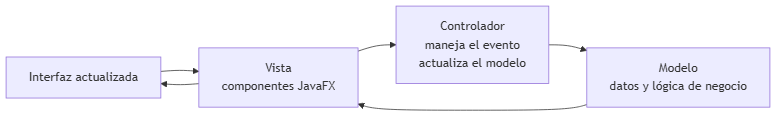
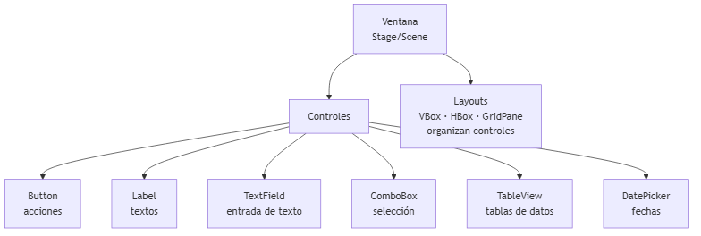
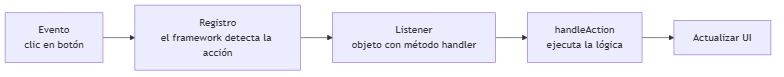

<!-- _class: title -->

# Interfaces Gráficas y Manejo de Eventos
## Unidad 8
### Ing. Gaston Genaro Quelali Calcina

---

## Agenda

1. **Fundamentos de GUI** — JavaFX y el patrón MVC
2. **Componentes** — botones, campos, tablas
3. **Eventos** — del clic al handler
4. **UX simple** — claridad, feedback, validación

---

## ¿Qué es una GUI?

> **GUI** = Interfaz Gráfica de Usuario

Interacción mediante **ventanas, botones, campos y menús**.

| Framework | Lenguaje |
|---|---|
| **JavaFX** | Java (lo usamos) |
| Swing | Java (clásico) |
| Tkinter | Python |
| WinForms | C# |

---

## Arquitectura MVC

<!-- fuente: assets/mermaid/01_arquitectura_gui.mmd -->


| Capa | Rol |
|---|---|
| **Modelo** | Datos y lógica |
| **Vista** | Componentes visuales |
| **Controlador** | Intermediario de eventos |

---

## Componentes típicos

<!-- fuente: assets/mermaid/03_componentes_gui.mmd -->


---

## Primer programa JavaFX

```java
public class MiApp extends Application {
    @Override
    public void start(Stage ventana) {
        Label saludo = new Label("Hola, mundo!");
        Button boton = new Button("Saludar");

        VBox raiz = new VBox(10, saludo, boton);
        Scene escena = new Scene(raiz, 300, 200);

        ventana.setTitle("Mi primera GUI");
        ventana.setScene(escena);
        ventana.show();
    }
    public static void main(String[] args) { launch(args); }
}
```

---

## Ciclo de un evento

<!-- fuente: assets/mermaid/02_ciclo_eventos.mmd -->


---

## Registrar un handler

```java
// 1. Lambda (recomendada)
boton.setOnAction(e -> saludo.setText("Hola"));

// 2. Clase anónima
boton.setOnAction(new EventHandler<ActionEvent>() {
    public void handle(ActionEvent e) { saludo.setText("Hola"); }
});
```

> `e.getSource()` → qué control generó el evento.

---

## Validación y feedback

```java
buttonGuardar.setOnAction(e -> {
    if (nombreField.getText().isEmpty()) {
        Alert alerta = new Alert(Alert.AlertType.WARNING);
        alerta.setContentText("El nombre no puede estar vacío");
        alerta.showAndWait();
    } else {
        listaProductos.add(new Producto(
            nombreField.getText(), precio));
        tabla.refresh();
    }
});
```

---

## Principios de UX simple

| Principio | Aplicación |
|---|---|
| **Claridad** | Etiquetas descriptivas |
| **Consistencia** | Mismo estilo en toda la app |
| **Feedback** | Alertas de éxito/error |
| **Prevención** | Deshabilitar botones sin datos |
| **Simplicidad** | Solo lo necesario |

---

## Buenas prácticas

1. Separar lógica de la UI (**MVC**)
2. Validar **antes** de actuar
3. Dar feedback siempre
4. Usar **layouts** (VBox, GridPane)
5. Probar con un usuario real

---

## Resumen

- **GUI** = ventanas + componentes
- **JavaFX** con patrón **MVC**
- **Evento → listener → handler → actualizar UI**
- UX: claridad, feedback, simplicidad

---

## Preguntas de repaso

1. ¿Qué es el patrón MVC?
2. ¿Qué es un evento y un listener?
3. Nombra 3 componentes JavaFX.
4. ¿3 principios de UX?

---

## Gracias

> **Tarea:** app JavaFX con `TextField` + botón que muestre el texto en un `Label`, con validación y feedback.
