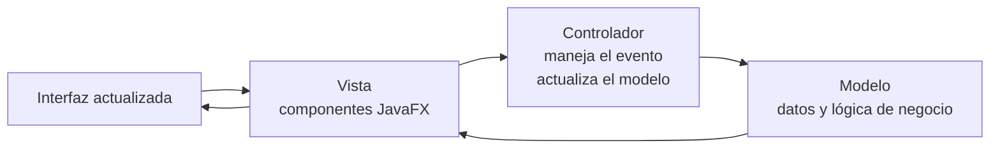
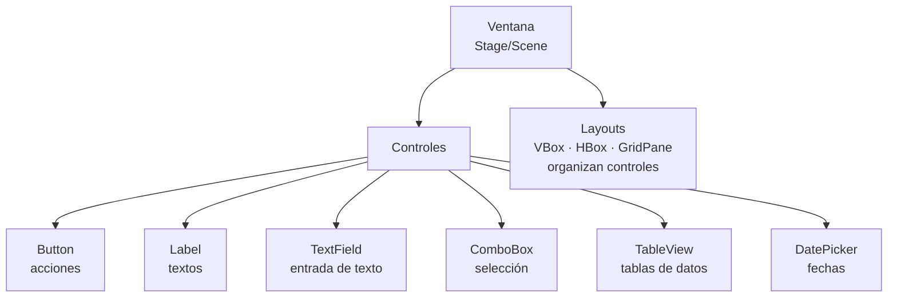
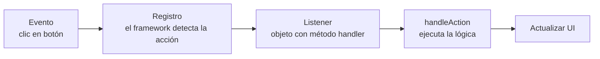

# UNIDAD 8 — DESARROLLO DE INTERFACES GRÁFICAS Y MANEJO DE EVENTOS

**Autor:** Ing. Gaston Genaro Quelali Calcina

---

**Contenido:**
- [7.1 Fundamentos de GUI: frameworks básicos](#71-fundamentos-de-gui-frameworks-básicos)
- [7.2 Creación de componentes y manejo de eventos](#72-creación-de-componentes-y-manejo-de-eventos)
- [7.3 Diseño de experiencias de usuario simples](#73-diseño-de-experiencias-de-usuario-simples)
- [Preguntas de repaso](#preguntas-de-repaso)
- [Glosario](#glosario)

---

## 7.1 Fundamentos de GUI: frameworks básicos

### 7.1.1 ¿Qué es una GUI?

Una **GUI** (*Graphical User Interface*, Interfaz Gráfica de Usuario) permite al usuario interactuar con el programa mediante **ventanas, botones, campos y menús**, en lugar de la línea de comandos.

| Framework | Lenguaje | Uso |
|---|---|---|
| **JavaFX** | Java | Moderno, recomendado para SIS120 |
| Swing | Java | Clásico, aún presente en sistemas antiguos |
| Tkinter | Python | Simple, para prototipos |
| WinForms / WPF | C# | Windows |

> **En esta asignatura usamos JavaFX** (el PCA menciona JavaFX como opción de Java).

### 7.1.2 Arquitectura MVC de una GUI



| Capa | Responsabilidad | Analogía |
|---|---|---|
| **Modelo** | Datos y reglas de negocio | La "información" |
| **Vista** | Componentes visuales | Lo que "ves" |
| **Controlador** | Reacciona a eventos, coordina | El "intermediario" |

---

## 7.2 Creación de componentes y manejo de eventos

### 7.2.1 Componentes típicos



### 7.2.2 Primer programa JavaFX

```java
import javafx.application.Application;
import javafx.scene.Scene;
import javafx.scene.control.Button;
import javafx.scene.control.Label;
import javafx.scene.layout.VBox;
import javafx.stage.Stage;

public class MiApp extends Application {

    @Override
    public void start(Stage ventana) {
        Label saludo = new Label("Hola, mundo!");
        Button boton = new Button("Saludar");

        VBox raiz = new VBox(10, saludo, boton);   // layout vertical
        Scene escena = new Scene(raiz, 300, 200);

        ventana.setTitle("Mi primera GUI");
        ventana.setScene(escena);
        ventana.show();
    }

    public static void main(String[] args) {
        launch(args);
    }
}
```

### 7.2.3 Manejo de eventos

Un **evento** es una acción del usuario (clic, teclado, selección). Un **listener** es el objeto que lo atiende.



```java
boton.setOnAction(e -> {
    // el evento "clic" llega aquí (lambda / EventHandler)
    saludo.setText("Bienvenido, estudiante!");
});
```

**Las 3 formas de registrar un manejador:**

```java
// 1. Lambda (recomendada, concisa)
boton.setOnAction(e -> saludo.setText("Hola"));

// 2. Clase anónima
boton.setOnAction(new EventHandler<ActionEvent>() {
    @Override
    public void handle(ActionEvent e) {
        saludo.setText("Hola");
    }
});

// 3. Clase que implementa EventHandler
public class MiHandler implements EventHandler<ActionEvent> {
    @Override
    public void handle(ActionEvent e) {
        saludo.setText("Hola");
    }
}
```

> El evento trae **información útil**: `e.getSource()` dice qué control lo generó.

---

## 7.3 Diseño de experiencias de usuario simples

### 7.3.1 Principios básicos de UX

| Principio | Aplicación |
|---|---|
| **Claridad** | Textos legibles, etiquetas descriptivas |
| **Consistencia** | Mismos colores y botones en toda la app |
| **Feedback** | Mostrar confirmaciones o errores (`Alert`) |
| **Prevención de errores** | Deshabilitar botones si faltan datos |
| **Simplicidad** | Menos es más: solo lo necesario |

### 7.3.2 Validación y feedback

```java
buttonGuardar.setOnAction(e -> {
    if (nombreField.getText().isEmpty()) {
        // feedback inmediato al usuario
        Alert alerta = new Alert(Alert.AlertType.WARNING);
        alerta.setContentText("El nombre no puede estar vacío");
        alerta.showAndWait();
    } else {
        // lógica de negocio (Modelo)
        Producto p = new Producto(nombreField.getText(), precio);
        listaProductos.add(p);
        tabla.refresh();
    }
});
```

### 7.3.3 Buenas prácticas para una app sencilla

1. **Separar la lógica** de la UI (MVC): el Modelo no debe saber que existe un botón.
2. **Validar antes** de ejecutar la acción de negocio.
3. **Dar feedback** siempre (éxito o error).
4. Usar **layouts adecuados** (`VBox`, `HBox`, `GridPane`) para no usar posiciones absolutas.
5. Probar la app con un **usuario real** para detectar problemas de uso.

---

## Preguntas de repaso

1. ¿Qué es una GUI y qué frameworks Java existen?
2. Explica las **tres capas MVC** y su responsabilidad.
3. Nombra 5 componentes JavaFX y su función.
4. ¿Qué es un **evento** y qué es un **listener**?
5. ¿Cuáles son las 3 formas de registrar un manejador de eventos?
6. Menciona 3 principios de UX y cómo se aplican.
7. Escribe un programa JavaFX con un `TextField` y un botón que muestre el texto ingresado en un `Label`.

---

## Glosario

| Término | Definición |
|---|---|
| **GUI** | Interfaz gráfica de usuario |
| **JavaFX** | Framework moderno de GUI para Java |
| **MVC** | Modelo-Vista-Controlador |
| **Componente** | Control visual (botón, campo, tabla) |
| **Evento** | Acción del usuario detectada por el framework |
| **Listener / Handler** | Objeto que atiende el evento |
| **Layout** | Contenedor que organiza los componentes |
| **UX** | Experiencia de usuario |
