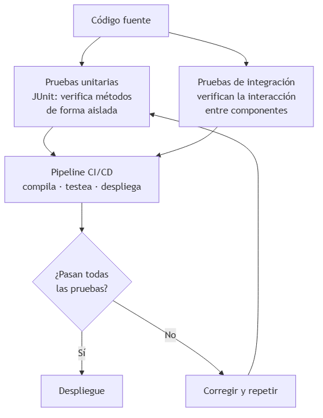
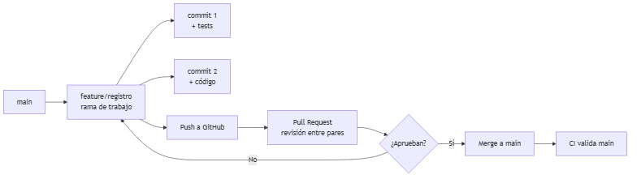
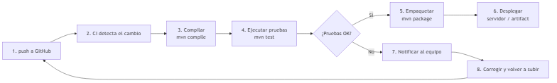
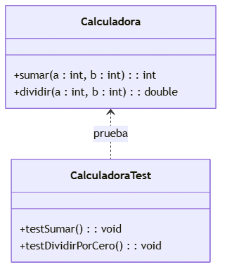
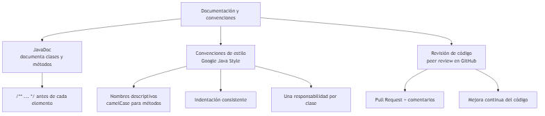

# UNIDAD 9 — PRUEBAS, BUENAS PRÁCTICAS Y DEVOPS BÁSICO

**Autor:** Ing. Gaston Genaro Quelali Calcina

---

**Contenido:**
- [8.1 Introducción a testing automatizado](#81-introducción-a-testing-automatizado)
- [8.2 Documentación de código, estilo y convenciones](#82-documentación-de-código-estilo-y-convenciones)
- [8.3 Uso profesional de Git y plataformas colaborativas](#83-uso-profesional-de-git-y-plataformas-colaborativas)
- [8.4 Integración continua y automatización básica (CI/CD)](#84-integración-continua-y-automatización-básica-cicd)
- [Preguntas de repaso](#preguntas-de-repaso)
- [Glosario](#glosario)

---

## 8.1 Introducción a testing automatizado

### 8.1.1 ¿Por qué probar?

Probar **automáticamente** garantiza que el código hace lo que debe y que los cambios futuros **no rompen** lo que ya funcionaba (regresiones).



*Figura: Flujo de pruebas unitarias y de integración*

| Tipo | Verifica | Alcance |
|---|---|---|
| **Unitaria** | Un método/clase aislado | Pequeño |
| **Integración** | Interacción entre componentes | Medio |
| **Sistema/Aceptación** | Todo el sistema con requisitos | Grande |

### 8.1.2 JUnit 5: el framework de pruebas de Java

```xml
<dependency>
    <groupId>org.junit.jupiter</groupId>
    <artifactId>junit-jupiter</artifactId>
    <version>5.10.0</version>
    <scope>test</scope>
</dependency>
```

```java
import static org.junit.jupiter.api.Assertions.*;
import org.junit.jupiter.api.Test;

class CalculadoraTest {

    @Test
    void sumarDevuelveLaSuma() {
        Calculadora calc = new Calculadora();
        assertEquals(5, calc.sumar(2, 3));
    }

    @Test
    void dividirPorCeroLanzaExcepcion() {
        Calculadora calc = new Calculadora();
        assertThrows(ArithmeticException.class,
                     () -> calc.dividir(10, 0));
    }
}
```



*Figura: Flujo de trabajo con Git y ramas*

### 8.1.3 Estructura de un buen test (AAA)

1. **Arrange** — preparar datos y objetos.
2. **Act** — ejecutar la operación a probar.
3. **Assert** — verificar el resultado esperado.

```java
@Test
void retirarDescuentaElSaldo() {
    // Arrange
    Cuenta cuenta = new Cuenta(100.0);

    // Act
    boolean resultado = cuenta.retirar(30.0);

    // Assert
    assertTrue(resultado);
    assertEquals(70.0, cuenta.consultarSaldo());
}
```

> Los nombres de los tests deben describir el **comportamiento esperado** (en español o inglés), no la implementación.

---

## 8.2 Documentación de código, estilo y convenciones

### 8.2.1 JavaDoc



*Figura: Pipeline de CI/CD*

```java
/**
 * Representa una cuenta bancaria con operaciones básicas.
 *
 * @author Estudiante SIS120
 * @version 1.0
 */
public class CuentaBancaria {

    /** Saldo actual de la cuenta. */
    private double saldo;

    /**
     * Retira dinero si hay saldo suficiente.
     *
     * @param monto cantidad a retirar
     * @return true si la operación se realizó
     */
    public boolean retirar(double monto) {
        if (monto > saldo) return false;
        saldo -= monto;
        return true;
    }
}
```

### 8.2.2 Convenciones clave (Google Java Style)

| Convención | Ejemplo |
|---|---|
| Clases en `PascalCase` | `ClienteController` |
| Métodos y variables en `camelCase` | `consultarSaldo()`, `saldoActual` |
| Constantes en `UPPER_SNAKE` | `MAX_INTENTOS` |
| Nombres descriptivos | `calcularTotalConImpuesto()` y no `cti()` |
| Una responsabilidad por clase (SRP) | Clases cortas y específicas |

---

## 8.3 Uso profesional de Git y plataformas colaborativas

### 8.3.1 Flujo de trabajo con ramas (branching)



*Figura: Relación entre la clase y su test JUnit*

### 8.3.2 Comandos esenciales

| Comando | Qué hace |
|---|---|
| `git init` | Inicia un repositorio |
| `git add <archivo>` | Agrega al área de staging |
| `git commit -m "mensaje"` | Guarda un punto de control |
| `git branch feature/x` | Crea una rama |
| `git checkout -b feature/x` | Crea y cambia a la rama |
| `git push origin rama` | Sube a GitHub |
| `git pull origin main` | Trae cambios remotos |
| `git status` / `git log` | Estado e historial |

### 8.3.3 Trabajo colaborativo en GitHub

1. **Cada cambio** va en una rama con nombre descriptivo.
2. Se abre un **Pull Request (PR)** al terminar.
3. Los compañeros **revisan el código** (peer review) y comentan.
4. La rama se **fusiona (merge)** a `main` tras la aprobación.
5. **GitHub Actions** (CI) valida automáticamente las pruebas.

---

## 8.4 Integración continua y automatización básica (CI/CD)

### 8.4.1 ¿Qué es CI/CD?

- **CI (Integración Continua):** integrar los cambios frecuentemente y validarlos con pruebas automáticas.
- **CD (Entrega Continua):** publicar el software de forma automática y repetible.



*Figura: Documentación, estilo y revisión de código*

### 8.4.2 Pipeline con GitHub Actions

```yaml
name: Java CI

on: [push, pull_request]

jobs:
  build:
    runs-on: ubuntu-latest
    steps:
      - uses: actions/checkout@v4
      - name: Set up JDK 17
        uses: actions/setup-java@v4
        with:
          java-version: '17'
          distribution: 'temurin'
      - name: Compilar y probar
        run: mvn clean test
```

> Con este archivo en `.github/workflows/ci.yml`, **cada push** compila y ejecuta las pruebas automáticamente en GitHub.

---

## Preguntas de repaso

1. ¿Qué diferencia hay entre prueba **unitaria** y de **integración**?
2. ¿Qué significa el patrón **AAA** en un test?
3. ¿Para qué sirve la anotación `@Test` y `assertEquals`?
4. Nombra 3 convenciones del Google Java Style.
5. ¿Cuál es el flujo correcto al trabajar con ramas en GitHub?
6. ¿Qué es una **Pull Request** y para qué sirve?
7. ¿Qué hace un pipeline de CI/CD en cada push?
8. Escribe un test JUnit para un método `descuento(precio)` que aplique 10% y devuelva `AssertionError` si falla.

---

## Glosario

| Término | Definición |
|---|---|
| **Testing unitario** | Probar métodos de forma aislada |
| **JUnit** | Framework de pruebas para Java |
| **AAA** | Arrange-Act-Assert: estructura de un test |
| **JavaDoc** | Documentación embebida en el código |
| **Pull Request** | Solicitud de revisión antes de fusionar |
| **Peer review** | Revisión de código entre pares |
| **CI/CD** | Integración y entrega continua |
| **Pipeline** | Secuencia automática: compilar → probar → desplegar |
