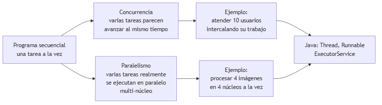
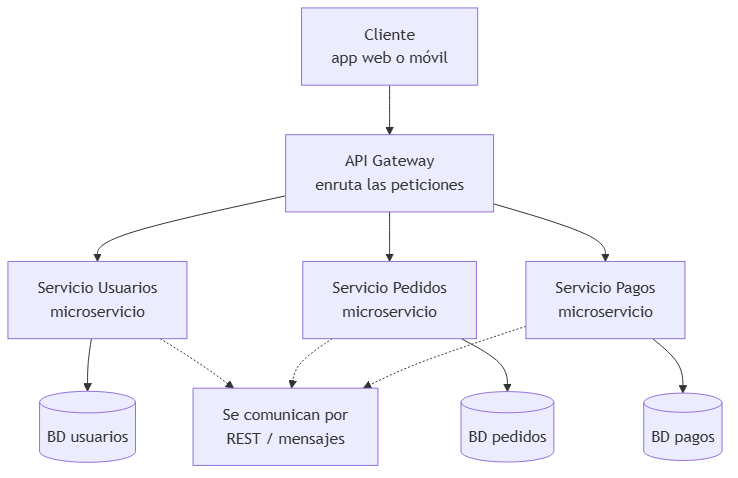
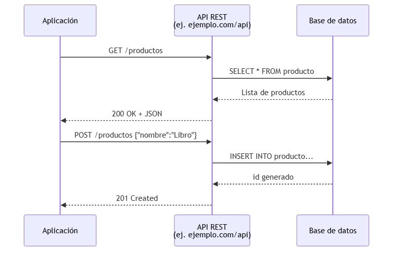
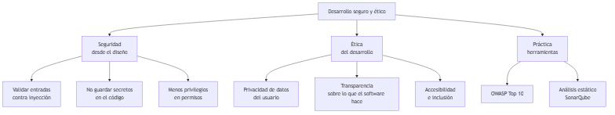

<!-- _class: title -->

# Tendencias y Temas Emergentes
## Unidad 10
### Ing. Gaston Genaro Quelali Calcina

---

## Agenda

1. **Concurrencia y paralelismo** — hilos en Java
2. **Microservicios y APIs REST** — de monolito a servicios
3. **Seguridad y ética** — diseño seguro
4. **TDD y mockeo** — pruebas primero

---

## Concurrencia vs Paralelismo

<!-- fuente: assets/mermaid/01_concurrencia_paralela.mmd -->


---

## Hilos en Java

```java
public class Contador implements Runnable {
    public void run() {
        for (int i = 1; i <= 5; i++)
            System.out.println("Hilo: " + i);
    }
}

Thread t1 = new Thread(new Contador());
Thread t2 = new Thread(new Contador());
t1.start();
t2.start();
```

---

## ExecutorService (mejor)

```java
ExecutorService pool = Executors.newFixedThreadPool(4);
for (int i = 0; i < 10; i++) {
    final int tarea = i;
    pool.submit(() -> System.out.println("Tarea " + tarea));
}
pool.shutdown();
```

> ⚠️ Compartir datos entre hilos genera **carreras**: usar `synchronized`, `AtomicInteger`, `ConcurrentHashMap`.

---

## Microservicios

<!-- fuente: assets/mermaid/02_microservicios.mmd -->


---

## Monolito vs Microservicios

| Monolito | Microservicios |
|---|---|
| Un solo despliegue | Despliegue independiente |
| Una BD | BD por servicio |
| Un fallo afecta todo | Fallos aislados |
| Simple al inicio | Complejo de operar |

---

## API REST

<!-- fuente: assets/mermaid/03_api_rest.mmd -->


---

## Verbos HTTP

| Verbo | Operación | Ejemplo |
|---|---|---|
| `GET` | Leer | `GET /productos` |
| `POST` | Crear | `POST /productos` |
| `PUT` | Actualizar | `PUT /productos/1` |
| `DELETE` | Eliminar | `DELETE /productos/1` |

---

## Consumir una API en Java

```java
HttpClient client = HttpClient.newHttpClient();
HttpRequest request = HttpRequest.newBuilder()
        .uri(URI.create("https://ejemplo.com/api/productos"))
        .GET().build();

HttpResponse<String> r = client.send(
        request, HttpResponse.BodyHandlers.ofString());

System.out.println(r.statusCode());  // 200
System.out.println(r.body());        // JSON
```

---

## Seguridad y ética

<!-- fuente: assets/mermaid/05_seguridad_etica.mmd -->


---

## Reglas de oro

1. **Validar entradas** — nunca confiar en el usuario
2. **No guardar secretos** — usar variables de entorno
3. **Menos privilegios** — permisos mínimos
4. **Privacidad** — solo los datos necesarios
5. **Transparencia** — explicar qué hace el software

> Referencia: **OWASP Top 10**

---

## TDD: RED-GREEN-REFACTOR

<!-- fuente: assets/mermaid/04_ciclo_tdd.mmd -->


```java
@Test
void descuentoDe100Devuelve90() {
    assertEquals(90.0, new Precio().descuento(100.0, 0.10));
}
```

---

## Mockeo con Mockito

```java
RepositorioProducto mock = mock(RepositorioProducto.class);

ServicioProducto servicio = new ServicioProducto(mock);
servicio.registrar(new Producto(1, "Libro", 25.5));

verify(mock).guardar(any(Producto.class));
```

> **Mock** = simular una dependencia para aislar la prueba.

---

## Resumen

- **Concurrencia/paralelismo**: hilos y pools en Java
- **Microservicios + REST**: sistemas escalables y comunicados
- **Seguridad y ética**: diseño seguro desde el inicio
- **TDD + mockeo**: calidad guiada por pruebas

---

## Preguntas de repaso

1. ¿Concurrencia vs paralelismo?
2. ¿Monolito vs microservicios?
3. ¿Qué es REST? 4 verbos HTTP.
4. ¿Qué es RED-GREEN-REFACTOR?

---

## Gracias

> **Cierre de asignatura:** conectamos POO → UML → SOLID → excepciones → colecciones → E/S → GUI → testing/DevOps → tendencias.
>
> **Tarea final:** consumir una API pública con `HttpClient` y probar la respuesta con un test.
