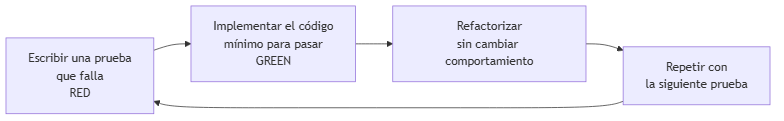

# UNIDAD 10 — TENDENCIAS Y TEMAS EMERGENTES

**Autor:** Ing. Gaston Genaro Quelali Calcina

---

**Contenido:**
- [9.1 Introducción a programación concurrente y paralela](#91-introducción-a-programación-concurrente-y-paralela)
- [9.2 Microservicios, APIs y consumo de servicios REST](#92-microservicios-apis-y-consumo-de-servicios-rest)
- [9.3 Primeros pasos en desarrollo seguro y ético](#93-primeros-pasos-en-desarrollo-seguro-y-ético)
- [9.4 Introducción a testing, mockeo y TDD](#94-introducción-a-testing-mockeo-y-tdd)
- [Preguntas de repaso](#preguntas-de-repaso)
- [Glosario](#glosario)

---

## 9.1 Introducción a programación concurrente y paralela

### 9.1.1 Concurrencia vs paralelismo


*Figura: Concurrencia vs paralelismo*

| Concepto | Definición | Ejemplo |
|---|---|---|
| **Concurrencia** | Varias tareas **intercaladas** (parecen simultáneas) | Atender varios clientes |
| **Paralelismo** | Varias tareas **realmente simultáneas** (multi-núcleo) | Procesar imágenes en paralelo |

### 9.1.2 Hilos en Java

```java
// Forma clásica: implementar Runnable
public class Contador implements Runnable {
    private final String nombre;

    public Contador(String nombre) { this.nombre = nombre; }

    public void run() {
        for (int i = 1; i <= 5; i++) {
            System.out.println(nombre + ": " + i);
        }
    }
}

public class Main {
    public static void main(String[] args) {
        Thread t1 = new Thread(new Contador("Hilo 1"));
        Thread t2 = new Thread(new Contador("Hilo 2"));
        t1.start();  // lanza la ejecución en paralelo
        t2.start();
    }
}
```

### 9.1.3 ExecutorService (recomendado)

```java
import java.util.concurrent.*;

ExecutorService pool = Executors.newFixedThreadPool(4);  // 4 hilos

for (int i = 0; i < 10; i++) {
    final int tarea = i;
    pool.submit(() -> System.out.println("Tarea " + tarea));
}

pool.shutdown();  // no acepta más tareas y finaliza
```

> **Cuidado:** con hilos compartiendo datos aparece la **concurrencia** (carreras). Herramientas: `synchronized`, `AtomicInteger`, `ConcurrentHashMap`.

---

## 9.2 Microservicios, APIs y consumo de servicios REST

### 9.2.1 Arquitectura de microservicios

En lugar de **una** aplicación enorme (monolito), el sistema se divide en **servicios pequeños e independientes**, cada uno con su propia base de datos y responsabilidad.


*Figura: Arquitectura de microservicios*

| Monolito | Microservicios |
|---|---|
| Un solo despliegue | Cada servicio se despliega solo |
| Una sola BD | Cada servicio su propia BD |
| Un fallo afecta todo | Fallos aislados |
| Más simple al inicio | Más complejo de operar |

### 9.2.2 ¿Qué es una API REST?

**API** (*Application Programming Interface*): contrato que permite a programas comunicarse. **REST** es el estilo más usado en la web, basado en HTTP y recursos.


*Figura: Flujo de una API REST*

**Verbos HTTP y su significado:**

| Verbo | Operación | Ejemplo |
|---|---|---|
| `GET` | Leer | `GET /productos` |
| `POST` | Crear | `POST /productos` |
| `PUT` | Actualizar (completo) | `PUT /productos/1` |
| `DELETE` | Eliminar | `DELETE /productos/1` |

### 9.2.3 Consumir una API en Java

```java
import java.net.http.*;
import java.net.URI;

HttpClient client = HttpClient.newHttpClient();
HttpRequest request = HttpRequest.newBuilder()
        .uri(URI.create("https://ejemplo.com/api/productos"))
        .GET()
        .build();

HttpResponse<String> respuesta =
        client.send(request, HttpResponse.BodyHandlers.ofString());

System.out.println("Código: " + respuesta.statusCode());  // 200
System.out.println("Cuerpo: " + respuesta.body());        // JSON
```

---

## 9.3 Primeros pasos en desarrollo seguro y ético

### 9.3.1 Seguridad desde el diseño



*Figura: Ciclo TDD: RED-GREEN-REFACTOR*

| Principio | Práctica |
|---|---|
| **Validar entradas** | Nunca confiar en lo que envía el usuario |
| **No guardar secretos** | Contraseñas/API keys fuera del código (variables de entorno) |
| **Menos privilegios** | Cada componente con los permisos mínimos |
| **Privacidad** | Recolectar solo los datos necesarios |
| **Transparencia** | Explicar qué hace el software con los datos |

> **Referencia:** el **OWASP Top 10** lista los riesgos más comunes (inyección SQL, XSS, exponer datos, etc.).

---

## 9.4 Introducción a testing, mockeo y TDD

### 9.4.1 TDD: Test Driven Development

**TDD** invierte el orden: **primero la prueba que falla**, después el código mínimo para pasarla y finalmente el refactor.


*Figura: Desarrollo seguro y ético*

```java
// 1. RED: primero la prueba (falla: el método no existe)
@Test
void descuentoDe100Devuelve90() {
    Precio precio = new Precio();
    assertEquals(90.0, precio.descuento(100.0, 0.10));
}

// 2. GREEN: implementación mínima
public class Precio {
    public double descuento(double precio, double pct) {
        return precio * (1 - pct);
    }
}

// 3. REFACTOR: mejorar sin romper la prueba
```

### 9.4.2 Mockeo con Mockito

Un **mock** simula una dependencia (base de datos, API externa) para probar el componente en aislamiento.

```java
import static org.mockito.Mockito.*;

public class RepositorioTest {

    @Test
    void guardarDelegaEnLaDependencia() {
        // Crear el mock de la dependencia
        RepositorioProducto mock = mock(RepositorioProducto.class);

        ServicioProducto servicio = new ServicioProducto(mock);
        servicio.registrar(new Producto(1, "Libro", 25.5));

        // Verificar que se llamó al método esperado
        verify(mock).guardar(any(Producto.class));
    }
}
```

| Concepto | Qué es | Para qué sirve |
|---|---|---|
| **TDD** | Escribir tests antes del código | Diseñar por comportamiento |
| **Mock** | Simulación de una dependencia | Aislar la unidad a probar |
| **Verify** | Confirmar interacciones | Verificar llamadas esperadas |

---

## Preguntas de repaso

1. ¿Cuál es la diferencia entre **concurrencia** y **paralelismo**? Da un ejemplo de cada uno.
2. ¿Cómo lanzas dos tareas en paralelo en Java?
3. ¿Qué diferencia hay entre un **monolito** y los **microservicios**?
4. ¿Qué significa que una API sea **REST**? Nombra 4 verbos HTTP y su función.
5. Menciona 3 prácticas de **seguridad** desde el diseño.
6. ¿Qué significa **RED-GREEN-REFACTOR** en TDD?
7. ¿Para qué sirve un **mock** en un test?
8. Consume una API pública (ej. JSONPlaceholder) con `HttpClient` y muestra los 3 primeros títulos.

---

## Glosario

| Término | Definición |
|---|---|
| **Concurrencia** | Tareas intercaladas (aparentemente simultáneas) |
| **Paralelismo** | Tareas simultáneas reales (multi-núcleo) |
| **Hilo (Thread)** | Unidad de ejecución concurrente |
| **Microservicio** | Servicio pequeño e independiente |
| **API** | Contrato de comunicación entre programas |
| **REST** | Estilo de API basado en HTTP y recursos |
| **TDD** | Desarrollo guiado por pruebas |
| **Mock** | Simulación de una dependencia |
| **OWASP Top 10** | Lista de los riesgos de seguridad más comunes |
